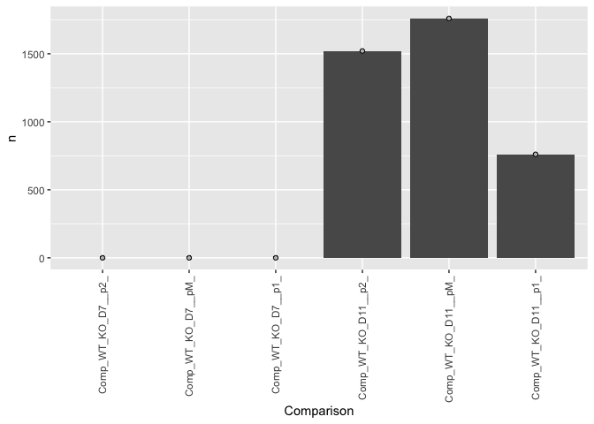
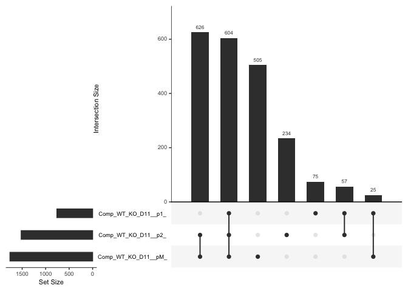
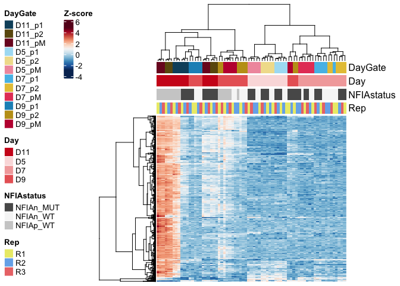
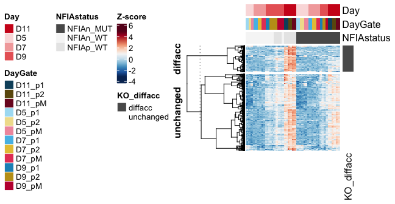

ATAC_NFIAB_KO
================

# ATAC analysis

Differential accessibility defects in NIFA/B KO.

``` r
rm(list=ls())

library(DESeq2)
library(RColorBrewer)
library(tidyverse)
library(ComplexHeatmap)
library(UpSetR)
```

### Load settings

Colors, main directory

``` r
source('./r_inputs/TemporalSpatialNeuralTube_settings.R')
```

### Set dirs

``` r
outdir="outputs_glialatac_6_NFIAB_KO/"
subworkinput="inputs_glialatac_1_eda_pca/"
ifelse(!dir.exists(file.path(workingdir,outdir)), dir.create(file.path(workingdir,outdir)), "Directory exists")
```

    ## [1] "Directory exists"

## Load data

``` r
#counts table
count_table <- read.table(file=paste0(workingdir,subworkinput,"consensus_peaks.mLb.clN.featureCounts.txt"),header=TRUE, stringsAsFactors = FALSE)

# clean colnames
colnames(count_table) <- gsub(".mLb.clN.bam","",colnames(count_table))

# we do not need coordinates
count_table <- count_table %>%
  select("Geneid", starts_with(c("MUT","WT")))


## Annotation table
ann_table <- read.table(file=paste0(workingdir,subworkinput,"consensus_peaks.mLb.clN.annotatePeaks.txt"), header=TRUE, stringsAsFactors = FALSE, sep = "\t")
colnames(ann_table)[1] <- "Peakid"


ann_table_clean <- ann_table %>% 
  select(c("Peakid","Chr","Start","End","Strand","Annotation","Distance.to.TSS","Nearest.PromoterID")) %>%
  separate(Annotation, into = "Annotation_brief", sep = " ", remove = FALSE)
```

    ## Warning: Expected 1 pieces. Additional pieces discarded in 87054 rows [2, 3, 4, 8, 11,
    ## 12, 15, 16, 17, 20, 24, 28, 29, 32, 33, 35, 36, 37, 40, 42, ...].

## Load vsd to plot heatmaps later

``` r
count_vsd <- read.csv(file=paste0(workingdir,"outputs_glialatac_1/","consensus_peaks.mLb.vsd.csv"),header=TRUE, stringsAsFactors = FALSE)
```

## Differential analysis between WT and KO for each domain at two timepoints

Targeted diff analysis in subsets of samples D11:

WT vs KO: pairwise for p1, p2, pMN

``` r
#subset 
timepoint=c("_D7_","_D11_")

#subset 
allgates=c("_p2_","_pM_","_p1_")


count_matrix <- count_table %>%
  column_to_rownames("Geneid")


PairWiseDEseq <- lapply(c(1:length(timepoint)),function (x) {
  lapply(c(1:length(allgates)), function (y) {
      timepoints <- timepoint[x]
      celltypes <- allgates[y]
      sub_counts <- count_matrix %>%
        dplyr::select(contains(celltypes) & contains(timepoints))
      
      ## Make metadata file for DESeq
      genecolData_sub <- data.frame(Sample_ID = colnames(sub_counts))
      genecolData_sub <- genecolData_sub %>% 
        separate(Sample_ID,into=c("Genotype","Day","Gate","NFIAgate","Rep"), sep="_", remove=FALSE) %>%
        mutate(Condition=paste(Genotype,Day,Gate,NFIAgate, sep="_"),
         DayNFIA=paste(Day,NFIAgate,Genotype,sep = "_"),
         DayGate=paste(Day,Gate,sep="_"),
         Experiment=paste(Genotype,Rep,sep="_"),
         NFIAstatus=paste(NFIAgate,Genotype,sep="_"))
      genecolData_sub <- as.data.frame(unclass(genecolData_sub))
      
      dds_sub <- DESeqDataSetFromMatrix(countData = sub_counts,
                                    colData = genecolData_sub,
                                    design = ~ Genotype)
      
      dds_sub <- DESeq(dds_sub)
      
      vsd_sub <- varianceStabilizingTransformation(dds_sub,blind = FALSE)
      
      # Export normalized tables for plotting elsewhere
      dds_sub_counts <- counts(dds_sub, normalized = TRUE)
      vsd_sub_data <- assay(vsd_sub)
      
      results_sub <- results(dds_sub)

      results_return <- results_sub %>% as.data.frame() %>% rownames_to_column("Interval")
      results_return$Comparison <- paste0("Comp_WT_KO",timepoints,celltypes)
      results_return

  })
}) 
```

    ## Warning in DESeqDataSet(se, design = design, ignoreRank): some variables in
    ## design formula are characters, converting to factors

    ## estimating size factors

    ## estimating dispersions

    ## gene-wise dispersion estimates

    ## mean-dispersion relationship

    ## final dispersion estimates

    ## fitting model and testing

    ## Warning in DESeqDataSet(se, design = design, ignoreRank): some variables in
    ## design formula are characters, converting to factors

    ## estimating size factors

    ## estimating dispersions

    ## gene-wise dispersion estimates

    ## mean-dispersion relationship

    ## final dispersion estimates

    ## fitting model and testing

    ## Warning in DESeqDataSet(se, design = design, ignoreRank): some variables in
    ## design formula are characters, converting to factors

    ## estimating size factors

    ## estimating dispersions

    ## gene-wise dispersion estimates

    ## mean-dispersion relationship

    ## final dispersion estimates

    ## fitting model and testing

    ## Warning in DESeqDataSet(se, design = design, ignoreRank): some variables in
    ## design formula are characters, converting to factors

    ## estimating size factors

    ## estimating dispersions

    ## gene-wise dispersion estimates

    ## mean-dispersion relationship

    ## final dispersion estimates

    ## fitting model and testing

    ## Warning in DESeqDataSet(se, design = design, ignoreRank): some variables in
    ## design formula are characters, converting to factors

    ## estimating size factors

    ## estimating dispersions

    ## gene-wise dispersion estimates

    ## mean-dispersion relationship

    ## final dispersion estimates

    ## fitting model and testing

    ## Warning in DESeqDataSet(se, design = design, ignoreRank): some variables in
    ## design formula are characters, converting to factors

    ## estimating size factors

    ## estimating dispersions

    ## gene-wise dispersion estimates

    ## mean-dispersion relationship

    ## final dispersion estimates

    ## fitting model and testing

### How many diff acc elements between WT and KO?

D7 WT vs KO does not have any elements fulfilling the filtering so they
don’t get plotted. TODO : change the bar graph to plot zeros by using
something like count.

``` r
PairWiseDEseq_list <- unlist(PairWiseDEseq, recursive = FALSE)
results_deseq_nfia <- do.call(rbind,PairWiseDEseq_list)

top_KO_comparisons <- results_deseq_nfia %>%
  as.data.frame() %>%
  filter(padj < 0.01 & abs(log2FoldChange) > 2 & baseMean > 100) 

top_KO_comparisons_count <- results_deseq_nfia %>%
  as.data.frame() %>%
  filter(padj < 0.01 & abs(log2FoldChange) > 2 & baseMean > 100) %>%
  mutate(Comparison=factor(Comparison, levels=results_deseq_nfia$Comparison %>% unique())) %>%
  group_by(Comparison) %>% dplyr::count(Comparison,.drop=FALSE)


ggplot(top_KO_comparisons_count, aes(x=Comparison,y=n)) +
  geom_col() +
  geom_point(color="black", fill="grey",shape=21) +
  theme(axis.text.x = element_text(angle = 90, vjust = 0.5, hjust=1))
```

<!-- -->

### Are they the same ones?

``` r
comparison_vector <- top_KO_comparisons$Comparison %>% unique()

list_test <- lapply(comparison_vector, function(x) {
  top_KO_comparisons[top_KO_comparisons$Comparison==x,"Interval"]
})
names(list_test) <- comparison_vector

upset(fromList(list_test), sets=comparison_vector, order.by = "freq")
```

<!-- -->
\### Visualise the elements that change

``` r
interval_subset <- top_KO_comparisons$Interval %>% unique()

# filter elements
vsd_hm <- count_vsd %>%
  filter(X %in% interval_subset) %>%
  column_to_rownames("X") 

dim(vsd_hm)
```

    ## [1] 2126   71

``` r
# z score
vsd_hm_z <- t(scale(t(vsd_hm))) 

# metadata for the heatmap
genecolData_first <- data.frame(Sample_ID = colnames(vsd_hm))
genecolData_first <- genecolData_first %>% 
  separate(Sample_ID,into=c("Genotype","Day","Gate","NFIAgate","Rep"), sep="_", remove=FALSE) %>%
  mutate(Condition=paste(Genotype,Day,Gate,NFIAgate, sep="_"),
         DayNFIA=paste(Day,NFIAgate,Genotype,sep = "_"),
         DayGate=paste(Day,Gate,sep="_"),
         Experiment=paste(Genotype,Rep,sep="_"),
         NFIAstatus=paste(NFIAgate,Genotype,sep="_"))
genecolData_first <- as.data.frame(unclass(genecolData_first))

phen_data <- genecolData_first %>%
  select(c("Sample_ID","DayGate","Day","NFIAstatus","Rep")) %>%
  remove_rownames() %>%
  column_to_rownames("Sample_ID")

ann_color_JD <- list(
  DayGate = c(D5_p1="#abdff4",D5_p2="#f1df9a", D5_pM="#f19aac",
              D7_p1="#55bee8",D7_p2="#e6c444",D7_pM="#e64466",
              D9_p1="#1a91c1",D9_p2="#c19e1a",D9_pM="#c11a3d",
              D11_p1="#0e506b",D11_p2="#6b570e",D11_pM="#7c1127"),
  NFIAstatus = c(NFIAn_WT="#f6f6f6",NFIAp_WT="#cecece",`100`="#808080",NFIAn_MUT="#595959"),
  Day = c(D5="#fadede",D7="#f3aaaa",D9="#e96666",D11="#cf1e1e"),
  Rep = c(R1="#ebeb77", R2="#77b1eb", R3="#eb7777"))


# Annotated heatmap with selected colors
hm_colors = colorRampPalette(rev(brewer.pal(n = 11, name = "RdBu")))(100)


# Build the annotation for the complex heatmap
colAnn <- HeatmapAnnotation(
    df = phen_data,
    which = 'col', # 'col' (samples) or 'row' (gene) annotation?
    na_col = 'white', # default colour for any NA values in the annotation data-frame, 'ann'
    col = ann_color_JD,
    annotation_height = 0.6,
    annotation_width = unit(1, 'cm'),
    gap = unit(1, 'mm'))


hmap <- Heatmap(vsd_hm_z,

    name = 'Z-score',

    col = hm_colors,

    # row (gene) parameters
      cluster_rows = TRUE,
      show_row_dend = TRUE,
      #row_title = 'Statistically significant genes',
      row_title_side = 'left',
      row_title_gp = gpar(fontsize = 12,  fontface = 'bold'),
      row_title_rot = 90,
      show_row_names = FALSE,
      row_names_gp = gpar(fontsize = 10, fontface = 'bold'),
      row_names_side = 'left',
      row_dend_width = unit(25,'mm'),

    # column (sample) parameters
      cluster_columns = TRUE,
      show_column_dend = TRUE,
      column_title = '',
      column_title_side = 'bottom',
      column_title_gp = gpar(fontsize = 12, fontface = 'bold'),
      column_title_rot = 0,
      show_column_names = FALSE,
      column_names_gp = gpar(fontsize = 8),
      column_names_max_height = unit(10, 'cm'),
      column_dend_height = unit(25,'mm'),

    # cluster methods for rows and columns
      clustering_distance_columns = function(x) as.dist(1 - cor(t(x))),
      clustering_method_columns = 'ward.D2',
      clustering_distance_rows = function(x) as.dist(1 - cor(t(x))),
      clustering_method_rows = 'ward.D2',

    # specify top and bottom annotations
      top_annotation = colAnn)
```

    ## `use_raster` is automatically set to TRUE for a matrix with more than
    ## 2000 rows. You can control `use_raster` argument by explicitly setting
    ## TRUE/FALSE to it.
    ## 
    ## Set `ht_opt$message = FALSE` to turn off this message.

    ## 'magick' package is suggested to install to give better rasterization.
    ## 
    ## Set `ht_opt$message = FALSE` to turn off this message.

``` r
draw(hmap,
    heatmap_legend_side = 'left',
    annotation_legend_side = 'left',
    row_sub_title_side = 'left')
```

<!-- -->

### Panel: upregulated with KO changes

All the changing elements (except 2) are downregulated in the mutant at
day 11 and should have been upregulated in over itme.

Plot the upregualted genes over time to visualize those affected by
NFIA/B.

#### Import data and select time elements

This is from `glialatac_2_time_space_1` where we already processed diff
acc between timepoints for WT only

Wild type only:

p1: pairwise only for D7-D11

p2: pairwise only for D7-D11

pM: pairwise only for D7-D11

``` r
subworkinput="outputs_glialatac_2_time_space/"
suboutdir2="output_Time_Specific/"

## filter the import for just the D7 vs D11 comparison with `pattern`

PairWiseDEseq_days <- lapply(list.files(path=paste0(workingdir,subworkinput,suboutdir2),pattern="Results_DESeq*.*_D7_vs_D11.txt", full.names=TRUE),function(x) {
  data <- read.table(x,header=T,stringsAsFactors=F) %>% as.data.frame() %>% rownames_to_column("Intervals")
  data$Comparison <- gsub(paste0(workingdir,subworkinput,suboutdir2,"/Results_DESeq_"),"", x)
  data$Comparison <- gsub(".txt","",data$Comparison)
  data
})

results_deseq_days <- do.call(rbind,PairWiseDEseq_days)
```

``` r
top_days_comparisons <- results_deseq_days %>%
  as.data.frame() %>%
  filter(padj < 0.01 & abs(log2FoldChange) > 2 & baseMean > 100)
```

#### plot

``` r
interval_subset_up <- top_days_comparisons %>% filter(log2FoldChange < 0) %>%
  select(Intervals) %>% unique()
#  top_days_comparisons$Intervals %>% unique()


# filter elements
vsd_hm <- count_vsd %>%
  filter(X %in% interval_subset_up$Intervals) %>%
  column_to_rownames("X")


dim(vsd_hm)
```

    ## [1] 7206   71

``` r
# z score
vsd_hm_z <- t(scale(t(vsd_hm))) 

# # order columns 
vsd_hm_z <- vsd_hm_z[,sorted.sample.wReps.all]


# annotate the rows for which elements are affected by KO : top_KO_comparisons
row_KO_annotation <- data.frame(intervalid=row.names(vsd_hm_z)) %>%
  mutate(KO_diffacc=case_when(intervalid %in% top_KO_comparisons$Interval ~ "diffacc", 
                              TRUE ~ "unchanged")) %>%
  select("KO_diffacc")

ann_color_row_JD <- list(
  KO_diffacc = c(diffacc="#5a5a5a",unchanged="white"))


rowAnn <- HeatmapAnnotation(
    df = row_KO_annotation,
    which = 'row', # 'col' (samples) or 'row' (gene) annotation?
    na_col = 'white', # default colour for any NA values in the annotation data-frame, 'ann'
    col = ann_color_row_JD,
    annotation_height = 0.6,
    annotation_width = unit(1, 'cm'),
    gap = unit(1, 'mm'))


# metadata for the heatmap
genecolData_first <- data.frame(Sample_ID = colnames(vsd_hm_z))
genecolData_first <- genecolData_first %>% 
  separate(Sample_ID,into=c("Genotype","Day","Gate","NFIAgate","Rep"), sep="_", remove=FALSE) %>%
  mutate(Condition=paste(Genotype,Day,Gate,NFIAgate, sep="_"),
         DayNFIA=paste(Day,NFIAgate,Genotype,sep = "_"),
         DayGate=paste(Day,Gate,sep="_"),
         Experiment=paste(Genotype,Rep,sep="_"),
         NFIAstatus=paste(NFIAgate,Genotype,sep="_"))
genecolData_first <- as.data.frame(unclass(genecolData_first))

phen_data <- genecolData_first %>%
  select(c("Sample_ID","Day","DayGate","NFIAstatus")) %>%
  remove_rownames() %>%
  column_to_rownames("Sample_ID")

ann_color_JD <- list(
  DayGate = c(D5_p1="#abdff4",D5_p2="#f1df9a", D5_pM="#f19aac",
              D7_p1="#55bee8",D7_p2="#e6c444",D7_pM="#e64466",
              D9_p1="#1a91c1",D9_p2="#c19e1a",D9_pM="#c11a3d",
              D11_p1="#0e506b",D11_p2="#6b570e",D11_pM="#7c1127"),
  NFIAstatus = c(NFIAn_WT="#f6f6f6",NFIAp_WT="#e8e8e8",`100`="#808080",NFIAn_MUT="#595959"),
  Day = c(D5="#fadede",D7="#f3aaaa",D9="#e96666",D11="#cf1e1e"))


# Annotated heatmap with selected colors
hm_colors = colorRampPalette(rev(brewer.pal(n = 11, name = "RdBu")))(100)


# Build the annotation for the complex heatmap
colAnn <- HeatmapAnnotation(
    df = phen_data,
    which = 'col', # 'col' (samples) or 'row' (gene) annotation?
    na_col = 'white', # default colour for any NA values in the annotation data-frame, 'ann'
    col = ann_color_JD,
    annotation_height = 0.6,
    annotation_width = unit(1, 'cm'),
    gap = unit(1, 'mm'))


hmap <- Heatmap(vsd_hm_z,

    name = 'Z-score',

    col = hm_colors,
    # split by KO or not
      row_split = row_KO_annotation,

    # row (gene) parameters
      cluster_rows = TRUE,
      show_row_dend = TRUE,
      #row_title = 'Statistically significant genes',
      row_title_side = 'left',
      row_title_gp = gpar(fontsize = 12,  fontface = 'bold'),
      row_title_rot = 90,
      show_row_names = FALSE,
      row_names_gp = gpar(fontsize = 10, fontface = 'bold'),
      row_names_side = 'left',
      row_dend_width = unit(25,'mm'),

    # column (sample) parameters
      cluster_columns = FALSE,
      show_column_dend = TRUE,
      column_title = '',
      column_title_side = 'bottom',
      column_title_gp = gpar(fontsize = 12, fontface = 'bold'),
      column_title_rot = 0,
      show_column_names = FALSE,
      column_names_gp = gpar(fontsize = 8),
      column_names_max_height = unit(10, 'cm'),
      column_dend_height = unit(25,'mm'),

    # cluster methods for rows and columns
      clustering_distance_columns = function(x) as.dist(1 - cor(t(x))),
      clustering_method_columns = 'ward.D2',
      clustering_distance_rows = function(x) as.dist(1 - cor(t(x))),
      clustering_method_rows = 'ward.D2',

    # specify top and bottom annotations
    right_annotation = rowAnn,  
    top_annotation = colAnn)
```

    ## `use_raster` is automatically set to TRUE for a matrix with more than
    ## 2000 rows. You can control `use_raster` argument by explicitly setting
    ## TRUE/FALSE to it.
    ## 
    ## Set `ht_opt$message = FALSE` to turn off this message.

    ## 'magick' package is suggested to install to give better rasterization.
    ## 
    ## Set `ht_opt$message = FALSE` to turn off this message.

``` r
draw(hmap,
    heatmap_legend_side = 'left',
    annotation_legend_side = 'left',
    row_sub_title_side = 'left')
```

<!-- -->

``` r
# print heatmap
pdf(paste0(workingdir,subworkinput,"Heatmap_NFIAB_KOup_ATAC.pdf"), width = 6.75, height = 3.5) 

draw(hmap,
    heatmap_legend_side = 'left',
    annotation_legend_side = 'left',
    row_sub_title_side = 'left')

dev.off()
```

    ## quartz_off_screen 
    ##                 2

``` r
sessionInfo()
```

    ## R version 4.4.0 (2024-04-24)
    ## Platform: aarch64-apple-darwin20
    ## Running under: macOS Sonoma 14.4.1
    ## 
    ## Matrix products: default
    ## BLAS:   /Library/Frameworks/R.framework/Versions/4.4-arm64/Resources/lib/libRblas.0.dylib 
    ## LAPACK: /Library/Frameworks/R.framework/Versions/4.4-arm64/Resources/lib/libRlapack.dylib;  LAPACK version 3.12.0
    ## 
    ## locale:
    ## [1] en_US.UTF-8/en_US.UTF-8/en_US.UTF-8/C/en_US.UTF-8/en_US.UTF-8
    ## 
    ## time zone: Europe/London
    ## tzcode source: internal
    ## 
    ## attached base packages:
    ## [1] grid      stats4    stats     graphics  grDevices utils     datasets 
    ## [8] methods   base     
    ## 
    ## other attached packages:
    ##  [1] UpSetR_1.4.0                ComplexHeatmap_2.19.0      
    ##  [3] lubridate_1.9.3             forcats_1.0.0              
    ##  [5] stringr_1.5.1               dplyr_1.1.4                
    ##  [7] purrr_1.0.2                 readr_2.1.5                
    ##  [9] tidyr_1.3.1                 tibble_3.2.1               
    ## [11] ggplot2_3.5.1               tidyverse_2.0.0            
    ## [13] RColorBrewer_1.1-3          DESeq2_1.43.5              
    ## [15] SummarizedExperiment_1.33.3 Biobase_2.63.1             
    ## [17] MatrixGenerics_1.15.1       matrixStats_1.3.0          
    ## [19] GenomicRanges_1.55.4        GenomeInfoDb_1.39.14       
    ## [21] IRanges_2.37.1              S4Vectors_0.41.7           
    ## [23] BiocGenerics_0.49.1        
    ## 
    ## loaded via a namespace (and not attached):
    ##  [1] tidyselect_1.2.1        farver_2.1.1            fastmap_1.1.1          
    ##  [4] digest_0.6.35           timechange_0.3.0        lifecycle_1.0.4        
    ##  [7] cluster_2.1.6           Cairo_1.6-2             magrittr_2.0.3         
    ## [10] compiler_4.4.0          rlang_1.1.3             tools_4.4.0            
    ## [13] utf8_1.2.4              yaml_2.3.8              knitr_1.46             
    ## [16] labeling_0.4.3          S4Arrays_1.3.7          DelayedArray_0.29.9    
    ## [19] plyr_1.8.9              abind_1.4-5             BiocParallel_1.37.1    
    ## [22] withr_3.0.0             fansi_1.0.6             colorspace_2.1-0       
    ## [25] scales_1.3.0            iterators_1.0.14        cli_3.6.2              
    ## [28] rmarkdown_2.26          crayon_1.5.2            generics_0.1.3         
    ## [31] rstudioapi_0.16.0       httr_1.4.7              tzdb_0.4.0             
    ## [34] rjson_0.2.21            zlibbioc_1.49.3         parallel_4.4.0         
    ## [37] XVector_0.43.1          vctrs_0.6.5             Matrix_1.7-0           
    ## [40] jsonlite_1.8.8          hms_1.1.3               GetoptLong_1.0.5       
    ## [43] clue_0.3-65             locfit_1.5-9.9          foreach_1.5.2          
    ## [46] glue_1.7.0              codetools_0.2-20        stringi_1.8.3          
    ## [49] gtable_0.3.5            shape_1.4.6.1           UCSC.utils_0.99.7      
    ## [52] munsell_0.5.1           pillar_1.9.0            htmltools_0.5.8.1      
    ## [55] GenomeInfoDbData_1.2.12 circlize_0.4.16         R6_2.5.1               
    ## [58] doParallel_1.0.17       evaluate_0.23           lattice_0.22-6         
    ## [61] highr_0.10              png_0.1-8               Rcpp_1.0.12            
    ## [64] gridExtra_2.3           SparseArray_1.3.7       xfun_0.43              
    ## [67] pkgconfig_2.0.3         GlobalOptions_0.1.2
