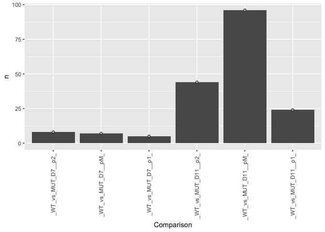
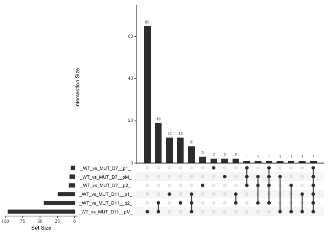
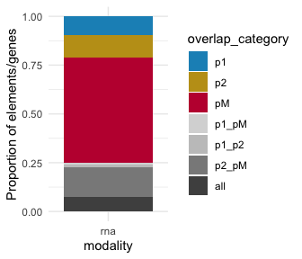

RNA_NFIAB_KO
================

# RNA analysis

Differential gene exp in groups of samples: genes changing over time,
and defects in NIFA/B KO.

Generate the comparison and export the data.

Start the analysis in the next script by importing these data so it is
more efficient.

``` r
rm(list=ls())

library(DESeq2)
library(RColorBrewer)
library(tidyverse)
library(ComplexHeatmap)
library(tximport)
library(UpSetR)
```

### Load settings

Colors, main directory

``` r
source('./r_inputs/TemporalSpatialNeuralTube_settings.R')
```

### Set dirs

``` r
outdir="outputs_NFIAB_RNA/"
#outdir="outputs_glialRNA_3_NFIAB_KO/"
subworkinput="inputs_glialRNA_1_qc/"
ifelse(!dir.exists(file.path(workingdir,outdir)), dir.create(file.path(workingdir,outdir)), "Directory exists")
```

    ## [1] "Directory exists"

``` r
suboutdir1="output_WT_KO_D7_D11/"
ifelse(!dir.exists(file.path(workingdir,outdir,suboutdir1)), dir.create(file.path(workingdir,outdir,suboutdir1)), "Directory exists")
```

    ## [1] "Directory exists"

## Load data

For RNA analysis, we are using the output of star_salmon so the import
to deseq is a bit more complicated.

``` r
#salmon counts from pipeline, import
path_files =  list.files(paste0(workingdir,subworkinput)) 
samples = data.frame(run=path_files, stringsAsFactors = FALSE) %>%
  filter(str_detect(run, "MUT|WT"))

files <- file.path(paste0(workingdir,subworkinput), samples$run, "quant.sf")
names(files) <- samples$run
all(file.exists(files))
```

    ## [1] TRUE

``` r
#from pipeline
tx2gene = read_tsv(paste0(paste0(workingdir,subworkinput),"/salmon_tx2gene.tsv"))
```

    ## New names:
    ## Rows: 35210 Columns: 3
    ## ── Column specification
    ## ──────────────────────────────────────────────────────── Delimiter: "\t" chr
    ## (3): NM_001011874, Xkr4...2, Xkr4...3
    ## ℹ Use `spec()` to retrieve the full column specification for this data. ℹ
    ## Specify the column types or set `show_col_types = FALSE` to quiet this message.
    ## • `Xkr4` -> `Xkr4...2`
    ## • `Xkr4` -> `Xkr4...3`

``` r
txi.salmon <- tximport(files, type = "salmon", tx2gene = tx2gene)
```

    ## reading in files with read_tsv
    ## 1 2 3 4 5 6 7 8 9 10 11 12 13 14 15 16 17 18 19 20 21 22 23 24 25 26 27 28 29 30 31 32 33 34 35 36 37 38 39 40 41 42 43 44 45 46 47 48 49 50 51 52 53 54 55 56 57 58 59 60 61 62 63 64 65 66 
    ## transcripts missing from tx2gene: 1
    ## summarizing abundance
    ## summarizing counts
    ## summarizing length

## Differential analysis between WT and KO for each domain at two timepoints

Targeted diff analysis in subsets of samples:

Just for D7 and D11: WT vs KO: pairwise for p1, p2, pMN WT vs KO:
pairwise for p1, p2, pMN

This DESeq2 analysis is done by subsetting samples. I subset the
`txi.salmon$counts` table and then use `DESeqDataSetFromMatrix` with
`round(sub_counts)` to perform the differential analysis.

``` r
count_table <- txi.salmon$counts

count_matrix <- count_table %>%
  as.data.frame() %>%
  rownames_to_column("GeneID") %>%
  filter(!str_starts(GeneID, "ERCC")) %>%
  column_to_rownames("GeneID")

#subset 
timepoint=c("_D7_","_D11_")
#subset 
allgates=c("_p2_","_pM_","_p1_")

#no filtering based on genotype

comparisons <- allgates


PairWiseDEseq <- lapply(c(1:length(timepoint)),function (x) {
  lapply(c(1:length(allgates)), function (y) {
      timepoints <- timepoint[x]
      celltypes <- allgates[y]
      sub_counts <- count_matrix %>%
        dplyr::select(contains(celltypes) & contains(timepoints))
      
      ## Make metadata file for DESeq
      genecolData_sub <- data.frame(Sample_ID = colnames(sub_counts))
      genecolData_sub <- genecolData_sub %>% 
        separate(Sample_ID,into=c("Genotype","Day","Gate","NFIAgate","Rep"), sep="_", remove=FALSE) %>%
        mutate(Condition=paste(Genotype,Day,Gate,NFIAgate, sep="_"),
         DayNFIA=paste(Day,NFIAgate,Genotype,sep = "_"),
         DayGate=paste(Day,Gate,sep="_"),
         Experiment=paste(Genotype,Rep,sep="_"),
         NFIAstatus=paste(NFIAgate,Genotype,sep="_"))
      genecolData_sub <- as.data.frame(unclass(genecolData_sub))
      
      dds_sub <- DESeqDataSetFromMatrix(countData =  round(sub_counts),
                                    colData = genecolData_sub,
                                    design = ~ Genotype)
      
      dds_sub <- DESeq(dds_sub)
      
      vsd_sub <- varianceStabilizingTransformation(dds_sub,blind = FALSE)
      
      # Export normalized tables for plotting elsewhere
      dds_sub_counts <- counts(dds_sub, normalized = TRUE)
      vsd_sub_data <- assay(vsd_sub)
      
      results_sub <- results(dds_sub)

      results_return <- results_sub %>% as.data.frame() %>% rownames_to_column("Geneid")
      results_return$Comparison <- paste0(resultsNames(dds_sub)[2],timepoints,celltypes)
      results_return$Comparison <- gsub("Genotype","",results_return$Comparison)
      results_return

  })
}) 
```

    ## Warning in DESeqDataSet(se, design = design, ignoreRank): some variables in
    ## design formula are characters, converting to factors
    ## Warning in DESeqDataSet(se, design = design, ignoreRank): some variables in
    ## design formula are characters, converting to factors
    ## Warning in DESeqDataSet(se, design = design, ignoreRank): some variables in
    ## design formula are characters, converting to factors
    ## Warning in DESeqDataSet(se, design = design, ignoreRank): some variables in
    ## design formula are characters, converting to factors
    ## Warning in DESeqDataSet(se, design = design, ignoreRank): some variables in
    ## design formula are characters, converting to factors
    ## Warning in DESeqDataSet(se, design = design, ignoreRank): some variables in
    ## design formula are characters, converting to factors

### RNA: How many diff expressed genes between WT and KO?

``` r
PairWiseDEseq_list <- unlist(PairWiseDEseq, recursive = FALSE)
results_deseq_nfia_rna <- do.call(rbind,PairWiseDEseq_list)


fc_cut <- 1
mean_cut <- 80

top_KO_comparisons_rna <- results_deseq_nfia_rna %>%
  as.data.frame() %>%
  filter(padj < 0.01 & abs(log2FoldChange) > fc_cut & baseMean > mean_cut) 

top_KO_comparisons_count_rna <- results_deseq_nfia_rna %>%
  as.data.frame() %>%
  filter(padj < 0.01 & abs(log2FoldChange) > fc_cut & baseMean > mean_cut) %>%
  mutate(Comparison=factor(Comparison, levels=results_deseq_nfia_rna$Comparison %>% unique())) %>%
  group_by(Comparison) %>% dplyr::count(Comparison,.drop=FALSE)

ggplot(top_KO_comparisons_count_rna, aes(x=Comparison,y=n)) +
  geom_col() +
  geom_point(color="black", fill="grey",shape=21) +
  theme(axis.text.x = element_text(angle = 90, vjust = 0.5, hjust=1))
```

<!-- -->

### Are they the same ones? upset

``` r
comparison_vector <- top_KO_comparisons_rna$Comparison %>% unique()

list_rna <- lapply(comparison_vector, function(x) {
  top_KO_comparisons_rna[top_KO_comparisons_rna$Comparison==x,"Geneid"]
})
names(list_rna) <- comparison_vector

#upset(fromList(list_test), sets=comparison_vector, order.by = "degree")
upset(fromList(list_rna), sets=comparison_vector, order.by = "freq")
```

<!-- -->

``` r
top_KO_comparisons_rna_d11 <- top_KO_comparisons_rna[str_detect(top_KO_comparisons_rna$Comparison, "_D11__"),"Comparison"] %>% unique()

list_rna_d11 <- lapply(top_KO_comparisons_rna_d11, function(x) {
  top_KO_comparisons_rna[top_KO_comparisons_rna$Comparison==x,"Geneid"]
})
names(list_rna_d11) <- top_KO_comparisons_rna_d11
```

### Fig: Stacked bars

``` r
rna_d11 <- fromList(list_rna_d11)

rna_d11_shaped <- rna_d11 %>%
  mutate(overlap_category=case_when( `_WT_vs_MUT_D11__p1_`=="1" & `_WT_vs_MUT_D11__p2_`=="0" & `_WT_vs_MUT_D11__pM_`=="0" ~ "p1",
                                     `_WT_vs_MUT_D11__p1_`=="0" & `_WT_vs_MUT_D11__p2_`=="1" & `_WT_vs_MUT_D11__pM_`=="0" ~ "p2",
                                     `_WT_vs_MUT_D11__p1_`=="0" & `_WT_vs_MUT_D11__p2_`=="0" & `_WT_vs_MUT_D11__pM_`=="1" ~ "pM",
                                     `_WT_vs_MUT_D11__p1_`=="1" & `_WT_vs_MUT_D11__p2_`=="1" & `_WT_vs_MUT_D11__pM_`=="1" ~ "all",
                                     `_WT_vs_MUT_D11__p1_`=="1" & `_WT_vs_MUT_D11__p2_`=="1" & `_WT_vs_MUT_D11__pM_`=="0" ~ "p1_p2",
                                     `_WT_vs_MUT_D11__p1_`=="0" & `_WT_vs_MUT_D11__p2_`=="1" & `_WT_vs_MUT_D11__pM_`=="1" ~ "p2_pM",
                                     `_WT_vs_MUT_D11__p1_`=="1" & `_WT_vs_MUT_D11__p2_`=="0" & `_WT_vs_MUT_D11__pM_`=="1" ~ "p1_pM",
                                     TRUE ~ "error")) %>%
  mutate(modality="rna") %>%
  mutate(overlap_category=factor(overlap_category, levels=rev(c("all","p2_pM","p1_p2","p1_pM","pM","p2","p1")))) %>%
  dplyr::select(overlap_category,modality)
```

``` r
bar_KO_atac_RNA <- ggplot(rna_d11_shaped, aes(x=modality)) + 
                      geom_bar(aes(fill=overlap_category), position = "fill") +
                      scale_fill_manual(values = rev(c("#4f4f4f","#8a8a8a","#c5c5c5","#d8d8d8","#c11a3d","#c19e1a","#1a91c1"))) +
                      ylab("Proportion of elements/genes") +
                      theme_minimal()

ggsave(plot=bar_KO_atac_RNA, filename=paste0(workingdir,outdir,"BarStacked_KO_ATAC_RNA.pdf"), device = "pdf",
             width=3.5, height=3, units="in", useDingbats=FALSE)


bar_KO_atac_RNA
```

<!-- -->

``` r
sessionInfo()
```

    ## R version 4.4.0 (2024-04-24)
    ## Platform: aarch64-apple-darwin20
    ## Running under: macOS 15.2
    ## 
    ## Matrix products: default
    ## BLAS:   /Library/Frameworks/R.framework/Versions/4.4-arm64/Resources/lib/libRblas.0.dylib 
    ## LAPACK: /Library/Frameworks/R.framework/Versions/4.4-arm64/Resources/lib/libRlapack.dylib;  LAPACK version 3.12.0
    ## 
    ## locale:
    ## [1] en_US.UTF-8/en_US.UTF-8/en_US.UTF-8/C/en_US.UTF-8/en_US.UTF-8
    ## 
    ## time zone: Europe/London
    ## tzcode source: internal
    ## 
    ## attached base packages:
    ## [1] grid      stats4    stats     graphics  grDevices utils     datasets 
    ## [8] methods   base     
    ## 
    ## other attached packages:
    ##  [1] UpSetR_1.4.0                tximport_1.32.0            
    ##  [3] ComplexHeatmap_2.20.0       lubridate_1.9.3            
    ##  [5] forcats_1.0.0               stringr_1.5.1              
    ##  [7] dplyr_1.1.4                 purrr_1.0.2                
    ##  [9] readr_2.1.5                 tidyr_1.3.1                
    ## [11] tibble_3.2.1                ggplot2_3.5.1              
    ## [13] tidyverse_2.0.0             RColorBrewer_1.1-3         
    ## [15] DESeq2_1.44.0               SummarizedExperiment_1.34.0
    ## [17] Biobase_2.64.0              MatrixGenerics_1.16.0      
    ## [19] matrixStats_1.3.0           GenomicRanges_1.56.0       
    ## [21] GenomeInfoDb_1.40.1         IRanges_2.38.0             
    ## [23] S4Vectors_0.42.0            BiocGenerics_0.50.0        
    ## 
    ## loaded via a namespace (and not attached):
    ##  [1] tidyselect_1.2.1        farver_2.1.2            fastmap_1.2.0          
    ##  [4] digest_0.6.35           timechange_0.3.0        lifecycle_1.0.4        
    ##  [7] cluster_2.1.6           magrittr_2.0.3          compiler_4.4.0         
    ## [10] rlang_1.1.4             tools_4.4.0             utf8_1.2.4             
    ## [13] yaml_2.3.8              knitr_1.47              labeling_0.4.3         
    ## [16] S4Arrays_1.4.1          bit_4.0.5               DelayedArray_0.30.1    
    ## [19] plyr_1.8.9              abind_1.4-5             BiocParallel_1.38.0    
    ## [22] withr_3.0.0             fansi_1.0.6             colorspace_2.1-0       
    ## [25] scales_1.3.0            iterators_1.0.14        cli_3.6.2              
    ## [28] rmarkdown_2.27          crayon_1.5.2            ragg_1.3.2             
    ## [31] generics_0.1.3          rstudioapi_0.16.0       httr_1.4.7             
    ## [34] tzdb_0.4.0              rjson_0.2.21            zlibbioc_1.50.0        
    ## [37] parallel_4.4.0          XVector_0.44.0          vctrs_0.6.5            
    ## [40] Matrix_1.7-0            jsonlite_1.8.8          hms_1.1.3              
    ## [43] GetoptLong_1.0.5        bit64_4.0.5             clue_0.3-65            
    ## [46] systemfonts_1.1.0       locfit_1.5-9.9          foreach_1.5.2          
    ## [49] glue_1.7.0              codetools_0.2-20        stringi_1.8.4          
    ## [52] gtable_0.3.5            shape_1.4.6.1           UCSC.utils_1.0.0       
    ## [55] munsell_0.5.1           pillar_1.9.0            htmltools_0.5.8.1      
    ## [58] GenomeInfoDbData_1.2.12 circlize_0.4.16         R6_2.5.1               
    ## [61] textshaping_0.4.0       doParallel_1.0.17       vroom_1.6.5            
    ## [64] evaluate_0.23           lattice_0.22-6          highr_0.11             
    ## [67] png_0.1-8               Rcpp_1.0.12             gridExtra_2.3          
    ## [70] SparseArray_1.4.8       xfun_0.44               pkgconfig_2.0.3        
    ## [73] GlobalOptions_0.1.2
