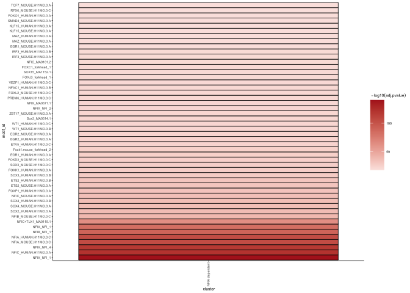
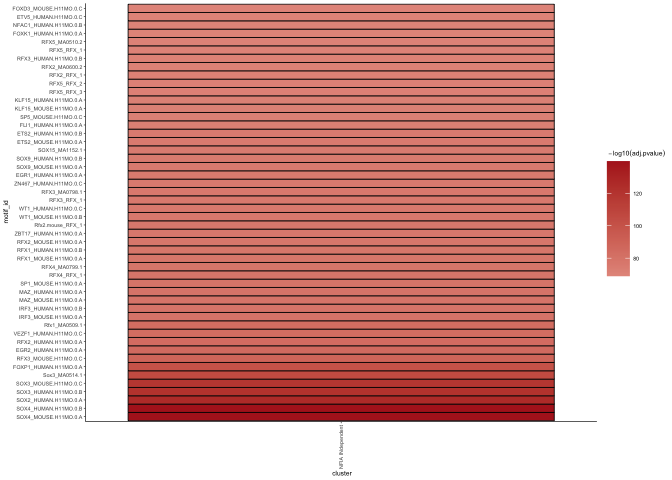
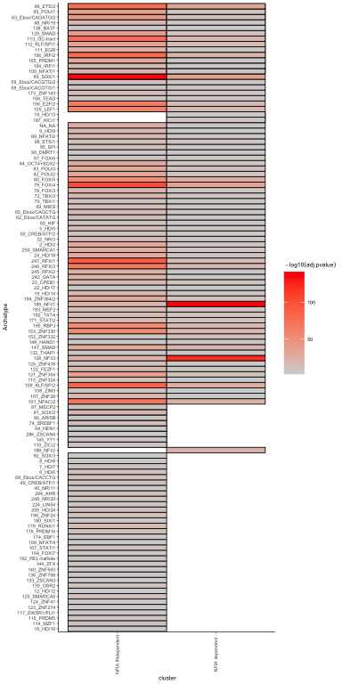

glialatac_7\_NFIA_dependent_elements_meme_motifs
================

## Guidelines on how to install and use MEME suite is here: <https://snystrom.github.io/memes-manual/index.html>

## Load libraries

``` r
rm(list=ls())

library(BiocManager)
library(genomation)
```

    ## Loading required package: grid

    ## Warning: replacing previous import 'Biostrings::pattern' by 'grid::pattern'
    ## when loading 'genomation'

``` r
library(GenomicRanges) #GRanges
```

    ## Loading required package: stats4

    ## Loading required package: BiocGenerics

    ## 
    ## Attaching package: 'BiocGenerics'

    ## The following objects are masked from 'package:stats':
    ## 
    ##     IQR, mad, sd, var, xtabs

    ## The following objects are masked from 'package:base':
    ## 
    ##     anyDuplicated, aperm, append, as.data.frame, basename, cbind,
    ##     colnames, dirname, do.call, duplicated, eval, evalq, Filter, Find,
    ##     get, grep, grepl, intersect, is.unsorted, lapply, Map, mapply,
    ##     match, mget, order, paste, pmax, pmax.int, pmin, pmin.int,
    ##     Position, rank, rbind, Reduce, rownames, sapply, setdiff, sort,
    ##     table, tapply, union, unique, unsplit, which.max, which.min

    ## Loading required package: S4Vectors

    ## 
    ## Attaching package: 'S4Vectors'

    ## The following objects are masked from 'package:base':
    ## 
    ##     expand.grid, I, unname

    ## Loading required package: IRanges

    ## Loading required package: GenomeInfoDb

``` r
library(magrittr)
```

    ## 
    ## Attaching package: 'magrittr'

    ## The following object is masked from 'package:GenomicRanges':
    ## 
    ##     subtract

``` r
library(Biostrings)
```

    ## Loading required package: XVector

    ## 
    ## Attaching package: 'Biostrings'

    ## The following object is masked from 'package:grid':
    ## 
    ##     pattern

    ## The following object is masked from 'package:base':
    ## 
    ##     strsplit

``` r
library(BSgenome.Mmusculus.UCSC.mm10)
```

    ## Loading required package: BSgenome

    ## Loading required package: rtracklayer

``` r
#library(JASPAR2020)
##library(TFBSTools)
##library(SummarizedExperiment)
##library(Matrix)
library(tidyverse)
```

    ## ── Attaching packages ─────────────────────────────────────── tidyverse 1.3.2
    ## ──

    ## ✔ ggplot2 3.4.1     ✔ purrr   1.0.1
    ## ✔ tibble  3.1.8     ✔ dplyr   1.1.0
    ## ✔ tidyr   1.3.0     ✔ stringr 1.5.0
    ## ✔ readr   2.1.4     ✔ forcats 1.0.0
    ## ── Conflicts ────────────────────────────────────────── tidyverse_conflicts() ──
    ## ✖ dplyr::collapse()    masks Biostrings::collapse(), IRanges::collapse()
    ## ✖ dplyr::combine()     masks BiocGenerics::combine()
    ## ✖ purrr::compact()     masks XVector::compact()
    ## ✖ dplyr::desc()        masks IRanges::desc()
    ## ✖ tidyr::expand()      masks S4Vectors::expand()
    ## ✖ tidyr::extract()     masks magrittr::extract()
    ## ✖ dplyr::filter()      masks stats::filter()
    ## ✖ dplyr::first()       masks S4Vectors::first()
    ## ✖ dplyr::lag()         masks stats::lag()
    ## ✖ ggplot2::Position()  masks BiocGenerics::Position(), base::Position()
    ## ✖ purrr::reduce()      masks GenomicRanges::reduce(), IRanges::reduce()
    ## ✖ dplyr::rename()      masks S4Vectors::rename()
    ## ✖ purrr::set_names()   masks magrittr::set_names()
    ## ✖ dplyr::slice()       masks XVector::slice(), IRanges::slice()
    ## ✖ magrittr::subtract() masks GenomicRanges::subtract()

``` r
library(readxl)
library(memes)
library(motifmatchr)
```

    ## 

``` r
##library(cmdfun)
library(universalmotif)
##library(grafify)
library(broom)

# Make sure to have installed MEME on your computer

options(meme_bin = "/Users/delasj/meme/bin/")

# Checking if MEME is installed

meme_is_installed()
```

    ## [1] TRUE

``` r
check_meme_install()
```

    ## checking main install
    ## ✔ /Users/delasj/meme/binchecking util installs
    ## ✔ /Users/delasj/meme/bin/dreme✔ /Users/delasj/meme/bin/ame✔ /Users/delasj/meme/bin/fimo✔ /Users/delasj/meme/bin/tomtom✔ /Users/delasj/meme/bin/meme✔ /Users/delasj/meme/bin/streme

AME from the MEME suite is used to test for enrichment of known motifs
in target sequences. runAme() will use the MEME_DB entry in .Renviron or
options(meme_db = “path/to/database.meme”) as the motif database.
Alternately, it will accept all valid inputs similar to runTomTom().

Sequence Inputs can be any of:

- Path to a .fasta formatted file
- Biostrings::XStringSet (can be generated from GRanges using
  get_sequence() helper function)
- A named list of Biostrings::XStringSet objects (generated by
  get_sequence())

### Set dirs

``` r
workingdir="~/Dropbox (The Francis Crick)/Glial_cisReg/"
subworkinput="outputs_glialatac_6_NFIAB_KO/"

outdir="outputs_glialatac_7_NFIAB_KO_indepdenent_motifs/"
ifelse(!dir.exists(file.path(workingdir,outdir)), dir.create(file.path(workingdir,outdir)), "Directory exists")
```

    ## [1] "Directory exists"

## Colors and custom plotting

``` r
sorted.DayGate <- c("D5_p1","D5_p2","D5_pM",
                    "D7_p1","D7_p2","D7_pM",
                    "D9_p1","D9_p2","D9_pM",
                    "D11_p1","D11_p2","D11_pM")
sorted.day <- c("D5","D7","D9","D11")
sorted.dayNfia <- c("D5_NFIAn_WT","D5_NFIAn_MUT",
                    "D7_NFIAn_WT","D7_NFIAn_MUT",
                    "D9_NFIAn_WT","D9_NFIAp_WT","D9_NFIAn_MUT",
                    "D11_NFIAp_WT","D11_NFIAn_MUT")

colorIZ <- c("#abdff4","#f1df9a","#f19aac",
             "#55bee8","#e6c444","#e64466",
            "#1a91c1","#c19e1a","#c11a3d",
            "#0e506b","#6b570e","#7c1127")

sorted.sample <- c("WT_D5_p1_NFIAn","WT_D5_p2_NFIAn","WT_D5_pM_NFIAn","WT_D7_p1_NFIAn","WT_D7_p2_NFIAn","WT_D7_pM_NFIAn","WT_D9_p1_NFIAn","WT_D9_p2_NFIAn","WT_D9_p2_NFIAp","WT_D9_pM_NFIAn","WT_D9_pM_NFIAp","WT_D11_p1_NFIAp","WT_D11_p2_NFIAp","WT_D11_pM_NFIAp")
```

## Import data

``` r
# Load mouse genome
# Using the get_sequence() function, GRanges objects are converted into DNAStringSet
mouse_genome <- BSgenome.Mmusculus.UCSC.mm10::BSgenome.Mmusculus.UCSC.mm10

# Get JASPAR2020 known TF database

#jaspar <- "JASPAR2018_CORE_vertebrates_non-redundant_pfms.meme"
all_archetype <- "motifs_archetypes.meme"

db <- paste0(workingdir,"inputs_glialatac_4_inputs_meme/",all_archetype)
```

And RNAseq normalized data for correlations at the end

``` r
gene_exp <- read.table(paste0(workingdir,"outputs_glialRNA_1/","featurecounts.normCounts.txt"),stringsAsFactors =FALSE)
```

Clean RNA table. The clusters are based on WT samples only

``` r
# gene_exp_preclean <- gene_exp %>%
#   rownames_to_column("genename") %>%
#   gather(sample, norm_counts, starts_with("WT")) %>%
#   separate(sample,into=c("Genotype","Day","Gate","NFIAgate","Rep"), sep="_", remove=FALSE) %>%
#   mutate(Condition=paste(Genotype,Day,Gate,NFIAgate, sep="_")) %>%
#   group_by(Condition, genename) %>%
#   summarise(ave_count = mean(norm_counts), .groups="keep")
```

Import vsd atac data

``` r
count_vsd <- read.csv(file=paste0(workingdir,"outputs_glialatac_1/","consensus_peaks.mLb.vsd.csv"),header=TRUE, stringsAsFactors = FALSE)

count_vsd_wt <- count_vsd %>% select("X", starts_with("WT"))
```

### Import full peak table

``` r
## Annotation table
ann_table <- read.table(file=paste0(workingdir,"inputs_glialatac_1_eda_pca/","consensus_peaks.mLb.clN.annotatePeaks.txt"), header=TRUE, stringsAsFactors = FALSE, sep = "\t")
colnames(ann_table)[1] <- "Peakid"
```

### Import the Invervals that are NFIA dependent and independent

``` r
elements_NFIAB_dep <- read.csv(paste0(workingdir,subworkinput,"Elements_D11_vs_D7_NFIA_dependent.csv"))
elements_NFIAB_indep <- read.csv(paste0(workingdir,subworkinput,"Elements_D11_vs_D7_NFIA_INdependent.csv"))
```

### get bed format lists of elements

``` r
NFIAB_dep_bed <- ann_table %>% 
  filter(Peakid %in% elements_NFIAB_dep$x) %>%
  select(c("Chr","Start","End","Peakid"))

NFIAB_indep_bed <- ann_table %>% 
  filter(Peakid %in% elements_NFIAB_indep$x) %>%
  select(c("Chr","Start","End","Peakid"))
```

## motif enrichment

Manual - for now. NFIA-dependent

``` r
cluster_bed <- GRanges(NFIAB_dep_bed)
 
 # Resizing to same length
  cluster_seq <- cluster_bed %>%
    resize(200, "center") %>%
    get_sequence(mouse_genome)

  ## Run motif enrichment with heatmap visualisation
  ame_results_NFIAdepen <- runAme(cluster_seq, database = db, method = "fisher") %>%
                         mutate(cluster = "NFIA dependent")

  # plot_ame_heatmap(ame_results, group = cluster) +
  #     coord_flip() +
  #     theme_classic(base_size = 5) +
  #     theme(axis.text.x = element_text(angle = 90, vjust = 0.5))

  # By padj value
top_50_cluster_1 <- dplyr::filter(ame_results_NFIAdepen, adj.pvalue < 0.00000001)

  ## By Rank
top_50_cluster_1 <- dplyr::filter(ame_results_NFIAdepen, rank <= 50)

plot_ame_heatmap(top_50_cluster_1, group = cluster) +
      coord_flip() +
      theme_classic(base_size = 5) +
      theme(axis.text.x = element_text(angle = 90, vjust = 0.5))
```

<!-- -->

NFIA independent elements

``` r
cluster_bed <- GRanges(NFIAB_indep_bed)
 
 # Resizing to same length
  cluster_seq <- cluster_bed %>%
    resize(200, "center") %>%
    get_sequence(mouse_genome)

  ## Run motif enrichment with heatmap visualisation
  ame_results_NFIAindepen <- runAme(cluster_seq, database = db, method = "fisher") %>%
                         mutate(cluster = "NFIA INdependent")

# They are too many, this is not useful
  # plot_ame_heatmap(ame_results, group = cluster) +
  #     coord_flip() +
  #     theme_classic(base_size = 5) +
  #     theme(axis.text.x = element_text(angle = 90, vjust = 0.5))

  # By padj value
top_50_cluster_1 <- dplyr::filter(ame_results_NFIAindepen, adj.pvalue < 0.00000001)

  ## By Rank
top_50_cluster_1 <- dplyr::filter(ame_results_NFIAindepen, rank <= 50)

plot_ame_heatmap(top_50_cluster_1, group = cluster) +
      coord_flip() +
      theme_classic(base_size = 5) +
      theme(axis.text.x = element_text(angle = 90, vjust = 0.5))
```

<!-- -->

``` r
# get_motif_enrich_clusters <- function(c){
#   # Upload .bed files of all clusters into a GRanges from genomation
#   cluster_bed <- readGeneric(file=paste0(workingdir,subworkinput,"Intervals_Cluster_",c,".bed"), 
#                              chr = 1, start = 2, end = 3, strand = NULL,
#                               meta.cols = NULL, keep.all.metadata = TRUE, zero.based = TRUE,
#                               remove.unusual = FALSE, header = FALSE, skip = 0, sep = "\t")
#   
#   # Resizing to same length
#   cluster_seq <- cluster_bed %>%
#     resize(200, "center") %>%
#     get_sequence(mouse_genome)
#   
#   ## Run motif enrichment with heatmap visualisation
#   ame_results <- runAme(cluster_seq, database = db, method = "fisher") %>%
#                          mutate(cluster = paste0("Cluster_",c))
#   
#   write.table(ame_results, file=paste0(workingdir,outdir,"AMEresults_Cluster",c,".txt"),
#                 sep="\t", col.names = F, row.names = F, quote = F)
#   
#   plot_ame_heatmap(ame_results, group = cluster) +
#       coord_flip() +
#       theme_classic(base_size = 5) +
#       theme(axis.text.x = element_text(angle = 90, vjust = 0.5))
#     ggsave(paste0(workingdir,outdir,"AMEresults_plot_Cluster_",c,".pdf"),
#            width=4,height = 15, units="in", useDingbats=FALSE)
#   
#   ame_results
#   
# }
# 
# 
# # hard coded number of clusters identified in kmeans script
# kmeansReClusters <- c(1:7)
# 
# #test <- get_motif_enrich_clusters("1")
# ame_results_clusters <- lapply(kmeansReClusters,get_motif_enrich_clusters)
# 
# ame_results_table <- do.call(rbind,ame_results_clusters)


ame_results_table <- do.call(rbind, list(ame_results_NFIAdepen,ame_results_NFIAindepen))

## By Rank
#top_50_cluster_1 <- dplyr::filter(ame_results_cluster_1, rank <= 30)
## By padj value
#top_50_cluster_1 <- dplyr::filter(ame_results_cluster_1, adj.pvalue < 0.00000001)
```

``` r
# Save files

# write.csv(ame_results_cluster_1,file = "~/Dropbox (The Francis Crick)/Isabel_Joaquina_Gliogenic_Switch_Paper/Motif_enrichment/Cluster_1_Enriched_Motifs.csv", quote = FALSE, row.names = FALSE)
# write.table(ame_results_cluster_1,file = "~/Dropbox (The Francis Crick)/Isabel_Joaquina_Gliogenic_Switch_Paper/Motif_enrichment/Cluster_1_Enriched_Motifs.txt", quote = FALSE, row.names = FALSE)

# Plot heatmap of top motifs

# # Integrated AME heatmap function
# heatmap_cluster_1 <- plot_ame_heatmap(top_50_cluster_1, id = motif_alt_id, value = -log10(adj.pvalue)) + 
#   coord_flip() +
#   theme_minimal() +
#   xlab("Top Motif Enrichment (adj.pvalue < 1e-8)") 
# heatmap_cluster_1
# 
# # Plot same heatmap using ggplot for easier modifications
# ggplot(top_50_cluster_1, aes(x = 1, y = reorder(motif_alt_id,rank), fill= adj.pvalue)) + 
#   geom_tile() +
#   scale_fill_gradient(low="light blue", high="purple") +
#   ylab("Top 60 Motif Enrichment Cluster 1") +
#   theme_minimal() +
#   scale_y_discrete(limits=rev, 
#                    position = "right") +
#   theme(axis.ticks.x = element_blank(),
#         axis.text.x = element_blank(),
#         axis.title.x = element_blank())
```

## Group by archetype

Import archetype table.

``` r
archetypes_clusterid <- read_excel(paste0(workingdir,"inputs_motifs_databases/","motif_annotations.xlsx"),2)  
archtypes_names <- read_excel(paste0(workingdir,"inputs_motifs_databases/","motif_annotations.xlsx"),1)  

archtypes_2_motifs <- archetypes_clusterid %>% select(c("Cluster_ID","Motif","Database","Consensus")) %>%
  left_join(archtypes_names %>% select(c("Cluster_ID","Name","DBD","Seed_motif")), by="Cluster_ID")
archtypes_2_motifs$Cluster_ID <- as.character(archtypes_2_motifs$Cluster_ID)
```

### Both NFIA independent and dependent to see differences

Merge motifs with archetype table

``` r
ame_results_arch <- ame_results_table %>%
  left_join(archtypes_2_motifs, by=c("motif_id"="Motif")) %>%
  mutate(Archetype=paste(Cluster_ID,Name,sep = "_"))
```

Select the most significant motif per archetype, but group also by
cluster (of elements) to retain different motifs of the same archetype
being most significant in different archetypes.

``` r
ame_results_arch_topmotif <- ame_results_arch %>%
  group_by(Archetype, cluster) %>%
  slice_min(adj.pvalue, n=1)
  

ame_results_arch_topmotif %>% 
  plot_ame_heatmap(group = cluster, id = Archetype) +
  scale_fill_gradient(low="lightgrey", high="red") +
  coord_flip() +
  theme_classic(base_size = 5) +
  theme(axis.text.x = element_text(angle = 90, vjust = 0.5))
```

    ## Scale for fill is already present.
    ## Adding another scale for fill, which will replace the existing scale.

<!-- -->

``` r
write.table(ame_results_arch_topmotif, file=paste0(workingdir,outdir,"Motifs_top_archtype_NFIA_depen_and_independent.txt"),
            sep = "\t", row.names = F)
```

``` r
sessionInfo()
```

    ## R version 4.2.2 (2022-10-31)
    ## Platform: aarch64-apple-darwin20 (64-bit)
    ## Running under: macOS Monterey 12.6.2
    ## 
    ## Matrix products: default
    ## BLAS:   /Library/Frameworks/R.framework/Versions/4.2-arm64/Resources/lib/libRblas.0.dylib
    ## LAPACK: /Library/Frameworks/R.framework/Versions/4.2-arm64/Resources/lib/libRlapack.dylib
    ## 
    ## locale:
    ## [1] en_US.UTF-8/en_US.UTF-8/en_US.UTF-8/C/en_US.UTF-8/en_US.UTF-8
    ## 
    ## attached base packages:
    ## [1] stats4    grid      stats     graphics  grDevices utils     datasets 
    ## [8] methods   base     
    ## 
    ## other attached packages:
    ##  [1] broom_1.0.3                        universalmotif_1.16.0             
    ##  [3] motifmatchr_1.20.0                 memes_1.6.0                       
    ##  [5] readxl_1.4.2                       forcats_1.0.0                     
    ##  [7] stringr_1.5.0                      dplyr_1.1.0                       
    ##  [9] purrr_1.0.1                        readr_2.1.4                       
    ## [11] tidyr_1.3.0                        tibble_3.1.8                      
    ## [13] ggplot2_3.4.1                      tidyverse_1.3.2                   
    ## [15] BSgenome.Mmusculus.UCSC.mm10_1.4.3 BSgenome_1.66.2                   
    ## [17] rtracklayer_1.58.0                 Biostrings_2.66.0                 
    ## [19] XVector_0.38.0                     magrittr_2.0.3                    
    ## [21] GenomicRanges_1.50.2               GenomeInfoDb_1.34.9               
    ## [23] IRanges_2.32.0                     S4Vectors_0.36.1                  
    ## [25] BiocGenerics_0.44.0                genomation_1.30.0                 
    ## [27] BiocManager_1.30.19               
    ## 
    ## loaded via a namespace (and not attached):
    ##   [1] backports_1.4.1             plyr_1.8.8                 
    ##   [3] BiocParallel_1.32.5         usethis_2.1.6              
    ##   [5] gridBase_0.4-7              TFBSTools_1.36.0           
    ##   [7] digest_0.6.31               htmltools_0.5.4            
    ##   [9] GO.db_3.16.0                fansi_1.0.4                
    ##  [11] memoise_2.0.1               googlesheets4_1.0.1        
    ##  [13] tzdb_0.3.0                  annotate_1.76.0            
    ##  [15] modelr_0.1.10               matrixStats_0.63.0         
    ##  [17] vroom_1.6.1                 R.utils_2.12.2             
    ##  [19] timechange_0.2.0            colorspace_2.1-0           
    ##  [21] blob_1.2.3                  rvest_1.0.3                
    ##  [23] haven_2.5.1                 xfun_0.37                  
    ##  [25] crayon_1.5.2                RCurl_1.98-1.10            
    ##  [27] jsonlite_1.8.4              TFMPvalue_0.0.9            
    ##  [29] impute_1.72.3               glue_1.6.2                 
    ##  [31] gtable_0.3.1                gargle_1.3.0               
    ##  [33] zlibbioc_1.44.0             DelayedArray_0.24.0        
    ##  [35] scales_1.2.1                DBI_1.1.3                  
    ##  [37] Rcpp_1.0.10                 plotrix_3.8-2              
    ##  [39] xtable_1.8-4                bit_4.0.5                  
    ##  [41] httr_1.4.4                  ellipsis_0.3.2             
    ##  [43] farver_2.1.1                pkgconfig_2.0.3            
    ##  [45] XML_3.99-0.13               R.methodsS3_1.8.2          
    ##  [47] ggseqlogo_0.1               dbplyr_2.3.0               
    ##  [49] utf8_1.2.3                  labeling_0.4.2             
    ##  [51] tidyselect_1.2.0            rlang_1.0.6                
    ##  [53] reshape2_1.4.4              AnnotationDbi_1.60.0       
    ##  [55] munsell_0.5.0               cellranger_1.1.0           
    ##  [57] tools_4.2.2                 cachem_1.0.6               
    ##  [59] cli_3.6.0                   DirichletMultinomial_1.40.0
    ##  [61] generics_0.1.3              RSQLite_2.3.0              
    ##  [63] evaluate_0.20               fastmap_1.1.0              
    ##  [65] yaml_2.3.7                  processx_3.8.0             
    ##  [67] knitr_1.42                  bit64_4.0.5                
    ##  [69] fs_1.6.1                    caTools_1.18.2             
    ##  [71] KEGGREST_1.38.0             R.oo_1.25.0                
    ##  [73] poweRlaw_0.70.6             pracma_2.4.2               
    ##  [75] xml2_1.3.3                  brio_1.1.3                 
    ##  [77] compiler_4.2.2              rstudioapi_0.14            
    ##  [79] png_0.1-8                   testthat_3.1.6             
    ##  [81] reprex_2.0.2                stringi_1.7.12             
    ##  [83] highr_0.10                  ps_1.7.2                   
    ##  [85] desc_1.4.2                  lattice_0.20-45            
    ##  [87] CNEr_1.34.0                 Matrix_1.5-3               
    ##  [89] vctrs_0.5.2                 pillar_1.8.1               
    ##  [91] lifecycle_1.0.3             data.table_1.14.8          
    ##  [93] bitops_1.0-7                R6_2.5.1                   
    ##  [95] BiocIO_1.8.0                KernSmooth_2.23-20         
    ##  [97] codetools_0.2-19            MASS_7.3-58.2              
    ##  [99] gtools_3.9.4                assertthat_0.2.1           
    ## [101] seqLogo_1.64.0              pkgload_1.3.2              
    ## [103] SummarizedExperiment_1.28.0 rprojroot_2.0.3            
    ## [105] rjson_0.2.21                withr_2.5.0                
    ## [107] GenomicAlignments_1.34.0    Rsamtools_2.14.0           
    ## [109] GenomeInfoDbData_1.2.9      parallel_4.2.2             
    ## [111] hms_1.1.2                   cmdfun_1.0.2               
    ## [113] rmarkdown_2.20              MatrixGenerics_1.10.0      
    ## [115] googledrive_2.0.0           seqPattern_1.30.0          
    ## [117] Biobase_2.58.0              lubridate_1.9.2            
    ## [119] restfulr_0.0.15
