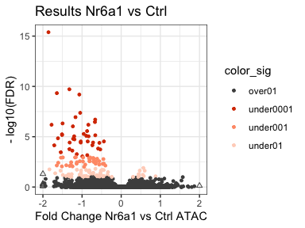

Nr6a1 overexpression day 9 ATAC
================

# Plottinng Nr6a1 overexpression results

``` r
rm(list=ls())
library(DESeq2)
library(RColorBrewer)
library(tidyverse)
library(ggrastr)
```

### Load settings

Colors, main directory

``` r
source('./r_inputs/TemporalSpatialNeuralTube_settings.R')
```

### Set dirs

``` r
subworkinput="inputs_glialnr6a1_2/"
outdir="outputs_glialnr6a1_2/"
ifelse(!dir.exists(file.path(workingdir,outdir)), dir.create(file.path(workingdir,outdir)), "Directory exists")
```

    ## [1] "Directory exists"

## Load data

Counts table generated by nf-core/atacseq in:
`results/bwa/mergedLibrary/macs/broadPeak/consensus/`

``` r
#counts table
count_table_full <- read.table(file=paste0(workingdir,subworkinput,"consensus_peaks.mLb.clN.featureCounts.txt"),header=TRUE, stringsAsFactors = FALSE)


# clean colnames
colnames(count_table_full) <- gsub(".mLb.clN.bam","",colnames(count_table_full))


# we do not need coordinates
count_table <- count_table_full %>%
  select("Geneid", Nr6a1OE_R2:Nr6a1OE_R3)
```

## Differential analysis

``` r
count_matrix <- count_table %>%
  column_to_rownames("Geneid")

## Make metadata file for DESeq

genecolData_first <- data.frame(Sample_ID = colnames(count_matrix))
genecolData_first <- genecolData_first %>% 
  separate(Sample_ID,into=c("Condition","Rep"), sep="_", remove=FALSE)
genecolData_first <- as.data.frame(unclass(genecolData_first))


dds <- DESeqDataSetFromMatrix(countData = count_matrix,
                              colData = genecolData_first,
                              design = ~ Condition)
```

    ## Warning in DESeqDataSet(se, design = design, ignoreRank): some variables in
    ## design formula are characters, converting to factors

``` r
dds <- DESeq(dds)
```

    ## estimating size factors

    ## estimating dispersions

    ## gene-wise dispersion estimates

    ## mean-dispersion relationship

    ## final dispersion estimates

    ## fitting model and testing

``` r
vsd <- varianceStabilizingTransformation(dds,blind = FALSE)
```

## Export files

Export normalized tables for plotting elsewhere

``` r
dds_counts <- counts(dds, normalized = TRUE)
vsd_data <- assay(vsd)
dds_results <- results(dds)

# write.table(dds_counts, file = "1_output_tables/consensus_peaks.mLb.clN.normCounts.txt", quote = FALSE, row.names = TRUE)
# write.csv(vsd_data, file = "1_output_tables/consensus_peaks.mLb.vsd.csv", quote = FALSE)
```

## Volcano plot

``` r
# color significant
results_sub_plot1 <- dds_results %>%
  as.data.frame() %>%
  mutate(color_sig=case_when(padj < 0.1 & padj > 0.01 ~ "under01",
                      padj < 0.01 & padj > 0.001 ~ "under001",
                      padj < 0.001 & padj >0 ~ "under0001",
                      TRUE ~ "over01"))
```

``` r
threshold <- 2

ggplot(results_sub_plot1, aes(x=log2FoldChange, y=-log10(padj), color=color_sig)) +
          geom_point(size=1) +
          geom_point(data=results_sub_plot1[results_sub_plot1$log2FoldChange > threshold,],
                   aes(y=-log10(padj), x=threshold), shape = 2, colour="gray30") +
          geom_point(data=results_sub_plot1[results_sub_plot1$log2FoldChange < -threshold,],
                    aes(y=-log10(padj), x=-threshold), shape = 2, colour="gray30") +
          xlim(-threshold,threshold) +
          scale_color_manual(values = c("gray30","#d83a00","#ff9b76","#ffd4c4")) +
          ylab(paste0("- log10(FDR)")) +
          xlab("Fold Change Nr6a1 vs Ctrl ATAC") + 
          ggtitle(paste0("Results Nr6a1 vs Ctrl")) +
          theme_bw() 
```

    ## Warning: Removed 7 rows containing missing values or values outside the scale range
    ## (`geom_point()`).

<!-- -->

``` r
plot_nr6a1ATAC_volcano <- ggplot(results_sub_plot1, aes(x=log2FoldChange, y=-log10(padj), color=color_sig)) +
          rasterise(geom_point(size=1),dpi = 300) +
          geom_point(data=results_sub_plot1[results_sub_plot1$log2FoldChange > threshold,],
                   aes(y=-log10(padj), x=threshold), shape = 2, colour="gray30") +
          geom_point(data=results_sub_plot1[results_sub_plot1$log2FoldChange < -threshold,],
                    aes(y=-log10(padj), x=-threshold), shape = 2, colour="gray30") +
          xlim(-threshold,threshold) +
          scale_color_manual(values = c("gray30","#d83a00","#ff9b76","#ffd4c4")) +
          ylab(paste0("- log10(FDR)")) +
          xlab("Fold Change Nr6a1 vs Ctrl ATAC") + 
          ggtitle(paste0("Results Nr6a1 vs Ctrl")) +
          theme_bw() 


ggsave(paste0(workingdir,outdir,"Volcano_Nr6a1OE_ATAC.pdf"), plot=plot_nr6a1ATAC_volcano,
             width=4, height=3, units="in", useDingbats=FALSE)
```

    ## Warning: Removed 7 rows containing missing values or values outside the scale range
    ## (`geom_point()`).

Export table with the significant peaks and closest genes

``` r
## Annotation table
ann_table <- read.table(file=paste0(workingdir,"inputs_glialnr6a1_2/","consensus_peaks.mLb.clN.annotatePeaks.txt"), header=TRUE, stringsAsFactors = FALSE, sep = "\t")
colnames(ann_table)[1] <- "Peakid"

ann_table_clean <- ann_table %>% 
  select(c("Peakid","Chr","Start","End","Strand","Annotation","Distance.to.TSS","Nearest.PromoterID")) %>%
  separate(Annotation, into = "Annotation_brief", sep = " ", remove = FALSE)
```

    ## Warning: Expected 1 pieces. Additional pieces discarded in 32662 rows [2, 4, 6, 12, 14,
    ## 17, 19, 20, 21, 22, 23, 27, 28, 29, 31, 32, 36, 37, 39, 44, ...].

``` r
write.table(results_sub_plot1 %>% rownames_to_column("Peakid") %>% left_join(ann_table_clean, by = "Peakid"),
  file = paste0(workingdir,outdir,"Results_annotated_Nr6a1OE-ATAC_differentconsensus.txt"),
  sep = "\t", quote = FALSE, row.names = FALSE)
```

Extract the bed files

``` r
# this is zeo
Nr6a1_up <- dds_results %>% 
  as.data.frame() %>%
  filter(padj < 0.001 & log2FoldChange > 0) %>%
  rownames_to_column("Peakid")

Nr6a1_down <- dds_results %>% 
  as.data.frame() %>%
  filter(padj < 0.001 & log2FoldChange < 0) %>%
  rownames_to_column("Peakid")


Nr6a1_down_bed <- ann_table_clean %>%
  select(Chr,Start,End, Strand,Peakid) %>%
  filter(Peakid %in% Nr6a1_down$Peakid)

# write.csv(Foxa2_up, file="1_outputs_DESeq2results/Foxa2_up_results.csv", row.names = F, quote = F)
# write.csv(Foxa2_down, file="1_outputs_DESeq2results/Foxa2_down_results.csv", row.names = F, quote = F)
# 
# 
write.table(Nr6a1_down_bed, file=paste0(workingdir,outdir,"Nr6a1_down.bed"),sep="\t", row.names = F, col.names = F, quote = F)
```

``` r
sessionInfo()
```

    ## R version 4.4.0 (2024-04-24)
    ## Platform: aarch64-apple-darwin20
    ## Running under: macOS Sonoma 14.4.1
    ## 
    ## Matrix products: default
    ## BLAS:   /Library/Frameworks/R.framework/Versions/4.4-arm64/Resources/lib/libRblas.0.dylib 
    ## LAPACK: /Library/Frameworks/R.framework/Versions/4.4-arm64/Resources/lib/libRlapack.dylib;  LAPACK version 3.12.0
    ## 
    ## locale:
    ## [1] en_US.UTF-8/en_US.UTF-8/en_US.UTF-8/C/en_US.UTF-8/en_US.UTF-8
    ## 
    ## time zone: Europe/London
    ## tzcode source: internal
    ## 
    ## attached base packages:
    ## [1] stats4    stats     graphics  grDevices utils     datasets  methods  
    ## [8] base     
    ## 
    ## other attached packages:
    ##  [1] ggrastr_1.0.2               lubridate_1.9.3            
    ##  [3] forcats_1.0.0               stringr_1.5.1              
    ##  [5] dplyr_1.1.4                 purrr_1.0.2                
    ##  [7] readr_2.1.5                 tidyr_1.3.1                
    ##  [9] tibble_3.2.1                ggplot2_3.5.1              
    ## [11] tidyverse_2.0.0             RColorBrewer_1.1-3         
    ## [13] DESeq2_1.43.5               SummarizedExperiment_1.33.3
    ## [15] Biobase_2.63.1              MatrixGenerics_1.15.1      
    ## [17] matrixStats_1.3.0           GenomicRanges_1.55.4       
    ## [19] GenomeInfoDb_1.39.14        IRanges_2.37.1             
    ## [21] S4Vectors_0.41.7            BiocGenerics_0.49.1        
    ## 
    ## loaded via a namespace (and not attached):
    ##  [1] beeswarm_0.4.0          gtable_0.3.5            xfun_0.43              
    ##  [4] lattice_0.22-6          tzdb_0.4.0              Cairo_1.6-2            
    ##  [7] vctrs_0.6.5             tools_4.4.0             generics_0.1.3         
    ## [10] parallel_4.4.0          fansi_1.0.6             highr_0.10             
    ## [13] pkgconfig_2.0.3         Matrix_1.7-0            lifecycle_1.0.4        
    ## [16] GenomeInfoDbData_1.2.12 farver_2.1.1            compiler_4.4.0         
    ## [19] textshaping_0.3.7       munsell_0.5.1           codetools_0.2-20       
    ## [22] vipor_0.4.7             htmltools_0.5.8.1       yaml_2.3.8             
    ## [25] pillar_1.9.0            crayon_1.5.2            BiocParallel_1.37.1    
    ## [28] DelayedArray_0.29.9     abind_1.4-5             tidyselect_1.2.1       
    ## [31] locfit_1.5-9.9          digest_0.6.35           stringi_1.8.3          
    ## [34] labeling_0.4.3          fastmap_1.1.1           grid_4.4.0             
    ## [37] colorspace_2.1-0        cli_3.6.2               SparseArray_1.3.7      
    ## [40] magrittr_2.0.3          S4Arrays_1.3.7          utf8_1.2.4             
    ## [43] withr_3.0.0             scales_1.3.0            UCSC.utils_0.99.7      
    ## [46] ggbeeswarm_0.7.2        timechange_0.3.0        rmarkdown_2.26         
    ## [49] XVector_0.43.1          httr_1.4.7              ragg_1.3.0             
    ## [52] hms_1.1.3               evaluate_0.23           knitr_1.46             
    ## [55] rlang_1.1.3             Rcpp_1.0.12             glue_1.7.0             
    ## [58] rstudioapi_0.16.0       jsonlite_1.8.8          R6_2.5.1               
    ## [61] systemfonts_1.0.6       zlibbioc_1.49.3
