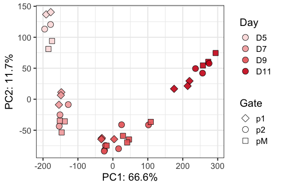
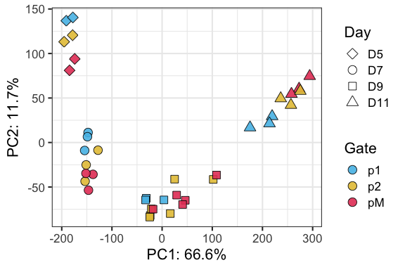

ATAC_1 PCA plots
================

# ATAC analysis

``` r
rm(list=ls())

library(DESeq2)
library(RColorBrewer)
library(tidyverse)
```

    ## Warning: package 'stringr' was built under R version 4.2.3

``` r
library(ComplexHeatmap)
library(circlize)
```

Before running, change your working directory in
`/r_inputs/TemporalSpatialNeuralTube_settings.R`

The ATAC analysis starts from the output of nf-core atacseq. File:
`consensus_peaks.mLb.clN.featureCounts.txt` in dir: ENTER

### Load settings

Colors, main directory

``` r
source('./r_inputs/TemporalSpatialNeuralTube_settings.R')
```

### Set dirs

``` r
subworkinput="inputs_glialatac_1_eda_pca/"
outdir="outputs_glialatac_1/"
ifelse(!dir.exists(file.path(workingdir,outdir)), dir.create(file.path(workingdir,outdir)), "Directory exists")
```

    ## [1] "Directory exists"

## Load data

``` r
#counts table
count_table <- read.table(file=paste0(workingdir,subworkinput,"consensus_peaks.mLb.clN.featureCounts.txt"),header=TRUE, stringsAsFactors = FALSE)

# clean colnames
colnames(count_table) <- gsub(".mLb.clN.bam","",colnames(count_table))

# we do not need coordinates
count_table <- count_table %>%
  select("Geneid", starts_with(c("MUT","WT")))


## Annotation table
ann_table <- read.table(file=paste0(workingdir,subworkinput,"consensus_peaks.mLb.clN.annotatePeaks.txt"), header=TRUE, stringsAsFactors = FALSE, sep = "\t")
colnames(ann_table)[1] <- "Peakid"


ann_table_clean <- ann_table %>% 
  select(c("Peakid","Chr","Start","End","Strand","Annotation","Distance.to.TSS","Nearest.PromoterID")) %>%
  separate(Annotation, into = "Annotation_brief", sep = " ", remove = FALSE)
```

    ## Warning: Expected 1 pieces. Additional pieces discarded in 87054 rows [2, 3, 4, 8, 11,
    ## 12, 15, 16, 17, 20, 24, 28, 29, 32, 33, 35, 36, 37, 40, 42, ...].

## Differential analysis WT samples

``` r
count_matrix <- count_table %>%
  column_to_rownames("Geneid") %>% 
  select(starts_with("WT"))

## Make metadata file for DESeq

genecolData_first <- data.frame(Sample_ID = colnames(count_matrix))
genecolData_first <- genecolData_first %>% 
  separate(Sample_ID,into=c("Genotype","Day","Gate","NFIAgate","Rep"), sep="_", remove=FALSE) %>%
  mutate(Condition=paste(Genotype,Day,Gate,NFIAgate, sep="_"),
         DayNFIA=paste(Day,NFIAgate,Genotype,sep = "_"),
         DayGate=paste(Day,Gate,sep="_"),
         Experiment=paste(Genotype,Rep,sep="_"),
         NFIAstatus=paste(NFIAgate,Genotype,sep="_"))
genecolData_first <- as.data.frame(unclass(genecolData_first))


dds <- DESeqDataSetFromMatrix(countData = count_matrix,
                              colData = genecolData_first,
                              design = ~ Gate)
```

    ## Warning in DESeqDataSet(se, design = design, ignoreRank): some variables in
    ## design formula are characters, converting to factors

``` r
dds <- DESeq(dds)
```

    ## estimating size factors

    ## estimating dispersions

    ## gene-wise dispersion estimates

    ## mean-dispersion relationship

    ## final dispersion estimates

    ## fitting model and testing

    ## -- replacing outliers and refitting for 465 genes
    ## -- DESeq argument 'minReplicatesForReplace' = 7 
    ## -- original counts are preserved in counts(dds)

    ## estimating dispersions

    ## fitting model and testing

``` r
vsd <- varianceStabilizingTransformation(dds,blind = FALSE)
```

## Export files

Useful for ploting heatmaps elsewhere - not for now.

``` r
# Export normalized tables for plotting elsewhere
dds_counts <- counts(dds, normalized = TRUE)
vsd_data <- assay(vsd)
# 
# write.table(dds_counts, file = paste0(workingdir,outdir,"consensus_peaks.mLb.clN.normCounts.txt"), quote = FALSE, row.names = TRUE)
# write.csv(vsd_data, file = paste0(workingdir,outdir,"/consensus_peaks.mLb.vsd.csv"), quote = FALSE)
```

## Plot PCAs

``` r
## to get more than 2 components

## to go it in the top ntop variable genes 
# calculate the variance for each gene
rv <- rowVars(vsd_data)
```

    ## Warning: useNames = NA is deprecated. Instead, specify either useNames = TRUE
    ## or useNames = FALSE.

``` r
# select the ntop genes by variance
ntop=30000
select <- order(rv, decreasing=TRUE)[seq_len(min(ntop, length(rv)))]

#pca <- prcomp(t(assay(object)[select,]))
t_vsd <- t(vsd_data[select,])
vsd_pca <- prcomp(t_vsd, retx=TRUE, scale. = FALSE)

var_explained <-vsd_pca$sdev^2/sum(vsd_pca$sdev^2)
```

``` r
vsd_pca_plot <- vsd_pca$x %>% 
  as.data.frame %>%
  rownames_to_column("Sample") %>%
  separate(Sample,into=c("Genotype","Day","Gate","NFIAgate","Rep"), sep="_", remove=FALSE) %>%
  mutate(Condition=paste(Genotype,Day,Gate,NFIAgate, sep="_"),
         DayNFIA=factor(paste(Day,NFIAgate,Genotype,sep = "_"), levels=sorted.dayNfia),
         NFIAstatus=paste(NFIAgate,Genotype,sep="_"),
         DayGate=factor(paste(Day,Gate,sep="_"), levels = sorted.DayGate),
         Experiment=paste(Genotype,Rep,sep="_"),
         Day=factor(Day, levels = sorted.day))
  


ggplot(vsd_pca_plot, aes(x=-PC1,y=-PC2,fill=Day,shape=Gate)) +
#  scale_fill_manual(values = colorIZ) +
  geom_point(size=4, alpha=0.9) +
  guides(fill = guide_legend(override.aes=list(shape=21))) +
  scale_shape_manual(values = shapes4_fill_manual) +
  scale_fill_manual(values = color_days) +
  labs(x=paste0("PC1: ",round(var_explained[1]*100,1),"%"),
       y=paste0("PC2: ",round(var_explained[2]*100,1),"%")) +
  theme_bw(base_size=16)
```

<!-- -->

``` r
ggplot(vsd_pca_plot, aes(x=-PC1,y=-PC2,fill=Gate,shape=Day)) +
  scale_fill_manual(values = colorIZ[4:7]) +
  geom_point(size=4, alpha=0.9) +
  guides(fill = guide_legend(override.aes=list(shape=21))) +
  scale_shape_manual(values = shapes4_fill_manual) +
  labs(x=paste0("PC1: ",round(var_explained[1]*100,1),"%"),
       y=paste0("PC2: ",round(var_explained[2]*100,1),"%")) +
  theme_bw(base_size=16)
```

<!-- -->

``` r
sessionInfo()
```

    ## R version 4.2.2 (2022-10-31)
    ## Platform: aarch64-apple-darwin20 (64-bit)
    ## Running under: macOS 14.4.1
    ## 
    ## Matrix products: default
    ## BLAS:   /Library/Frameworks/R.framework/Versions/4.2-arm64/Resources/lib/libRblas.0.dylib
    ## LAPACK: /Library/Frameworks/R.framework/Versions/4.2-arm64/Resources/lib/libRlapack.dylib
    ## 
    ## locale:
    ## [1] en_US.UTF-8/en_US.UTF-8/en_US.UTF-8/C/en_US.UTF-8/en_US.UTF-8
    ## 
    ## attached base packages:
    ## [1] grid      stats4    stats     graphics  grDevices utils     datasets 
    ## [8] methods   base     
    ## 
    ## other attached packages:
    ##  [1] circlize_0.4.15             ComplexHeatmap_2.15.4      
    ##  [3] lubridate_1.9.3             forcats_1.0.0              
    ##  [5] stringr_1.5.1               dplyr_1.1.3                
    ##  [7] purrr_1.0.2                 readr_2.1.4                
    ##  [9] tidyr_1.3.0                 tibble_3.2.1               
    ## [11] ggplot2_3.4.4               tidyverse_2.0.0            
    ## [13] RColorBrewer_1.1-3          DESeq2_1.38.3              
    ## [15] SummarizedExperiment_1.28.0 Biobase_2.58.0             
    ## [17] MatrixGenerics_1.10.0       matrixStats_1.1.0          
    ## [19] GenomicRanges_1.50.2        GenomeInfoDb_1.34.9        
    ## [21] IRanges_2.32.0              S4Vectors_0.36.2           
    ## [23] BiocGenerics_0.44.0        
    ## 
    ## loaded via a namespace (and not attached):
    ##  [1] bitops_1.0-7           bit64_4.0.5            doParallel_1.0.17     
    ##  [4] httr_1.4.7             tools_4.2.2            utf8_1.2.4            
    ##  [7] R6_2.5.1               DBI_1.1.3              colorspace_2.1-0      
    ## [10] GetoptLong_1.0.5       withr_2.5.2            tidyselect_1.2.0      
    ## [13] bit_4.0.5              compiler_4.2.2         cli_3.6.1             
    ## [16] DelayedArray_0.24.0    labeling_0.4.3         scales_1.2.1          
    ## [19] digest_0.6.33          rmarkdown_2.25         XVector_0.38.0        
    ## [22] pkgconfig_2.0.3        htmltools_0.5.7        highr_0.10            
    ## [25] fastmap_1.1.1          rlang_1.1.2            GlobalOptions_0.1.2   
    ## [28] rstudioapi_0.15.0      RSQLite_2.3.3          farver_2.1.1          
    ## [31] shape_1.4.6            generics_0.1.3         BiocParallel_1.32.6   
    ## [34] RCurl_1.98-1.13        magrittr_2.0.3         GenomeInfoDbData_1.2.9
    ## [37] Matrix_1.6-3           Rcpp_1.0.11            munsell_0.5.0         
    ## [40] fansi_1.0.5            lifecycle_1.0.4        stringi_1.8.1         
    ## [43] yaml_2.3.7             zlibbioc_1.44.0        blob_1.2.4            
    ## [46] parallel_4.2.2         crayon_1.5.2           lattice_0.22-5        
    ## [49] Biostrings_2.66.0      annotate_1.76.0        hms_1.1.3             
    ## [52] KEGGREST_1.38.0        locfit_1.5-9.8         knitr_1.45            
    ## [55] pillar_1.9.0           rjson_0.2.21           geneplotter_1.76.0    
    ## [58] codetools_0.2-19       XML_3.99-0.15          glue_1.6.2            
    ## [61] evaluate_0.23          png_0.1-8              vctrs_0.6.4           
    ## [64] tzdb_0.4.0             foreach_1.5.2          gtable_0.3.4          
    ## [67] clue_0.3-65            cachem_1.0.8           xfun_0.43             
    ## [70] xtable_1.8-4           iterators_1.0.14       AnnotationDbi_1.60.2  
    ## [73] memoise_2.0.1          cluster_2.1.4          timechange_0.2.0
