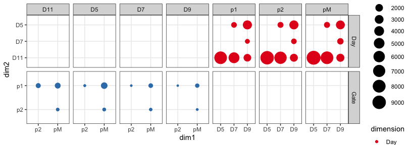

ATAC_2_time_vs_domain_import
================

# ATAC analysis

Differential accessibility in groups of samples

Imports diff accessibility and plots numbers of elements changing in
time and space. Export tables.

``` r
rm(list=ls())

library(DESeq2)
library(RColorBrewer)
library(tidyverse)
```

    ## Warning: package 'stringr' was built under R version 4.2.3

``` r
library(ComplexHeatmap)
library(UpSetR)
```

### Load settings

Colors, main directory

``` r
source('./r_inputs/TemporalSpatialNeuralTube_settings.R')
```

### Set dirs

``` r
subworkinput="outputs_glialatac_2_time_space/"

suboutdir1="output_Domain_Specific/"
suboutdir2="output_Time_Specific/"
```

## Load data

Load the diff expression from previous script.

## Differential analysis between domains for each timepoint

Targeted diff analysis in subsets of samples:

Wild type only: D5: pairwise for p1, p2, pMN D7: pairwise for p1, p2,
pMN D9: pairwise for p1, p2, pMN D11: pairwise for p1, p2, pMN

re importing does not work because the ~/ gets converted to full name of
the dir

Change working dir to local and it’ll be fine. For not, this is the
patch.

``` r
PairWiseDEseq_domain <- lapply(list.files(path=paste0(workingdir,subworkinput,suboutdir1),pattern="Results_DESeq*", full.names=TRUE),function(x) {
  data <- read.table(x,header=T,stringsAsFactors=F) %>% as.data.frame() %>% rownames_to_column("Intervals")
  data$Comparison <- gsub(paste0(workingdir,subworkinput,suboutdir1,"/Results_DESeq_"),"", x)
  data$Comparison <- gsub(".txt","",data$Comparison)
  data
})

results_deseq_domain <- do.call(rbind,PairWiseDEseq_domain)
```

## Differential analysis between timepoints for each domain

Targeted diff analysis in subsets of samples:

Wild type only: p1: pairwise D5-D7, D7-D9, D9-D11, D5-D9, D5-D11, D7-D11
p2: pairwise D5-D7, D7-D9, D9-D11, D5-D9, D5-D11, D7-D11 pM: pairwise
D5-D7, D7-D9, D9-D11, D5-D9, D5-D11, D7-D11

``` r
PairWiseDEseq_days <- lapply(list.files(path=paste0(workingdir,subworkinput,suboutdir2),pattern="Results_DESeq*", full.names=TRUE),function(x) {
  data <- read.table(x,header=T,stringsAsFactors=F) %>% as.data.frame() %>% rownames_to_column("Intervals")
  data$Comparison <- gsub(paste0(workingdir,subworkinput,suboutdir2,"/Results_DESeq_"),"", x)
  data$Comparison <- gsub(".txt","",data$Comparison)
  data
})

results_deseq_days <- do.call(rbind,PairWiseDEseq_days)
```

### How many diff acc elements between domains?

``` r
top_domain_comparisons <- results_deseq_domain %>%
  as.data.frame() %>%
  filter(padj < 0.01 & abs(log2FoldChange) > 2 & baseMean > 100)
```

### How many diff acc elements between timepoints?

``` r
top_days_comparisons <- results_deseq_days %>%
  as.data.frame() %>%
  filter(padj < 0.01 & abs(log2FoldChange) > 2 & baseMean > 100)
```

## Plot number of elements changing between domains and over time

``` r
top_combined_comparisons <- rbind(top_days_comparisons,top_domain_comparisons)

#tidy
top_combined_comparisons <- top_combined_comparisons %>%
  separate(Comparison, into = c("empty","faceting","dimension","dim1","vs","dim2"), sep = "_")  %>%
  mutate(dim2=factor(dim2, levels=c("D11","D7","D5","p2","p1")),
         dim1=factor(dim1, levels=c("p2","pM","D5","D7","D9")))

ggplot(top_combined_comparisons, aes(x=dim1, y=dim2)) +
  geom_count(aes(color=dimension)) +
  scale_colour_brewer(palette = "Set1") +
  scale_size(range = c(1,9), breaks = seq(0,10000, by=1000)) + 
  facet_grid(dimension ~ faceting, scales = "free") +
  theme_bw()
```

<!-- -->

``` r
sessionInfo()
```

    ## R version 4.2.2 (2022-10-31)
    ## Platform: aarch64-apple-darwin20 (64-bit)
    ## Running under: macOS 14.4.1
    ## 
    ## Matrix products: default
    ## BLAS:   /Library/Frameworks/R.framework/Versions/4.2-arm64/Resources/lib/libRblas.0.dylib
    ## LAPACK: /Library/Frameworks/R.framework/Versions/4.2-arm64/Resources/lib/libRlapack.dylib
    ## 
    ## locale:
    ## [1] en_US.UTF-8/en_US.UTF-8/en_US.UTF-8/C/en_US.UTF-8/en_US.UTF-8
    ## 
    ## attached base packages:
    ## [1] grid      stats4    stats     graphics  grDevices utils     datasets 
    ## [8] methods   base     
    ## 
    ## other attached packages:
    ##  [1] UpSetR_1.4.0                ComplexHeatmap_2.15.4      
    ##  [3] lubridate_1.9.3             forcats_1.0.0              
    ##  [5] stringr_1.5.1               dplyr_1.1.3                
    ##  [7] purrr_1.0.2                 readr_2.1.4                
    ##  [9] tidyr_1.3.0                 tibble_3.2.1               
    ## [11] ggplot2_3.4.4               tidyverse_2.0.0            
    ## [13] RColorBrewer_1.1-3          DESeq2_1.38.3              
    ## [15] SummarizedExperiment_1.28.0 Biobase_2.58.0             
    ## [17] MatrixGenerics_1.10.0       matrixStats_1.1.0          
    ## [19] GenomicRanges_1.50.2        GenomeInfoDb_1.34.9        
    ## [21] IRanges_2.32.0              S4Vectors_0.36.2           
    ## [23] BiocGenerics_0.44.0        
    ## 
    ## loaded via a namespace (and not attached):
    ##  [1] bitops_1.0-7           bit64_4.0.5            doParallel_1.0.17     
    ##  [4] httr_1.4.7             tools_4.2.2            utf8_1.2.4            
    ##  [7] R6_2.5.1               DBI_1.1.3              colorspace_2.1-0      
    ## [10] GetoptLong_1.0.5       withr_2.5.2            gridExtra_2.3         
    ## [13] tidyselect_1.2.0       bit_4.0.5              compiler_4.2.2        
    ## [16] cli_3.6.1              DelayedArray_0.24.0    scales_1.2.1          
    ## [19] digest_0.6.33          rmarkdown_2.25         XVector_0.38.0        
    ## [22] pkgconfig_2.0.3        htmltools_0.5.7        highr_0.10            
    ## [25] fastmap_1.1.1          rlang_1.1.2            GlobalOptions_0.1.2   
    ## [28] rstudioapi_0.15.0      RSQLite_2.3.3          farver_2.1.1          
    ## [31] shape_1.4.6            generics_0.1.3         BiocParallel_1.32.6   
    ## [34] RCurl_1.98-1.13        magrittr_2.0.3         GenomeInfoDbData_1.2.9
    ## [37] Matrix_1.6-3           Rcpp_1.0.11            munsell_0.5.0         
    ## [40] fansi_1.0.5            lifecycle_1.0.4        stringi_1.8.1         
    ## [43] yaml_2.3.7             zlibbioc_1.44.0        plyr_1.8.9            
    ## [46] blob_1.2.4             parallel_4.2.2         crayon_1.5.2          
    ## [49] lattice_0.22-5         Biostrings_2.66.0      annotate_1.76.0       
    ## [52] circlize_0.4.15        hms_1.1.3              KEGGREST_1.38.0       
    ## [55] locfit_1.5-9.8         knitr_1.45             pillar_1.9.0          
    ## [58] rjson_0.2.21           geneplotter_1.76.0     codetools_0.2-19      
    ## [61] XML_3.99-0.15          glue_1.6.2             evaluate_0.23         
    ## [64] png_0.1-8              vctrs_0.6.4            tzdb_0.4.0            
    ## [67] foreach_1.5.2          gtable_0.3.4           clue_0.3-65           
    ## [70] cachem_1.0.8           xfun_0.43              xtable_1.8-4          
    ## [73] iterators_1.0.14       AnnotationDbi_1.60.2   memoise_2.0.1         
    ## [76] cluster_2.1.4          timechange_0.2.0
