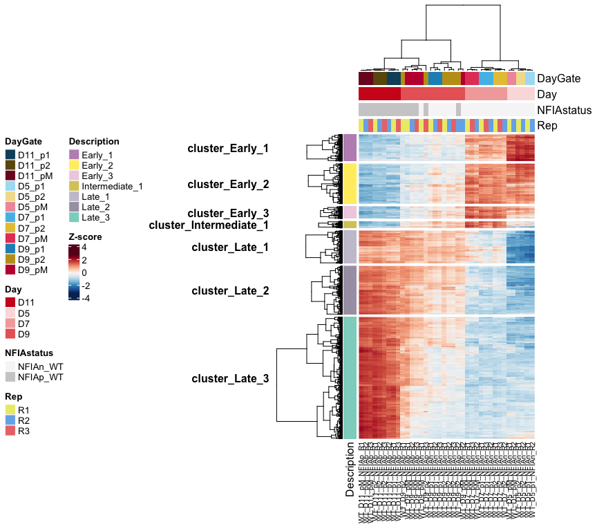

ATAC_2_time_vs_domain_import
================

# ATAC analysis

Differential accessibility in groups of samples

Imports diff accessibility and plots numbers of elements changing in
time and space. Export tables.

``` r
rm(list=ls())

library(DESeq2)
```

    ## Warning: package 'matrixStats' was built under R version 4.2.3

``` r
library(RColorBrewer)
library(tidyverse)
```

    ## Warning: package 'tidyr' was built under R version 4.2.3

    ## Warning: package 'readr' was built under R version 4.2.3

    ## Warning: package 'dplyr' was built under R version 4.2.3

    ## Warning: package 'stringr' was built under R version 4.2.3

``` r
library(ComplexHeatmap)
library(factoextra)
library(ggrepel)
```

    ## Warning: package 'ggrepel' was built under R version 4.2.3

``` r
library(UpSetR)
```

### Load settings

Colors, main directory

``` r
source('./r_inputs/TemporalSpatialNeuralTube_settings.R')
```

### Set dirs

``` r
subworkinput="outputs_glialatac_2_time_space/"

subinputdir1="output_Domain_Specific/"
subinputdir2="output_Time_Specific/"

outdir="outputs_glialatac_2_time_clusters/"
ifelse(!dir.exists(file.path(workingdir,outdir)), dir.create(file.path(workingdir,outdir)), "Directory exists")
```

    ## [1] "Directory exists"

## Load data

Load vsd to plot heatmaps later

``` r
count_vsd <- read.csv(file=paste0(workingdir,"outputs_glialatac_1/","consensus_peaks.mLb.vsd.csv"),header=TRUE, stringsAsFactors = FALSE)
```

Load the diff expression from previous script.

## Differential analysis between domains for each timepoint

Targeted diff analysis in subsets of samples:

Wild type only: D5: pairwise for p1, p2, pMN D7: pairwise for p1, p2,
pMN D9: pairwise for p1, p2, pMN D11: pairwise for p1, p2, pMN

re importing does not work because the ~/ gets converted to full name of
the dir

Change working dir to local and it’ll be fine. For not, this is the
patch.

``` r
PairWiseDEseq_domain <- lapply(list.files(path=paste0(workingdir,subworkinput,subinputdir1),pattern="Results_DESeq*", full.names=TRUE),function(x) {
  data <- read.table(x,header=T,stringsAsFactors=F) %>% as.data.frame() %>% rownames_to_column("Intervals")
  data$Comparison <- gsub(paste0(workingdir,subworkinput,subinputdir1,"/Results_DESeq_"),"", x)
  data$Comparison <- gsub(".txt","",data$Comparison)
  data
})

results_deseq_domain <- do.call(rbind,PairWiseDEseq_domain)
```

## Differential analysis between timepoints for each domain

Targeted diff analysis in subsets of samples:

Wild type only: p1: pairwise D5-D7, D7-D9, D9-D11, D5-D9, D5-D11, D7-D11
p2: pairwise D5-D7, D7-D9, D9-D11, D5-D9, D5-D11, D7-D11 pM: pairwise
D5-D7, D7-D9, D9-D11, D5-D9, D5-D11, D7-D11

``` r
PairWiseDEseq_days <- lapply(list.files(path=paste0(workingdir,subworkinput,subinputdir2),pattern="Results_DESeq*", full.names=TRUE),function(x) {
  data <- read.table(x,header=T,stringsAsFactors=F) %>% as.data.frame() %>% rownames_to_column("Intervals")
  data$Comparison <- gsub(paste0(workingdir,subworkinput,subinputdir2,"/Results_DESeq_"),"", x)
  data$Comparison <- gsub(".txt","",data$Comparison)
  data
})

results_deseq_days <- do.call(rbind,PairWiseDEseq_days)
```

### How many diff acc elements between domains?

``` r
top_domain_comparisons <- results_deseq_domain %>%
  as.data.frame() %>%
  filter(padj < 0.01 & abs(log2FoldChange) > 2 & baseMean > 100)
```

### How many diff acc elements between timepoints?

``` r
top_days_comparisons <- results_deseq_days %>%
  as.data.frame() %>%
  filter(padj < 0.01 & abs(log2FoldChange) > 2 & baseMean > 100)
```

## Plot number of elements changing between domains and over time

``` r
top_combined_comparisons <- rbind(top_days_comparisons,top_domain_comparisons)

#tidy
top_combined_comparisons <- top_combined_comparisons %>%
  separate(Comparison, into = c("empty","faceting","dimension","dim1","vs","dim2"), sep = "_")  %>%
  mutate(dim2=factor(dim2, levels=c("D11","D7","D5","p2","p1")),
         dim1=factor(dim1, levels=c("p2","pM","D5","D7","D9")))

ggplot(top_combined_comparisons, aes(x=dim1, y=dim2)) +
  geom_count(aes(color=dimension)) +
  scale_colour_brewer(palette = "Set1") +
  scale_size(range = c(1,9), breaks = seq(0,10000, by=1000)) + 
  facet_grid(dimension ~ faceting, scales = "free") +
  theme_bw()
```

<!-- -->

## Temporal elements and clustering

Find elements diff acc over time, and in all domains. This does not
require them to be significant in the same timepoints

``` r
p1_elements <- Reduce(union, 
                       list(top_days_comparisons[top_days_comparisons$Comparison=="_p1_Day_D5_vs_D11","Intervals"],
                     top_days_comparisons[top_days_comparisons$Comparison=="_p1_Day_D5_vs_D7","Intervals"],
                     top_days_comparisons[top_days_comparisons$Comparison=="_p1_Day_D5_vs_D9","Intervals"],
                     top_days_comparisons[top_days_comparisons$Comparison=="_p1_Day_D7_vs_D11","Intervals"],
                     top_days_comparisons[top_days_comparisons$Comparison=="_p1_Day_D7_vs_D9","Intervals"],
                     top_days_comparisons[top_days_comparisons$Comparison=="_p1_Day_D9_vs_D11","Intervals"]))

p2_elements <- Reduce(union, 
                       list(top_days_comparisons[top_days_comparisons$Comparison=="_p2_Day_D5_vs_D11","Intervals"],
                     top_days_comparisons[top_days_comparisons$Comparison=="_p2_Day_D5_vs_D7","Intervals"],
                     top_days_comparisons[top_days_comparisons$Comparison=="_p2_Day_D5_vs_D9","Intervals"],
                     top_days_comparisons[top_days_comparisons$Comparison=="_p2_Day_D7_vs_D11","Intervals"],
                     top_days_comparisons[top_days_comparisons$Comparison=="_p2_Day_D7_vs_D9","Intervals"],
                     top_days_comparisons[top_days_comparisons$Comparison=="_p2_Day_D9_vs_D11","Intervals"]))

pM_elements <- Reduce(union, 
                       list(top_days_comparisons[top_days_comparisons$Comparison=="_pM_Day_D5_vs_D11","Intervals"],
                     top_days_comparisons[top_days_comparisons$Comparison=="_pM_Day_D5_vs_D7","Intervals"],
                     top_days_comparisons[top_days_comparisons$Comparison=="_pM_Day_D5_vs_D9","Intervals"],
                     top_days_comparisons[top_days_comparisons$Comparison=="_pM_Day_D7_vs_D11","Intervals"],
                     top_days_comparisons[top_days_comparisons$Comparison=="_pM_Day_D7_vs_D9","Intervals"],
                     top_days_comparisons[top_days_comparisons$Comparison=="_pM_Day_D9_vs_D11","Intervals"]))

length(p1_elements)
```

    ## [1] 8870

``` r
length(p2_elements)
```

    ## [1] 10389

``` r
length(pM_elements)
```

    ## [1] 11433

``` r
time_elements_allDomains <- Reduce(intersect, list(p1_elements,p2_elements,pM_elements))
```

### Plot the elements in heatmap to visualize

``` r
# filter elements
vsd_hm <- count_vsd %>%
  filter(X %in% time_elements_allDomains) %>%
  column_to_rownames("X") %>%
  select(starts_with("WT"))

dim(vsd_hm)
```

    ## [1] 5408   38

``` r
# z score
vsd_hm_z <- t(scale(t(vsd_hm))) 

# metadata for the heatmap
genecolData_first <- data.frame(Sample_ID = colnames(vsd_hm))
genecolData_first <- genecolData_first %>% 
  separate(Sample_ID,into=c("Genotype","Day","Gate","NFIAgate","Rep"), sep="_", remove=FALSE) %>%
  mutate(Condition=paste(Genotype,Day,Gate,NFIAgate, sep="_"),
         DayNFIA=paste(Day,NFIAgate,Genotype,sep = "_"),
         DayGate=paste(Day,Gate,sep="_"),
         Experiment=paste(Genotype,Rep,sep="_"),
         NFIAstatus=paste(NFIAgate,Genotype,sep="_"))
genecolData_first <- as.data.frame(unclass(genecolData_first))

phen_data <- genecolData_first %>%
  select(c("Sample_ID","DayGate","Day","NFIAstatus","Rep")) %>%
  remove_rownames() %>%
  column_to_rownames("Sample_ID")

ann_color_JD <- list(
  DayGate = c(D5_p1="#abdff4",D5_p2="#f1df9a", D5_pM="#f19aac",
              D7_p1="#55bee8",D7_p2="#e6c444",D7_pM="#e64466",
              D9_p1="#1a91c1",D9_p2="#c19e1a",D9_pM="#c11a3d",
              D11_p1="#0e506b",D11_p2="#6b570e",D11_pM="#7c1127"),
  NFIAstatus = c(NFIAn_WT="#f6f6f6",NFIAp_WT="#cecece",`100`="#808080",NFIAn_MUT="#595959"),
  Day = c(D5="#fadede",D7="#f3aaaa",D9="#e96666",D11="#cf1e1e"),
  Rep = c(R1="#ebeb77", R2="#77b1eb", R3="#eb7777"))


# Annotated heatmap with selected colors
hm_colors = colorRampPalette(rev(brewer.pal(n = 11, name = "RdBu")))(100)


# Build the annotation for the complex heatmap
colAnn <- HeatmapAnnotation(
    df = phen_data,
    which = 'col', # 'col' (samples) or 'row' (gene) annotation?
    na_col = 'white', # default colour for any NA values in the annotation data-frame, 'ann'
    col = ann_color_JD,
    annotation_height = 0.6,
    annotation_width = unit(1, 'cm'),
    gap = unit(1, 'mm'))


hmap <- Heatmap(vsd_hm_z,

    name = 'Z-score',

    col = hm_colors,

    # row (gene) parameters
      cluster_rows = TRUE,
      show_row_dend = TRUE,
      #row_title = 'Statistically significant genes',
      row_title_side = 'left',
      row_title_gp = gpar(fontsize = 12,  fontface = 'bold'),
      row_title_rot = 90,
      show_row_names = FALSE,
      row_names_gp = gpar(fontsize = 10, fontface = 'bold'),
      row_names_side = 'left',
      row_dend_width = unit(25,'mm'),

    # column (sample) parameters
      cluster_columns = TRUE,
      show_column_dend = TRUE,
      column_title = '',
      column_title_side = 'bottom',
      column_title_gp = gpar(fontsize = 12, fontface = 'bold'),
      column_title_rot = 0,
      show_column_names = TRUE,
      column_names_gp = gpar(fontsize = 8),
      column_names_max_height = unit(10, 'cm'),
      column_dend_height = unit(25,'mm'),

    # cluster methods for rows and columns
      clustering_distance_columns = function(x) as.dist(1 - cor(t(x))),
      clustering_method_columns = 'ward.D2',
      clustering_distance_rows = function(x) as.dist(1 - cor(t(x))),
      clustering_method_rows = 'ward.D2',

    # specify top and bottom annotations
      top_annotation = colAnn)
```

    ## `use_raster` is automatically set to TRUE for a matrix with more than
    ## 2000 rows. You can control `use_raster` argument by explicitly setting
    ## TRUE/FALSE to it.
    ## 
    ## Set `ht_opt$message = FALSE` to turn off this message.

``` r
draw(hmap,
    heatmap_legend_side = 'left',
    annotation_legend_side = 'left',
    row_sub_title_side = 'left')
```

<!-- -->

``` r
vsd_elements_allDomains_ave <- vsd_hm %>%
  rownames_to_column("order") %>%
  gather(sample, vsd, starts_with("WT")) %>%
  mutate(condition = gsub('_R[1-3]', '', sample)) %>%
  group_by(order, condition) %>%
  summarise(ave_vsd = mean(vsd)) %>%
  spread(condition, ave_vsd) %>%
  ungroup() %>%
  column_to_rownames("order")
```

    ## `summarise()` has grouped output by 'order'. You can override using the
    ## `.groups` argument.

## kMeans clustering

``` r
#x=1
#choose_seed <- c(10,56,87,345,8,22,456,887,8472,25)
#set seed
set.seed(8)

x="finalclusters"

  ## kmeans
  vsd_kclusterd_2 <- kmeans(vsd_elements_allDomains_ave,30,iter.max = 100, nstart = 50)
  clustering_qc <- data.frame("Tot.withinss"=vsd_kclusterd_2$tot.withinss,
                              "ifault"=vsd_kclusterd_2$ifault)
  
  write.table(clustering_qc, file=paste0(workingdir,outdir,"Stats_30_iter_",x,".txt"), sep = "\t", quote = FALSE, row.names = FALSE)
  
  vsd_kclusterd <- vsd_kclusterd_2
  
  # get cluster centers to plot and get distances
  clusters_k30_plot <- vsd_kclusterd$centers %>% as.data.frame() %>%
    rownames_to_column("cluster") %>%
    gather(Sample,Centers, starts_with("WT")) %>%
    separate(Sample,into=c("Genotype","Day","Gate","NFIAgate"), sep="_", remove=FALSE) %>%
    mutate(Condition=paste(Genotype,Day,Gate,NFIAgate, sep="_"),
         DayNFIA=factor(paste(Day,NFIAgate,Genotype,sep = "_"), levels=sorted.dayNfia),
         NFIAstatus=paste(NFIAgate,Genotype,sep="_"),
         DayGate=factor(paste(Day,Gate,sep="_"), levels = sorted.DayGate),
         Day=factor(Day, levels = sorted.day), 
          Sample=factor(Sample, levels = sorted.sample))


# get cluster centers
  clusters_k30 <- vsd_kclusterd$centers
  write.table(clusters_k30, file=paste0(workingdir,outdir,"Cluster_30_Centers_iter_",x,".txt"), sep = "\t", quote = FALSE, row.names = FALSE)
  
  clusters_genes_k30 <- as.data.frame(vsd_kclusterd$cluster) %>%
    rownames_to_column()
  colnames(clusters_genes_k30) <- c("Peakid","Cluster")


  clusters_genes_k30 <- clusters_genes_k30[order(clusters_genes_k30[,2] ),]

  write.csv(clusters_genes_k30, file=paste0(workingdir,outdir,"Peaks_Cluster_30_Centers_iter_",x,".csv"), quote = FALSE, row.names = FALSE)
  
  ## Computing correlation based distances
  dist_cluster <- get_dist(clusters_k30, method = "pearson")
  dist_cluster_hm <- as.matrix(dist_cluster)
  
  #calculate hclust
  hcl=hclust(dist_cluster)
 
  ## chose the number of re-clusters here
  k=7
   
  # print hierchical cluster and cutree for each iteration
  #pdf(paste0(workingdir,outdir,"Plot_",k,"hclust_Iter_",x,".pdf")) 

  plot(hcl, hang= -1) 
  reclusters <- rect.hclust(hcl, k, border = "red")
```

<!-- -->

``` r
  #dev.off() 


# visualize the re-clustering 
  # visualize the clusters and mega clusters
  ReClustering_dirty <- do.call(rbind.data.frame, reclusters)
```

    ## Warning in (function (..., deparse.level = 1, make.row.names = TRUE,
    ## stringsAsFactors = FALSE, : number of columns of result, 10, is not a multiple
    ## of vector length 4 of arg 2

    ## Warning in (function (..., deparse.level = 1, make.row.names = TRUE,
    ## stringsAsFactors = FALSE, : number of columns of result, 10, is not a multiple
    ## of vector length 3 of arg 6

``` r
  ReClustering <- ReClustering_dirty %>% rownames_to_column("ReCluster") %>% 
    gather("col_del", "cluster", 2:(ncol(ReClustering_dirty)+1)) %>%
    dplyr::select("cluster","ReCluster") %>%
    unique() %>%
    arrange(cluster) %>%
    remove_rownames() %>%
    column_to_rownames("cluster")
  
  ReCluster_id <- data.frame(ReCluster=c("1","2","3","4","5","6","7"), 
                            Description=c("Late_3","Late_1","Late_2","Intermediate_1","Early_3",
                                           "Early_1","Early_2"))
  
  #color clusters
  k=length(unique(ReClustering$ReCluster)) # how many clusters
  Nclusters <- c(1:k) %>% as.character() # make vector
  Ncolors <- colorRampPalette(brewer.pal(12, "Set3"))(k) # get colors

  
  names(Ncolors) <- c("Late_3","Late_1","Late_2","Intermediate_1","Early_3",
                                           "Early_1","Early_2") # named vector
  
  hm_colors = colorRampPalette(rev(brewer.pal(n = 11, name = "RdBu")))(100)
  
  ann_color_cluster <- list(
    Description = c(Ncolors))
  

## heatmap 2: Rows split by ReClusters   

  ## plot zscores per ReCluster

  # scale the vsd data
  #heat <- t(scale(t(vsd_pairwise_ave)))
  # you already have this, it is called: vsd_subset_z_score
  
  Reclustering_clean <- ReClustering %>%
    rownames_to_column("cluster") %>%
    left_join(ReCluster_id, by = "ReCluster")
  
  # # how to plot clusters in a heatmap
  reclusteres_cluster_order <- vsd_kclusterd$cluster %>% as.data.frame() %>%
    rename("cluster"=".") %>%
    rownames_to_column("order") %>%
    merge(Reclustering_clean) %>%
    arrange(order)
 
#print to be able to re -plot easily
write.csv(reclusteres_cluster_order, file=paste0(workingdir,outdir,"Intervals_temporal_Alldomains_clusterannotated.csv"),
          quote = FALSE, row.names = FALSE)
  
  vsd_hm_z <- t(scale(t(vsd_hm))) 
  
genecolData_first <- data.frame(Sample_ID = colnames(vsd_hm))
genecolData_first <- genecolData_first %>% 
  separate(Sample_ID,into=c("Genotype","Day","Gate","NFIAgate","Rep"), sep="_", remove=FALSE) %>%
  mutate(Condition=paste(Genotype,Day,Gate,NFIAgate, sep="_"),
         DayNFIA=paste(Day,NFIAgate,Genotype,sep = "_"),
         DayGate=paste(Day,Gate,sep="_"),
         NFIAstatus=paste(NFIAgate,Genotype,sep="_"))
genecolData_first <- as.data.frame(unclass(genecolData_first))

phen_data <- genecolData_first %>%
  dplyr::select(c("Sample_ID","DayGate","Day","NFIAstatus","Rep")) %>%
  remove_rownames() %>%
  column_to_rownames("Sample_ID")
ann_color_IZ <- list(
  DayGate = c(D5_p1="#abdff4",D5_p2="#f1df9a", D5_pM="#f19aac",
              D7_p1="#55bee8",D7_p2="#e6c444",D7_pM="#e64466",
              D9_p1="#1a91c1",D9_p2="#c19e1a",D9_pM="#c11a3d",
              D11_p1="#0e506b",D11_p2="#6b570e",D11_pM="#7c1127"),
  NFIAstatus = c(NFIAn_WT="#f6f6f6",NFIAp_WT="#cecece",`100`="#808080",NFIAn_MUT="#595959"),
  Day = c(D5="#fadede",D7="#f3aaaa",D9="#e96666",D11="#cf1e1e"),
  Rep = c(R1="#ebeb77", R2="#77b1eb", R3="#eb7777"))


# Annotated heatmap with selected colors
hm_colors = colorRampPalette(rev(brewer.pal(n = 11, name = "RdBu")))(100)


# Build the annotation for the complex heatmap
colAnn <- HeatmapAnnotation(
    df = phen_data,
    which = 'col', # 'col' (samples) or 'row' (gene) annotation?
    na_col = 'white', # default colour for any NA values in the annotation data-frame, 'ann'
    col = ann_color_IZ,
    annotation_height = 0.6,
    annotation_width = unit(1, 'cm'),
    gap = unit(1, 'mm'))

# annotations Rows
phen_intervals <- vsd_hm_z %>%
  as.data.frame() %>%
  rownames_to_column("order") %>%
  left_join(reclusteres_cluster_order, by="order") %>%
  select(Description)


#Ncolors <- colorRampPalette(brewer.pal(5, "Oranges"))(5)
# ann_colRows_JD <- list(
#     N_comparison =c(`1`="#FEEDDE",`2`="#FDBE85",`3`="#FD8D3C"),
#     Comp__p1__D7__D11_ =c(`1`="#377EB8"),
#     Comp__p2__D7__D11_=c(`1`="#4DAF4A"),
#     Comp__pM__D7__D11_=c(`1`="#E41A1C"))


rowAnn <- HeatmapAnnotation(
  which = 'row',
  df=phen_intervals,
  col = ann_color_cluster,
  na_col = 'white')
```

``` r
hmap <- Heatmap(vsd_hm_z,

    # split the genes / rows according to the PAM clusters
    row_split = phen_intervals,
    row_title = "cluster_%s",
    row_title_rot = 0,
    cluster_row_slices = FALSE, 
    #cluster_column_slices = FALSE,
    

    name = 'Z-score',

    col = hm_colors,

    # row (gene) parameters
      cluster_rows = TRUE,
      show_row_dend = TRUE,
      #row_title = 'Statistically significant genes',
      row_title_side = 'left',
      row_title_gp = gpar(fontsize = 12,  fontface = 'bold'),
      #row_title_rot = 90,
      show_row_names = FALSE,
      row_names_gp = gpar(fontsize = 10, fontface = 'bold'),
      row_names_side = 'left',
      row_dend_width = unit(25,'mm'),

    # column (sample) parameters
      cluster_columns = TRUE,
      show_column_dend = TRUE,
      column_title = '',
      column_title_side = 'bottom',
      column_title_gp = gpar(fontsize = 12, fontface = 'bold'),
      column_title_rot = 0,
      show_column_names = TRUE,
      column_names_gp = gpar(fontsize = 8),
      column_names_max_height = unit(10, 'cm'),
      column_dend_height = unit(25,'mm'),

    # cluster methods for rows and columns
      clustering_distance_columns = function(x) as.dist(1 - cor(t(x))),
      clustering_method_columns = 'ward.D2',
      clustering_distance_rows = function(x) as.dist(1 - cor(t(x))),
      clustering_method_rows = 'ward.D2',

    # specify top and bottom annotations
      left_annotation = rowAnn,
      top_annotation = colAnn)
```

    ## `use_raster` is automatically set to TRUE for a matrix with more than
    ## 2000 rows. You can control `use_raster` argument by explicitly setting
    ## TRUE/FALSE to it.
    ## 
    ## Set `ht_opt$message = FALSE` to turn off this message.

``` r
draw(hmap,
    heatmap_legend_side = 'left',
    annotation_legend_side = 'left',
    row_sub_title_side = 'left')
```

<!-- -->

``` r
## get the number of elements per recluster for violin plot representation 
  
  n.hcluster <- reclusteres_cluster_order %>%
    group_by(ReCluster) %>%
    summarise(n = n()) %>%
    mutate(label = sprintf('n = %s', n))
   
  ## Violin   
  reclustered_hclust_zcoresconditions <- vsd_hm_z %>% as.data.frame() %>%
    rownames_to_column("order") %>%
    merge(reclusteres_cluster_order, by="order" ) %>%
    gather(Sample, Zscore, starts_with("WT")) %>%
    separate(Sample, into=c("Genotype","Day","Gate","NFIAgate"), sep="_", remove=FALSE) %>%
    mutate(Condition=paste(Genotype,Day,Gate,NFIAgate, sep="_"),
         DayNFIA=factor(paste(Day,NFIAgate,Genotype,sep = "_"), levels=sorted.dayNfia),
         NFIAstatus=paste(NFIAgate,Genotype,sep="_"),
         DayGate=factor(paste(Day,Gate,sep="_"), levels = sorted.DayGate),
         Day=factor(Day, levels = sorted.day), 
         Condition=factor(Condition, levels = sorted.sample))
```

    ## Warning: Expected 4 pieces. Additional pieces discarded in 205504 rows [1, 2, 3, 4, 5,
    ## 6, 7, 8, 9, 10, 11, 12, 13, 14, 15, 16, 17, 18, 19, 20, ...].

``` r
zscore_plot <-  ggplot(reclustered_hclust_zcoresconditions, aes(x = Condition, y = Zscore, fill=DayGate)) + 
    geom_violin(size=0.2) +
    scale_fill_manual(values = colorIZ) +
    facet_wrap(~ReCluster) + xlab('') + ylab('Z-Score') +
    geom_text_repel(data = n.hcluster, aes(x = 0.75, y = 4, label = label), inherit.aes = F) +
    geom_hline(yintercept = 0, col = 'red', linetype = 'dashed') +
    theme_bw(base_size=10)+
    theme(axis.text.x = element_text(angle = 90, hjust = 1, vjust = 0.5),
          legend.position = 'none')
```

    ## Warning: Using `size` aesthetic for lines was deprecated in ggplot2 3.4.0.
    ## ℹ Please use `linewidth` instead.
    ## This warning is displayed once every 8 hours.
    ## Call `lifecycle::last_lifecycle_warnings()` to see where this warning was
    ## generated.

``` r
    #ggsave(paste0(workingdir,outdir,"Plot_",k,"_ReCluster_Iter_",x,".pdf"), 
    #       width=10, height=5, units="in", useDingbats=FALSE)

zscore_plot
```

<!-- -->

``` r
#})
```

### Print annotated table with interval info

``` r
## Annotation table
ann_table <- read.table(file=paste0(workingdir,"inputs_glialatac_1_eda_pca/","consensus_peaks.mLb.clN.annotatePeaks.txt"), header=TRUE, stringsAsFactors = FALSE, sep = "\t")
colnames(ann_table)[1] <- "Peakid"


ann_table_clean <- ann_table %>% 
  select(c("Peakid","Chr","Start","End","Strand","Annotation","Distance.to.TSS","Nearest.PromoterID")) %>%
  separate(Annotation, into = "Annotation_brief", sep = " ", remove = FALSE)
```

    ## Warning: Expected 1 pieces. Additional pieces discarded in 87054 rows [2, 3, 4, 8, 11,
    ## 12, 15, 16, 17, 20, 24, 28, 29, 32, 33, 35, 36, 37, 40, 42, ...].

``` r
write.table(reclusteres_cluster_order %>% left_join(ann_table_clean, by = c("order"="Peakid")),
  file = paste0(workingdir,outdir,"Intervals_temporal_Alldomains_cluster_and_interval_annotation.txt"),
  sep = "\t", quote = FALSE, row.names = FALSE)
```

``` r
sessionInfo()
```

    ## R version 4.2.2 (2022-10-31)
    ## Platform: aarch64-apple-darwin20 (64-bit)
    ## Running under: macOS 14.4.1
    ## 
    ## Matrix products: default
    ## BLAS:   /Library/Frameworks/R.framework/Versions/4.2-arm64/Resources/lib/libRblas.0.dylib
    ## LAPACK: /Library/Frameworks/R.framework/Versions/4.2-arm64/Resources/lib/libRlapack.dylib
    ## 
    ## locale:
    ## [1] en_US.UTF-8/en_US.UTF-8/en_US.UTF-8/C/en_US.UTF-8/en_US.UTF-8
    ## 
    ## attached base packages:
    ## [1] grid      stats4    stats     graphics  grDevices utils     datasets 
    ## [8] methods   base     
    ## 
    ## other attached packages:
    ##  [1] UpSetR_1.4.0                ggrepel_0.9.5              
    ##  [3] factoextra_1.0.7            ComplexHeatmap_2.15.4      
    ##  [5] lubridate_1.9.3             forcats_1.0.0              
    ##  [7] stringr_1.5.1               dplyr_1.1.4                
    ##  [9] purrr_1.0.2                 readr_2.1.5                
    ## [11] tidyr_1.3.1                 tibble_3.2.1               
    ## [13] ggplot2_3.5.1               tidyverse_2.0.0            
    ## [15] RColorBrewer_1.1-3          DESeq2_1.38.3              
    ## [17] SummarizedExperiment_1.28.0 Biobase_2.58.0             
    ## [19] MatrixGenerics_1.10.0       matrixStats_1.3.0          
    ## [21] GenomicRanges_1.50.2        GenomeInfoDb_1.34.9        
    ## [23] IRanges_2.32.0              S4Vectors_0.36.2           
    ## [25] BiocGenerics_0.44.0        
    ## 
    ## loaded via a namespace (and not attached):
    ##  [1] bitops_1.0-7           bit64_4.0.5            doParallel_1.0.17     
    ##  [4] httr_1.4.7             tools_4.2.2            utf8_1.2.4            
    ##  [7] R6_2.5.1               DBI_1.2.2              colorspace_2.1-0      
    ## [10] GetoptLong_1.0.5       withr_3.0.0            gridExtra_2.3         
    ## [13] tidyselect_1.2.1       bit_4.0.5              compiler_4.2.2        
    ## [16] cli_3.6.2              Cairo_1.6-2            DelayedArray_0.24.0   
    ## [19] labeling_0.4.3         scales_1.3.0           digest_0.6.35         
    ## [22] rmarkdown_2.26         XVector_0.38.0         pkgconfig_2.0.3       
    ## [25] htmltools_0.5.8.1      highr_0.10             fastmap_1.1.1         
    ## [28] rlang_1.1.3            GlobalOptions_0.1.2    rstudioapi_0.16.0     
    ## [31] RSQLite_2.3.6          farver_2.1.1           shape_1.4.6.1         
    ## [34] generics_0.1.3         BiocParallel_1.32.6    RCurl_1.98-1.14       
    ## [37] magrittr_2.0.3         GenomeInfoDbData_1.2.9 Matrix_1.6-5          
    ## [40] Rcpp_1.0.12            munsell_0.5.1          fansi_1.0.6           
    ## [43] lifecycle_1.0.4        stringi_1.8.3          yaml_2.3.8            
    ## [46] zlibbioc_1.44.0        plyr_1.8.9             blob_1.2.4            
    ## [49] parallel_4.2.2         crayon_1.5.2           lattice_0.22-6        
    ## [52] Biostrings_2.66.0      annotate_1.76.0        circlize_0.4.16       
    ## [55] hms_1.1.3              KEGGREST_1.38.0        magick_2.8.3          
    ## [58] locfit_1.5-9.9         knitr_1.46             pillar_1.9.0          
    ## [61] rjson_0.2.21           geneplotter_1.76.0     codetools_0.2-20      
    ## [64] XML_3.99-0.16.1        glue_1.7.0             evaluate_0.23         
    ## [67] png_0.1-8              vctrs_0.6.5            tzdb_0.4.0            
    ## [70] foreach_1.5.2          gtable_0.3.5           clue_0.3-65           
    ## [73] cachem_1.0.8           xfun_0.43              xtable_1.8-4          
    ## [76] iterators_1.0.14       AnnotationDbi_1.60.2   memoise_2.0.1         
    ## [79] cluster_2.1.6          timechange_0.3.0
