ATAC_3_time_comparisons
================

# ATAC analysis

Import elements that recapitulate the temporal program

``` r
rm(list=ls())

library(RColorBrewer)
library(tidyverse)
library(ComplexHeatmap)
library(Hmisc)
```

    ## Warning: package 'Hmisc' was built under R version 4.4.1

``` r
library(corrplot)
```

    ## Warning: package 'corrplot' was built under R version 4.4.1

### Load settings

Colors, main directory

``` r
source('./r_inputs/TemporalSpatialNeuralTube_settings.R')
```

### Set dirs

``` r
subworkinput="outputs_glialatac_2_time_clusters/"
subinputdir1="output_glialscATAC/"

# subinputdir2="output_Time_Specific/"

outdir="outputs_glialatac_3_time_comparisons/"
ifelse(!dir.exists(file.path(workingdir,outdir)), dir.create(file.path(workingdir,outdir)), "Directory exists")
```

    ## [1] "Directory exists"

## Load data

Load vsd to plot heatmaps later

``` r
count_vsd <- read.csv(file=paste0(workingdir,"outputs_glialatac_1/","consensus_peaks.mLb.vsd.csv"),header=TRUE, stringsAsFactors = FALSE)

temporal_program <- read.table(file = paste0(workingdir,subworkinput,"Intervals_temporal_Alldomains_cluster_and_interval_annotation.txt"), 
                               header = TRUE, sep="\t")
```

# filter elements to those in the temporal clusters

``` r
# filter elements
vsd_hm <- count_vsd %>%
  filter(X %in% temporal_program$order) %>%
  column_to_rownames("X") %>%
  select(starts_with("WT"))

dim(vsd_hm)
```

    ## [1] 5408   38

## Heatmap by clusters clustering

``` r
# z score
vsd_hm_z <- t(scale(t(vsd_hm))) 


genecolData_first <- data.frame(Sample_ID = colnames(vsd_hm))
genecolData_first <- genecolData_first %>% 
  separate(Sample_ID,into=c("Genotype","Day","Gate","NFIAgate","Rep"), sep="_", remove=FALSE) %>%
  mutate(Condition=paste(Genotype,Day,Gate,NFIAgate, sep="_"),
         DayNFIA=paste(Day,NFIAgate,Genotype,sep = "_"),
         DayGate=paste(Day,Gate,sep="_"),
         NFIAstatus=paste(NFIAgate,Genotype,sep="_"))
genecolData_first <- as.data.frame(unclass(genecolData_first))

phen_data <- genecolData_first %>%
  dplyr::select(c("Sample_ID","DayGate","Day","NFIAstatus","Rep")) %>%
  remove_rownames() %>%
  column_to_rownames("Sample_ID")
ann_color_IZ <- list(
  DayGate = c(D5_p1="#abdff4",D5_p2="#f1df9a", D5_pM="#f19aac",
              D7_p1="#55bee8",D7_p2="#e6c444",D7_pM="#e64466",
              D9_p1="#1a91c1",D9_p2="#c19e1a",D9_pM="#c11a3d",
              D11_p1="#0e506b",D11_p2="#6b570e",D11_pM="#7c1127"),
  NFIAstatus = c(NFIAn_WT="#f6f6f6",NFIAp_WT="#cecece",`100`="#808080",NFIAn_MUT="#595959"),
  Day = c(D5="#fadede",D7="#f3aaaa",D9="#e96666",D11="#cf1e1e"),
  Rep = c(R1="#ebeb77", R2="#77b1eb", R3="#eb7777"))


# Annotated heatmap with selected colors
hm_colors = colorRampPalette(rev(brewer.pal(n = 11, name = "RdBu")))(100)


# Build the annotation for the complex heatmap
colAnn <- HeatmapAnnotation(
    df = phen_data,
    which = 'col', # 'col' (samples) or 'row' (gene) annotation?
    na_col = 'white', # default colour for any NA values in the annotation data-frame, 'ann'
    col = ann_color_IZ,
    annotation_height = 0.6,
    annotation_width = unit(1, 'cm'),
    gap = unit(1, 'mm'))

# annotations Rows
phen_intervals <- vsd_hm_z %>%
  as.data.frame() %>%
  rownames_to_column("order") %>%
  left_join(temporal_program, by="order") %>%
  select(Description)


#color clusters
  k=length(unique(temporal_program$ReCluster)) # how many clusters
  Nclusters <- c(1:k) %>% as.character() # make vector
  Ncolors <- colorRampPalette(brewer.pal(12, "Set3"))(k) # get colors
  
ann_color_cluster <- list(
    Description = c(Ncolors))

names(Ncolors) <- c("Late_3","Late_1","Late_2","Intermediate_1","Early_3",
                                           "Early_1","Early_2") # named vector

hm_colors = colorRampPalette(rev(brewer.pal(n = 11, name = "RdBu")))(100)
  
  ann_color_cluster <- list(
    Description = c(Ncolors))

rowAnn <- HeatmapAnnotation(
  which = 'row',
  df=phen_intervals,
  col = ann_color_cluster,
  na_col = 'white')
```

``` r
set.seed(8)

hmap <- Heatmap(vsd_hm_z,

    # split the genes / rows according to the PAM clusters
    row_split = phen_intervals,
    row_title = "cluster_%s",
    row_title_rot = 0,
    cluster_row_slices = FALSE, 
    #cluster_column_slices = FALSE,
    

    name = 'Z-score',

    col = hm_colors,

    # row (gene) parameters
      cluster_rows = TRUE,
      show_row_dend = TRUE,
      #row_title = 'Statistically significant genes',
      row_title_side = 'left',
      row_title_gp = gpar(fontsize = 12,  fontface = 'bold'),
      #row_title_rot = 90,
      show_row_names = FALSE,
      row_names_gp = gpar(fontsize = 10, fontface = 'bold'),
      row_names_side = 'left',
      row_dend_width = unit(25,'mm'),

    # column (sample) parameters
      cluster_columns = TRUE,
      show_column_dend = TRUE,
      column_title = '',
      column_title_side = 'bottom',
      column_title_gp = gpar(fontsize = 12, fontface = 'bold'),
      column_title_rot = 0,
      show_column_names = TRUE,
      column_names_gp = gpar(fontsize = 8),
      column_names_max_height = unit(10, 'cm'),
      column_dend_height = unit(25,'mm'),

    # cluster methods for rows and columns
      clustering_distance_columns = function(x) as.dist(1 - cor(t(x))),
      clustering_method_columns = 'ward.D2',
      clustering_distance_rows = function(x) as.dist(1 - cor(t(x))),
      clustering_method_rows = 'ward.D2',

    # specify top and bottom annotations
      left_annotation = rowAnn,
      top_annotation = colAnn)
```

    ## `use_raster` is automatically set to TRUE for a matrix with more than
    ## 2000 rows. You can control `use_raster` argument by explicitly setting
    ## TRUE/FALSE to it.
    ## 
    ## Set `ht_opt$message = FALSE` to turn off this message.

``` r
draw(hmap,
    heatmap_legend_side = 'left',
    annotation_legend_side = 'left',
    row_sub_title_side = 'left')
```

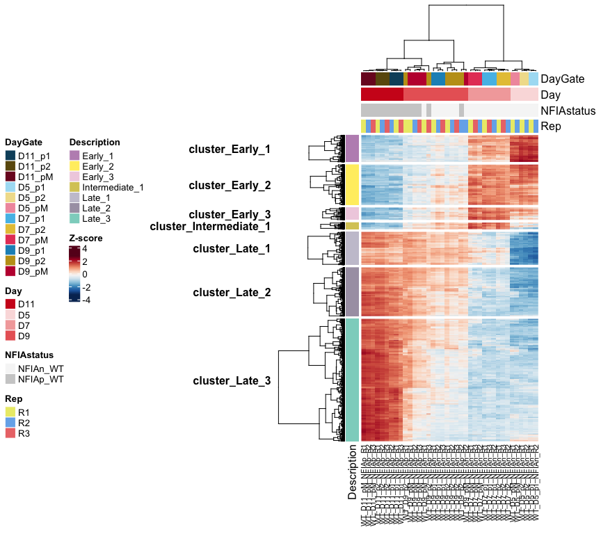<!-- -->

Can I extract the order - this is just to double check the scATAC export

``` r
# r.dend <- row_dend(hmap)  #Extract row dendrogram
# rcl.list <- row_order(hmap)  #Extract clusters (output is a list)
# 
# lapply(rcl.list, function(x) length(x))  #check/confirm size clusters
# 
# # loop to extract genes for each cluster.
# for (i in 1:length(row_order(hmap))){
#  if (i == 1) {
#  clu <- t(t(row.names(vsd_hm_z[row_order(hmap)[[i]],])))
#  out <- cbind(clu, paste("cluster", i, sep=""))
#  colnames(out) <- c("GeneID", "Cluster")
#  } else {
#  clu <- t(t(row.names(vsd_hm_z[row_order(hmap)[[i]],])))
#  clu <- cbind(clu, paste("cluster", i, sep=""))
#  out <- rbind(out, clu)
#  }
#  }
# 
# gene_clusters <- as.data.frame(out)
# 
# write.csv(gene_clusters,paste0(workingdir,outdir,"elements_in_order.csv"),quote = FALSE, row.names = FALSE)
```

### Prep the vsd from in vitro

``` r
vsd_hm_ave <- vsd_hm %>% 
  rownames_to_column("order") %>%
  pivot_longer(starts_with("WT"), names_to = "Sample_ID",values_to = "vsd") %>%
  separate(Sample_ID,into=c("Genotype","Day","Gate","NFIAgate","Rep"), sep="_", remove=FALSE) %>%
  mutate(Condition=paste(Genotype,Day,Gate,NFIAgate, sep="_"),
         DayNFIA=paste(Day,NFIAgate,Genotype,sep = "_"),
         DayGate=paste(Day,Gate,sep="_"),
         NFIAstatus=paste(NFIAgate,Genotype,sep="_")) %>%
  group_by(Day,order) %>%
  summarise(vsd_ave = mean(vsd)) %>%
  ungroup() %>% 
  pivot_wider(values_from = "vsd_ave", names_from = "Day") %>%
  select(order,D5,D7,D9,D11)
```

    ## `summarise()` has grouped output by 'Day'. You can override using the `.groups`
    ## argument.

### Comparison: cerebellum

``` r
cerebellum <- read.table(paste0(workingdir,subinputdir1,"cerebellum_temporalelements.txt"), header = TRUE)
```

``` r
cerebellum_combined <-  vsd_hm_ave %>%
  left_join(cerebellum %>% dplyr::select(e10:e15, order), by="order") %>%
  column_to_rownames("order")

res <- cor(cerebellum_combined)

round(res, 2)
```

    ##        D5    D7   D9   D11  e10  e11   e12   e13   e15
    ## D5   1.00  0.84 0.27 -0.52 0.40 0.15 -0.07 -0.18 -0.19
    ## D7   0.84  1.00 0.58 -0.39 0.48 0.27  0.01 -0.13 -0.15
    ## D9   0.27  0.58 1.00  0.41 0.42 0.50  0.39  0.27  0.23
    ## D11 -0.52 -0.39 0.41  1.00 0.04 0.31  0.51  0.58  0.57
    ## e10  0.40  0.48 0.42  0.04 1.00 0.80  0.51  0.36  0.30
    ## e11  0.15  0.27 0.50  0.31 0.80 1.00  0.84  0.65  0.56
    ## e12 -0.07  0.01 0.39  0.51 0.51 0.84  1.00  0.89  0.80
    ## e13 -0.18 -0.13 0.27  0.58 0.36 0.65  0.89  1.00  0.96
    ## e15 -0.19 -0.15 0.23  0.57 0.30 0.56  0.80  0.96  1.00

``` r
res2 <- rcorr(as.matrix(cerebellum_combined), type="pearson")
```

``` r
corrplot(res, type = "upper", 
         tl.col = "black", tl.srt = 45)
```

<!-- -->

``` r
diag(res2$P) <- 0

# Insignificant correlation are crossed
corrplot(res2$r, type="upper", method = "color",tl.col = "black", tl.srt = 45,
         p.mat = res2$P, sig.level = 0.01, insig = "blank", pch.cex = 0.8, addCoef.col = 'black')
```

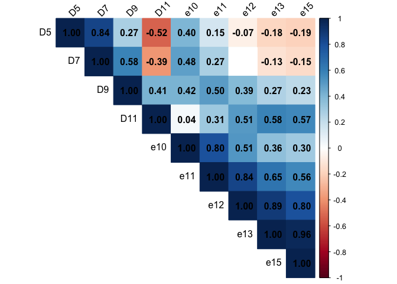<!-- -->

``` r
corrplot(res2$r, type="upper",tl.col = "black", tl.srt = 45,
         p.mat = res2$P, sig.level = 0.01, insig = "pch", pch.cex = 1)
```

<!-- -->

``` r
corrplot(res2$r, type="upper",  tl.col = "black", tl.srt = 45,
         p.mat = res2$P, sig.level = 0.01, insig = "blank")
```

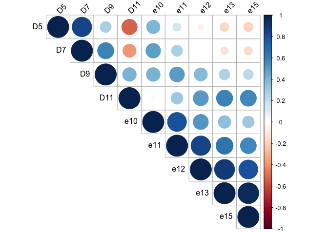<!-- -->

``` r
# corrplot(res2$r[6:9,1:5], type="upper",tl.col = "black", tl.srt = 45, method = "color",
#          p.mat = res2$P[6:9,1:5], sig.level = 0.01, insig = "pch", pch.cex = 1, addCoef.col = 'black')


corrplot(res2$r[1:4,], type="upper",tl.col = "black", tl.srt = 45,
         p.mat = res2$P[1:4,], sig.level = 0.01, insig = "label_sig", pch.cex = 1, col = rev(COL2('RdBu', 10)))
```

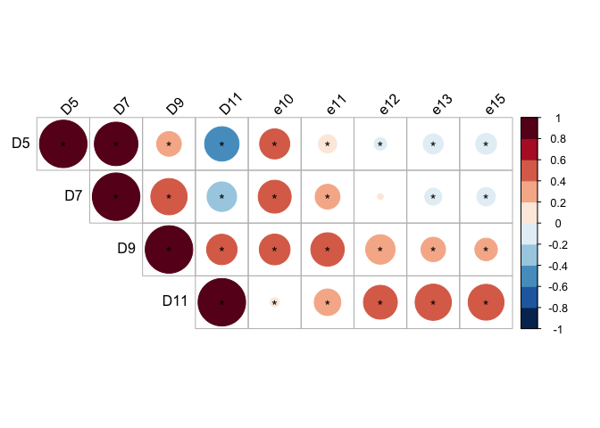<!-- -->

### Comparison: cortex

``` r
cortex <- read.table(paste0(workingdir,subinputdir1,"cortex_temporalelements.txt"), header = TRUE)
```

``` r
cortex_combined <-  vsd_hm_ave %>%
  left_join(cortex %>% dplyr::select(e13_5:e18_5, order), by="order") %>%
  column_to_rownames("order")

res <- cor(cortex_combined)

round(res, 2)
```

    ##          D5    D7   D9   D11 e13_5 e15_5 e18_5
    ## D5     1.00  0.84 0.27 -0.52 -0.19 -0.23 -0.17
    ## D7     0.84  1.00 0.58 -0.39 -0.13 -0.14 -0.14
    ## D9     0.27  0.58 1.00  0.41  0.22  0.21  0.13
    ## D11   -0.52 -0.39 0.41  1.00  0.52  0.52  0.45
    ## e13_5 -0.19 -0.13 0.22  0.52  1.00  0.94  0.73
    ## e15_5 -0.23 -0.14 0.21  0.52  0.94  1.00  0.80
    ## e18_5 -0.17 -0.14 0.13  0.45  0.73  0.80  1.00

``` r
res2 <- rcorr(as.matrix(cortex_combined), type="pearson")
```

``` r
corrplot(res, type = "upper", 
         tl.col = "black", tl.srt = 45)
```

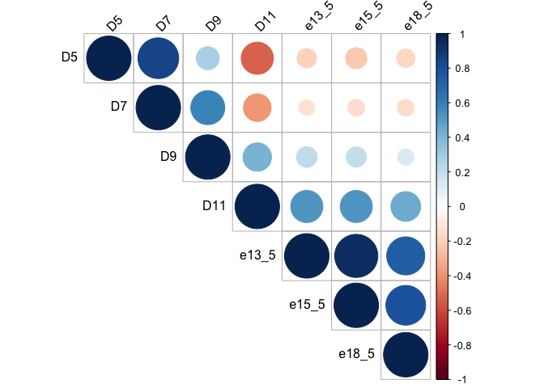<!-- -->

``` r
diag(res2$P) <- 0

# Insignificant correlation are crossed
corrplot(res2$r, type="upper", method = "color",tl.col = "black", tl.srt = 45,
         p.mat = res2$P, sig.level = 0.01, insig = "blank", pch.cex = 0.8, addCoef.col = 'black')
```

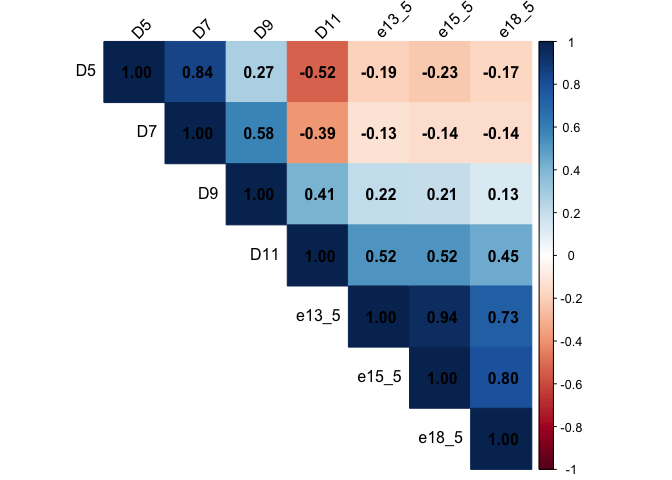<!-- -->

``` r
corrplot(res2$r, type="upper",tl.col = "black", tl.srt = 45,
         p.mat = res2$P, sig.level = 0.01, insig = "pch", pch.cex = 1)
```

<!-- -->

``` r
corrplot(res2$r, type="upper",  tl.col = "black", tl.srt = 45,
         p.mat = res2$P, sig.level = 0.01, insig = "blank")
```

``` r
# corrplot(res2$r[6:9,1:5], type="upper",tl.col = "black", tl.srt = 45, method = "color",
#          p.mat = res2$P[6:9,1:5], sig.level = 0.01, insig = "pch", pch.cex = 1, addCoef.col = 'black')


corrplot(res2$r[1:4,], type="upper",tl.col = "black", tl.srt = 45,
         p.mat = res2$P[1:4,], sig.level = 0.01, insig = "label_sig", pch.cex = 1, col = rev(COL2('RdBu', 10)))
```

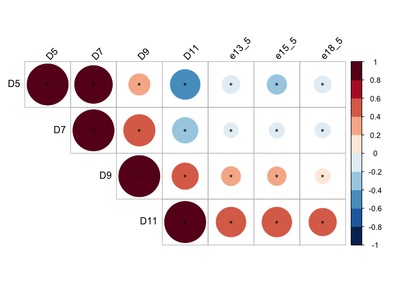<!-- -->

### Comparison: retina

``` r
retina <- read.table(paste0(workingdir,subinputdir1,"retina_temporalelements.txt"), header = TRUE)
```

``` r
retina_combined <-  vsd_hm_ave %>%
  left_join(retina %>% dplyr::select(e11:e18, order), by="order") %>%
  column_to_rownames("order")

res <- cor(retina_combined)

round(res, 2)
```

    ##        D5    D7   D9   D11   e11   e12   e14  e16  e18
    ## D5   1.00  0.84 0.27 -0.52  0.48  0.46  0.37 0.23 0.07
    ## D7   0.84  1.00 0.58 -0.39  0.43  0.42  0.36 0.22 0.06
    ## D9   0.27  0.58 1.00  0.41  0.17  0.15  0.25 0.26 0.24
    ## D11 -0.52 -0.39 0.41  1.00 -0.19 -0.21 -0.03 0.12 0.26
    ## e11  0.48  0.43 0.17 -0.19  1.00  0.95  0.81 0.62 0.38
    ## e12  0.46  0.42 0.15 -0.21  0.95  1.00  0.84 0.64 0.39
    ## e14  0.37  0.36 0.25 -0.03  0.81  0.84  1.00 0.91 0.68
    ## e16  0.23  0.22 0.26  0.12  0.62  0.64  0.91 1.00 0.89
    ## e18  0.07  0.06 0.24  0.26  0.38  0.39  0.68 0.89 1.00

``` r
res2 <- rcorr(as.matrix(retina_combined), type="pearson")
```

``` r
corrplot(res, type = "upper", 
         tl.col = "black", tl.srt = 45)
```

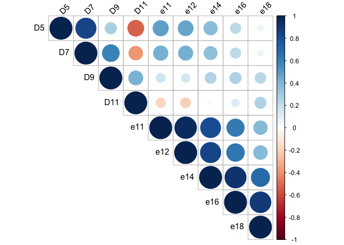<!-- -->

``` r
diag(res2$P) <- 0

# Insignificant correlation are crossed
corrplot(res2$r, type="upper", method = "color",tl.col = "black", tl.srt = 45,
         p.mat = res2$P, sig.level = 0.01, insig = "blank", pch.cex = 0.8, addCoef.col = 'black')
```

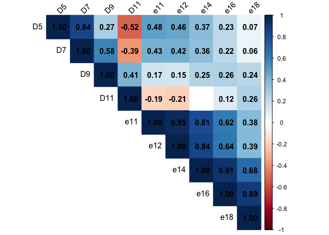<!-- -->

``` r
corrplot(res2$r, type="upper",tl.col = "black", tl.srt = 45,
         p.mat = res2$P, sig.level = 0.01, insig = "pch", pch.cex = 1)
```

<!-- -->

``` r
corrplot(res2$r, type="upper",  tl.col = "black", tl.srt = 45,
         p.mat = res2$P, sig.level = 0.01, insig = "blank")
```

<!-- -->

``` r
# corrplot(res2$r[6:9,1:5], type="upper",tl.col = "black", tl.srt = 45, method = "color",
#          p.mat = res2$P[6:9,1:5], sig.level = 0.01, insig = "pch", pch.cex = 1, addCoef.col = 'black')


corrplot(res2$r[1:4,], type="upper",tl.col = "black", tl.srt = 45,
         p.mat = res2$P[1:4,], sig.level = 0.01, insig = "label_sig", pch.cex = 1, col = rev(COL2('RdBu', 10)))
```

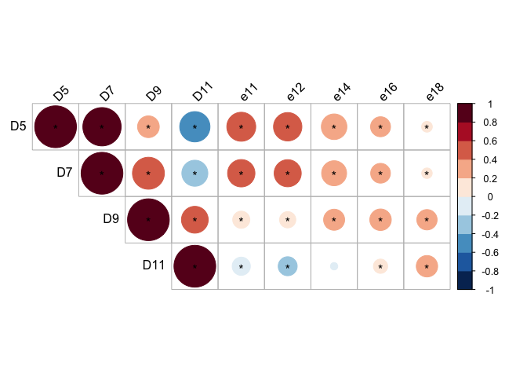<!-- -->

### Comparison: organogenesis atlas

``` r
organogenesis <- read.table(paste0(workingdir,subinputdir1,"organo_temporalelements.txt"), header = TRUE)
organogenesis_sc <- read.table(paste0(workingdir,subinputdir1,"organoSC_temporalelements.txt"), header = TRUE)
```

``` r
organogenesis0 <-  vsd_hm_ave %>%
  left_join(organogenesis_sc %>% dplyr::select(E10.5:E13.5, order), by="order") %>%
  column_to_rownames("order")

res2 <- rcorr(as.matrix(organogenesis0), type="pearson")
diag(res2$P) <- 0


# Insignificant correlation are crossed
corrplot(res2$r, type="upper", method = "color",tl.col = "black", tl.srt = 45,
         p.mat = res2$P, sig.level = 0.01, insig = "blank", pch.cex = 0.8, addCoef.col = 'black')
```

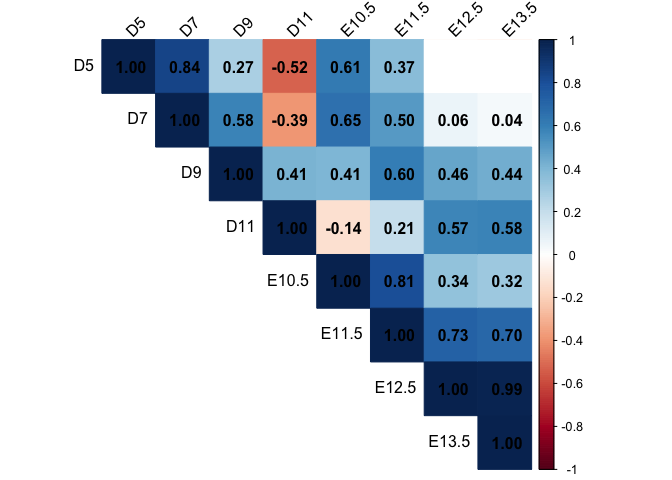<!-- -->

``` r
corrplot(res2$r[1:4,], type="upper",tl.col = "black", tl.srt = 45,
         p.mat = res2$P[1:4,], sig.level = 0.01, insig = "label_sig", pch.cex = 1, col = rev(COL2('RdBu', 10)))
```

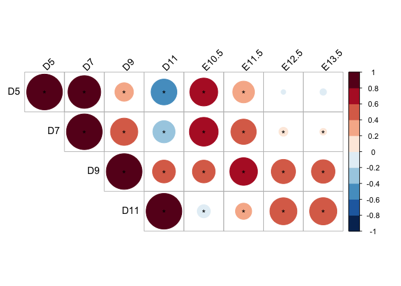<!-- -->

``` r
organogenesis1 <-  vsd_hm_ave %>%
  left_join(organogenesis %>% dplyr::select(ends_with("Hindbrain"), order), by="order") %>%
  column_to_rownames("order")

res2 <- rcorr(as.matrix(organogenesis1), type="pearson")
diag(res2$P) <- 0


# Insignificant correlation are crossed
corrplot(res2$r, type="upper", method = "color",tl.col = "black", tl.srt = 45,
         p.mat = res2$P, sig.level = 0.01, insig = "blank", pch.cex = 0.8, addCoef.col = 'black')
```

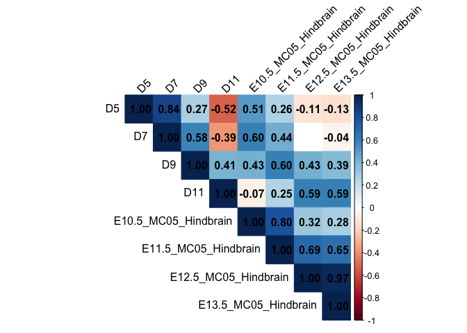<!-- -->

``` r
corrplot(res2$r[1:4,], type="upper",tl.col = "black", tl.srt = 45,
         p.mat = res2$P[1:4,], sig.level = 0.01, insig = "label_sig", pch.cex = 1, col = rev(COL2('RdBu', 10)))
```

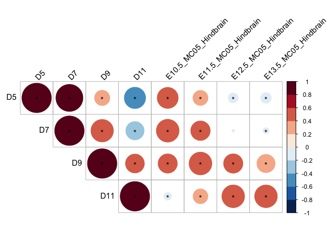<!-- -->

``` r
organogenesis2 <-  vsd_hm_ave %>%
  left_join(organogenesis %>% dplyr::select(ends_with("MHB"), order), by="order") %>%
  column_to_rownames("order")

res2 <- rcorr(as.matrix(organogenesis2), type="pearson")
diag(res2$P) <- 0


# Insignificant correlation are crossed
corrplot(res2$r, type="upper", method = "color",tl.col = "black", tl.srt = 45,
         p.mat = res2$P, sig.level = 0.01, insig = "blank", pch.cex = 0.8, addCoef.col = 'black')
```

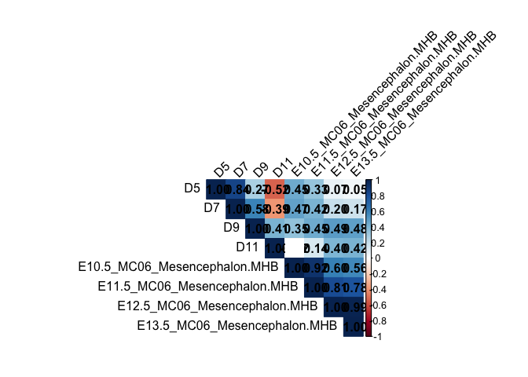<!-- -->

``` r
corrplot(res2$r[1:4,], type="upper",tl.col = "black", tl.srt = 45,
         p.mat = res2$P[1:4,], sig.level = 0.01, insig = "label_sig", pch.cex = 1, col = rev(COL2('RdBu', 10)))
```

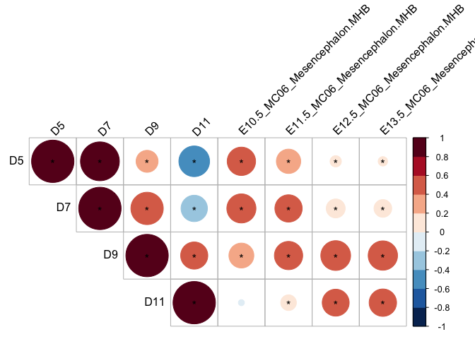<!-- -->

``` r
organogenesis3 <-  vsd_hm_ave %>%
  left_join(organogenesis %>% dplyr::select(ends_with("telencephalon"), order), by="order") %>%
  column_to_rownames("order")

res2 <- rcorr(as.matrix(organogenesis3), type="pearson")
diag(res2$P) <- 0


# Insignificant correlation are crossed
corrplot(res2$r, type="upper", method = "color",tl.col = "black", tl.srt = 45,
         p.mat = res2$P, sig.level = 0.01, insig = "blank", pch.cex = 0.8, addCoef.col = 'black')
```

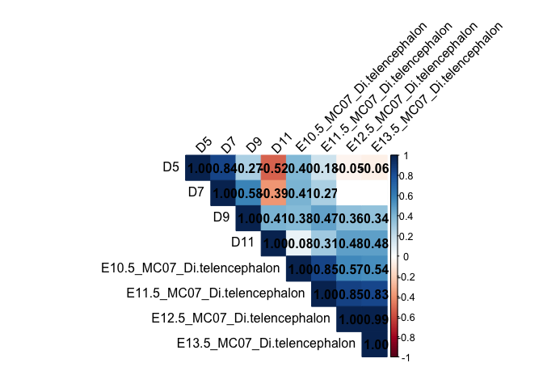<!-- -->

``` r
corrplot(res2$r[1:4,], type="upper",tl.col = "black", tl.srt = 45,
         p.mat = res2$P[1:4,], sig.level = 0.01, insig = "label_sig", pch.cex = 1, col = rev(COL2('RdBu', 10)))
```

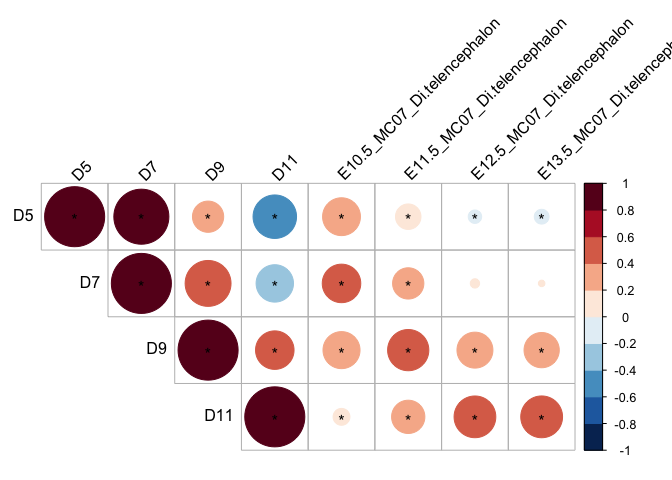<!-- -->

### Comparison: Spinal Cord in vivo

``` r
spinalcord <- read.table(paste0(workingdir,subinputdir1,"spinalcord_temporalelements.txt"), header = TRUE)
```

``` r
spinalcord_combined <-  vsd_hm_ave %>%
  left_join(spinalcord %>% dplyr::select(e9_5,e10_5,e12_5,e13_5, order), by="order") %>%
  column_to_rownames("order")

res2 <- rcorr(as.matrix(spinalcord_combined), type="pearson")
diag(res2$P) <- 0


# Insignificant correlation are crossed
corrplot(res2$r, type="upper", method = "color",tl.col = "black", tl.srt = 45,
         p.mat = res2$P, sig.level = 0.01, insig = "blank", pch.cex = 0.8, addCoef.col = 'black')
```

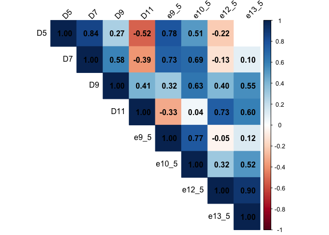<!-- -->

``` r
corrplot(res2$r[1:4,], type="upper",tl.col = "black", tl.srt = 45,
         p.mat = res2$P[1:4,], sig.level = 0.01, insig = "label_sig", pch.cex = 1, col = rev(COL2('RdBu', 10)))
```

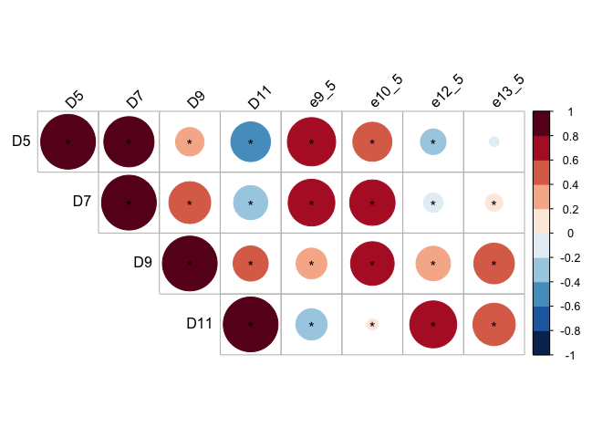<!-- -->

``` r
sessionInfo()
```

    ## R version 4.4.0 (2024-04-24)
    ## Platform: aarch64-apple-darwin20
    ## Running under: macOS 15.4.1
    ## 
    ## Matrix products: default
    ## BLAS:   /Library/Frameworks/R.framework/Versions/4.4-arm64/Resources/lib/libRblas.0.dylib 
    ## LAPACK: /Library/Frameworks/R.framework/Versions/4.4-arm64/Resources/lib/libRlapack.dylib;  LAPACK version 3.12.0
    ## 
    ## locale:
    ## [1] en_US.UTF-8/en_US.UTF-8/en_US.UTF-8/C/en_US.UTF-8/en_US.UTF-8
    ## 
    ## time zone: Europe/London
    ## tzcode source: internal
    ## 
    ## attached base packages:
    ## [1] grid      stats     graphics  grDevices utils     datasets  methods  
    ## [8] base     
    ## 
    ## other attached packages:
    ##  [1] corrplot_0.95         Hmisc_5.2-3           ComplexHeatmap_2.20.0
    ##  [4] lubridate_1.9.3       forcats_1.0.0         stringr_1.5.1        
    ##  [7] dplyr_1.1.4           purrr_1.0.2           readr_2.1.5          
    ## [10] tidyr_1.3.1           tibble_3.2.1          ggplot2_3.5.1        
    ## [13] tidyverse_2.0.0       RColorBrewer_1.1-3   
    ## 
    ## loaded via a namespace (and not attached):
    ##  [1] gtable_0.3.5        circlize_0.4.16     shape_1.4.6.1      
    ##  [4] rjson_0.2.21        xfun_0.44           htmlwidgets_1.6.4  
    ##  [7] GlobalOptions_0.1.2 tzdb_0.4.0          Cairo_1.6-2        
    ## [10] vctrs_0.6.5         tools_4.4.0         generics_0.1.3     
    ## [13] stats4_4.4.0        parallel_4.4.0      fansi_1.0.6        
    ## [16] highr_0.11          cluster_2.1.6       pkgconfig_2.0.3    
    ## [19] data.table_1.15.4   checkmate_2.3.2     S4Vectors_0.42.0   
    ## [22] lifecycle_1.0.4     compiler_4.4.0      munsell_0.5.1      
    ## [25] codetools_0.2-20    clue_0.3-65         htmltools_0.5.8.1  
    ## [28] yaml_2.3.8          htmlTable_2.4.3     Formula_1.2-5      
    ## [31] pillar_1.9.0        crayon_1.5.2        magick_2.8.3       
    ## [34] iterators_1.0.14    rpart_4.1.23        foreach_1.5.2      
    ## [37] tidyselect_1.2.1    digest_0.6.35       stringi_1.8.4      
    ## [40] fastmap_1.2.0       colorspace_2.1-0    cli_3.6.2          
    ## [43] magrittr_2.0.3      base64enc_0.1-3     utf8_1.2.4         
    ## [46] foreign_0.8-86      withr_3.0.0         backports_1.5.0    
    ## [49] scales_1.3.0        timechange_0.3.0    rmarkdown_2.27     
    ## [52] matrixStats_1.3.0   nnet_7.3-19         gridExtra_2.3      
    ## [55] png_0.1-8           GetoptLong_1.0.5    hms_1.1.3          
    ## [58] evaluate_0.23       knitr_1.47          IRanges_2.38.0     
    ## [61] doParallel_1.0.17   rlang_1.1.4         Rcpp_1.0.12        
    ## [64] glue_1.7.0          BiocGenerics_0.50.0 rstudioapi_0.16.0  
    ## [67] R6_2.5.1
