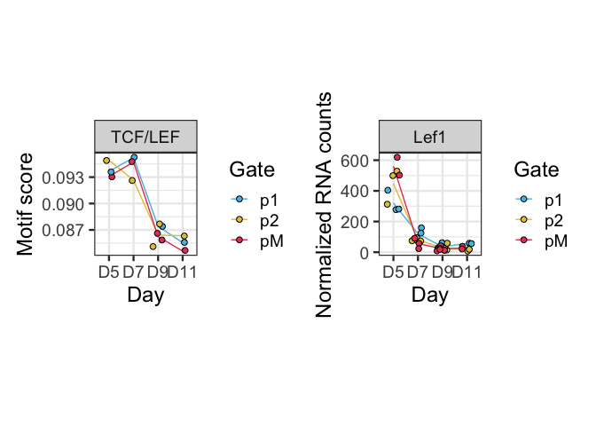
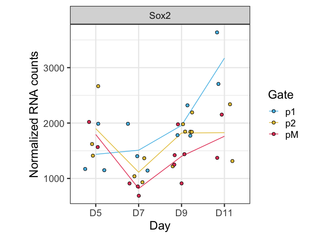
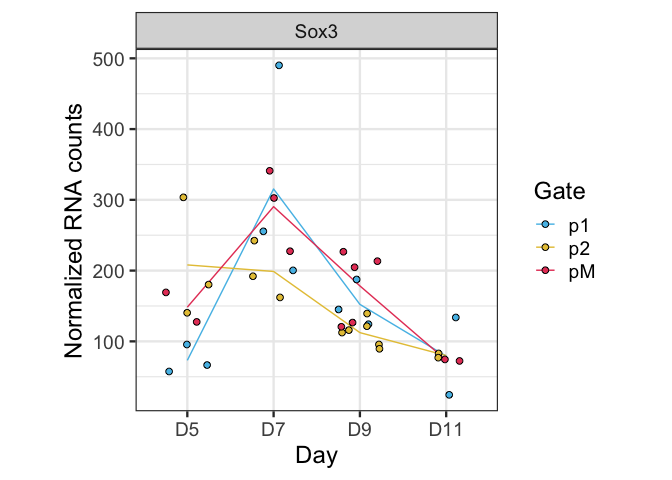
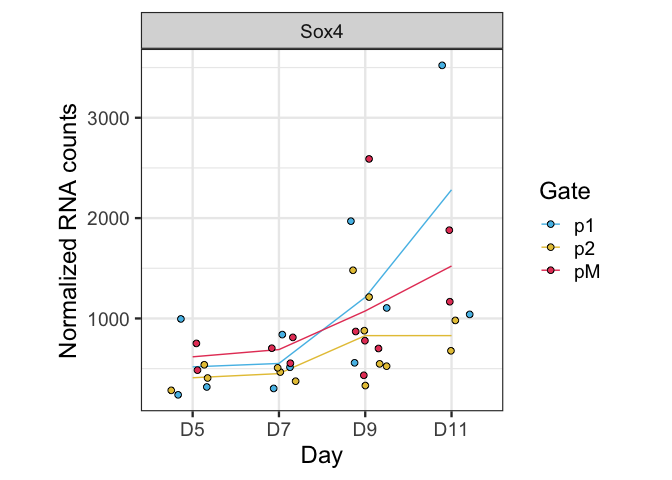

Temporal footprint_1_WT
================

## Overview analysis Glial switch Footprinting

``` r
rm(list=ls())

library(RColorBrewer)
library(ComplexHeatmap)
library(readxl)
library(broom)
library(ggrepel)
```

    ## Warning: package 'ggrepel' was built under R version 4.2.3

``` r
library(patchwork)
```

    ## Warning: package 'patchwork' was built under R version 4.2.3

``` r
library(tidyverse)
```

    ## Warning: package 'tidyr' was built under R version 4.2.3

    ## Warning: package 'readr' was built under R version 4.2.3

    ## Warning: package 'dplyr' was built under R version 4.2.3

    ## Warning: package 'stringr' was built under R version 4.2.3

### Load settings

Colors, main directory

``` r
source('./r_inputs/TemporalSpatialNeuralTube_settings.R')
```

### Set dirs

``` r
outdir="outputs_glialfootprint_1_WT/"
subworkinput="inputs_glialfootprint_1/"
ifelse(!dir.exists(file.path(workingdir,outdir)), dir.create(file.path(workingdir,outdir)), "Directory exists")
```

    ## [1] "Directory exists"

``` r
suboutdir1="Plots_Archetypes_RNA/"
ifelse(!dir.exists(file.path(workingdir,outdir,suboutdir1)), dir.create(file.path(workingdir,outdir,suboutdir1)), "Directory exists")
```

    ## [1] "Directory exists"

``` r
suboutdir2="Plots_scores_Arch/"
ifelse(!dir.exists(file.path(workingdir,outdir,suboutdir2)), dir.create(file.path(workingdir,outdir,suboutdir2)), "Directory exists")
```

    ## [1] "Directory exists"

### Import data

``` r
Motif_preds_tabl <- read.table(paste0(workingdir,subworkinput,"bindetect_results.txt"),header=T,sep="\t",stringsAsFactors=F)
```

Clean table and subset scores

``` r
Motif_scores <- Motif_preds_tabl %>%
  dplyr::select(c("output_prefix" ,"name","motif_id","cluster", "total_tfbs",contains("_score")))
```

### table to group motifs to archetypes

``` r
archetypes_clusterid <- read_excel(paste0(workingdir,subworkinput,"motif_annotations.xlsx"),2)  
archtypes_names <- read_excel(paste0(workingdir,subworkinput,"motif_annotations.xlsx"),1)  

archtypes_2_motifs <- archetypes_clusterid %>% dplyr::select(c("Cluster_ID","Motif","Database","Consensus")) %>%
  left_join(archtypes_names %>% dplyr::select(c("Cluster_ID","Name","DBD","Seed_motif")), by="Cluster_ID")
archtypes_2_motifs$Cluster_ID <- as.character(archtypes_2_motifs$Cluster_ID)
```

## Heatmap of all

``` r
scores_plot <- Motif_preds_tabl %>% dplyr::select(c("output_prefix","name","motif_id","cluster", ends_with("_score")))
```

## Filter “significant” as the BINDetect volcano plot does

The volcano plots shows y_min = np.percentile(yvalues\[yvalues \> 0\],
5) \#5% smallest pvalues x_min, x_max = np.percentile(xvalues, \[5,
95\]) \#5% smallest and largest changes

Filter lowest pval and largest changes PER comparison

``` r
scores_plotTop <- Motif_preds_tabl %>% 
  dplyr::select(c("output_prefix",ends_with("_score"))) %>%
  gather(quant_item, value,ends_with("_score"))

scores_plot_topchanges <- Motif_preds_tabl %>%
  dplyr::select("output_prefix", ends_with("_change")) %>%
  gather(item_changes, value_change, ends_with("_change")) %>% 
  group_by(item_changes) %>%
  mutate(value_abs_change = abs(value_change)) %>%
  top_frac(0.05,value_abs_change) %>%
  ungroup() %>%
  spread(item_changes, value_change)

scores_plot_topovalues <- Motif_preds_tabl %>%
  dplyr::select("output_prefix", ends_with("_pvalue")) %>%
  gather(item_pvalue, value_pvalue, ends_with("_pvalue")) %>% 
  group_by(item_pvalue) %>%
  top_frac(-0.05,value_pvalue) %>%
  ungroup() %>%
  spread(item_pvalue, value_pvalue)
```

## top variable or significant

With the top motifs, get heatmap

``` r
scores_subset <- scores_plot %>% 
  filter(output_prefix %in% as.character(scores_plot_topovalues$output_prefix) | output_prefix %in% as.character(scores_plot_topchanges$output_prefix)) 
```

## Heatmap of top motif in cluster - WT only

Plot only WT

``` r
scores_subset_cluster = scores_subset %>%
   dplyr::select("output_prefix","motif_id", starts_with("WT")) %>% ## dplyr::selecting only the WT
  left_join(archtypes_2_motifs, by = c("motif_id"="Motif")) %>%
  mutate(Archetype=paste(Cluster_ID,Name,sep = "_")) %>%
  gather(sample, mean_score, ends_with("_score")) %>%
  group_by(output_prefix) %>%
  mutate(score_var = var(mean_score)) %>%
  ungroup() %>% group_by(Archetype) %>%
  top_n(1,score_var) %>%
  dplyr::select(-score_var, -output_prefix, -motif_id, -Database) %>% # eliminate the name of the motif
  unique() %>%
  spread(sample,mean_score)


#write.csv(top_motif_per_achr, file="Topvar_motif_by_archetypes.csv", quote = FALSE)


scores_1percluster_ann <- scores_subset_cluster %>%
  dplyr::select(c("Archetype","DBD","Name","Cluster_ID", ends_with("_score"))) %>%
  remove_rownames() %>%
  column_to_rownames("Archetype") %>%
  dplyr::select("DBD")

scores_subset_hm <- scores_subset_cluster %>%
  remove_rownames() %>%
  column_to_rownames("Archetype") %>% dplyr::select(ends_with("_score"))


## clean column names
colnames(scores_subset_hm) <- gsub("_footprints_mean_score","",colnames(scores_subset_hm))


scores_subset_hm_z <- t(scale(t(scores_subset_hm))) 
# same as t(apply(scores_hm, 1, function(r) (r - mean(r))/sd(r)))

## make column annotation
## Make metadata file, same as  DESeq but for heatmaps
genecolData_first <- data.frame(Sample_ID = colnames(scores_subset_cluster)) %>%
  filter(grepl("_score", Sample_ID)) %>%
  mutate(Sample_ID=gsub("_footprints_mean_score","",Sample_ID))

genecolData_first <- genecolData_first %>% 
  separate(Sample_ID,into=c("Genotype","Day","Gate","NFIAgate"), sep="_", remove=FALSE) %>%
        mutate(Condition=paste(Genotype,Day,Gate,NFIAgate, sep="_"),
         DayNFIA=paste(Day,NFIAgate,Genotype,sep = "_"),
         DayGate=paste(Day,Gate,sep="_"),
         NFIAstatus=paste(NFIAgate,Genotype,sep="_"))
genecolData_first <- as.data.frame(unclass(genecolData_first))

phen_data <- genecolData_first %>%
  dplyr::select(c("Sample_ID","DayGate","Day","NFIAstatus")) %>%
  remove_rownames() %>%
  column_to_rownames("Sample_ID")


ann_color_JD <- list(
  DayGate = c(D5_p1="#abdff4",D5_p2="#f1df9a", D5_pM="#f19aac",
              D7_p1="#55bee8",D7_p2="#e6c444",D7_pM="#e64466",
              D9_p1="#1a91c1",D9_p2="#c19e1a",D9_pM="#c11a3d",
              D11_p1="#0e506b",D11_p2="#6b570e",D11_pM="#7c1127"),
  NFIAstatus = c(NFIAn_WT="#f6f6f6",NFIAp_WT="#cecece",`100`="#808080",NFIAn_MUT="#595959"),
  Day = c(D5="#fadede",D7="#f3aaaa",D9="#e96666",D11="#cf1e1e"))


# Build the annotation for the complex heatmap
heatmap_ann <- HeatmapAnnotation(df=phen_data, col=ann_color_JD)


rowAnn <- HeatmapAnnotation(
    df = scores_1percluster_ann,
    which = 'row', # 'col' (samples) or 'row' (gene) annotation?
    na_col = 'white', # default colour for any NA values in the annotation data-frame, 'ann'
    #col = ann_color_JD,
    annotation_height = 0.6,
    annotation_width = unit(1, 'cm'),
    gap = unit(1, 'mm'))


# Annotated heatmap with selected colors
hm_colors = colorRampPalette(rev(brewer.pal(n = 11, name = "RdBu")))(100)

Heatmap(scores_subset_hm_z, name="Motif z-score",
                col = hm_colors,
                top_annotation = heatmap_ann,
                right_annotation = rowAnn,
        
                # row (gene) parameters
                cluster_rows = TRUE,
                show_row_dend = TRUE,
                #row_title = 'Statistically significant genes',
                row_title_side = 'left',
                row_title_gp = gpar(fontsize = 12,  fontface = 'bold'),
                row_title_rot = 90,
                show_row_names = TRUE,
                row_names_gp = gpar(fontsize = 6, fontface = 'bold'),
                row_names_side = 'right',
                row_dend_width = unit(25,'mm'),
                
                # column (sample) parameters
                cluster_columns = TRUE,
                show_column_dend = TRUE,
                column_title = '',
                column_title_side = 'bottom',
                column_title_gp = gpar(fontsize = 12, fontface = 'bold'),
                column_title_rot = 0,
                show_column_names = TRUE,
                column_names_gp = gpar(fontsize = 10, fontface = 'bold'),
                column_names_max_height = unit(10, 'cm'),
                column_dend_height = unit(25,'mm'),
                
                # cluster methods for rows and columns
                clustering_distance_columns = function(x) as.dist(1 - cor(t(x))),
                clustering_method_columns = 'ward.D2',
                clustering_distance_rows = function(x) as.dist(1 - cor(t(x))),
                clustering_method_rows = 'ward.D2'
        )
```

<!-- -->

# Correlations to gene expression: just WT first

``` r
scores_subset_plot_z <- scores_subset_hm_z %>%
  as.data.frame() %>%
  rownames_to_column("Archetype")


scores_subset_plot_z_gather <- scores_subset_plot_z %>%
  gather("sample","zscore", starts_with("WT")) %>%
  #mutate(sample=factor(sample, levels = sorted.sample)) %>%
  separate(sample,into=c("Genotype","Day","Gate","NFIAgate"), sep="_", remove=FALSE) %>%
  mutate(Condition=paste(Genotype,Day,Gate,NFIAgate, sep="_"),
         DayGate=paste(Day,Gate,sep="_"),
         NFIAstatus=paste(NFIAgate,Genotype,sep="_")) %>%
  mutate(DayGate = factor(DayGate, levels = sorted.DayGate))
```

# Correlation with gene expression

Upload the lookup table and the gene expression matrix

``` r
gene_motifs_cluster <- read.csv(paste0(workingdir,subworkinput,"lookup_motif_gene_archetype_21-11-23.csv"),
                                stringsAsFactors =FALSE,
                                colClasses=c("character","character"))

gene_2_clusterID_all <- gene_motifs_cluster %>% dplyr::select("Cluster_ID","mouse_genename") %>% unique()
gene_2_clusterID <- gene_2_clusterID_all %>%
  filter(!is.na(mouse_genename))

gene_2_arch <- gene_2_clusterID %>%
  left_join(archtypes_2_motifs, by = "Cluster_ID") %>%
  mutate(Archetype=paste(Cluster_ID,Name,sep = "_"))
```

    ## Warning in left_join(., archtypes_2_motifs, by = "Cluster_ID"): Detected an unexpected many-to-many relationship between `x` and `y`.
    ## ℹ Row 1 of `x` matches multiple rows in `y`.
    ## ℹ Row 3 of `y` matches multiple rows in `x`.
    ## ℹ If a many-to-many relationship is expected, set `relationship =
    ##   "many-to-many"` to silence this warning.

``` r
## trying to get this table cleaner and fuller

gene_exp <- read.table(paste0(workingdir,"outputs_glialRNA_1/","featurecounts.normCounts.txt"),stringsAsFactors =FALSE)
```

Clean tables

``` r
gene_exp_preclean <- gene_exp %>%
  rownames_to_column("genename") %>%
  gather(sample, norm_counts, starts_with("WT")) %>%
  separate(sample,into=c("Genotype","Day","Gate","NFIAgate","Rep"), sep="_", remove=FALSE) %>%
  mutate(Condition=paste(Genotype,Day,Gate,NFIAgate, sep="_")) %>%
  group_by(Condition, genename) %>%
  summarise(ave_count = mean(norm_counts))
```

    ## `summarise()` has grouped output by 'Condition'. You can override using the
    ## `.groups` argument.

``` r
# Only keep genes where at least 1 Condition has more than 100 normalized counts (average across reps)
gene_exp_clean <- gene_exp %>%
  rownames_to_column("genename") %>%
  gather(sample, norm_counts, starts_with("WT")) %>%
  separate(sample,into=c("Genotype","Day","Gate","NFIAgate","Rep"), sep="_", remove=FALSE) %>%
  mutate(Condition=paste(Genotype,Day,Gate,NFIAgate, sep="_")) %>%
  group_by(Condition, genename) %>%
  summarise(ave_count = mean(norm_counts), .groups="keep") %>%
  spread(Condition, ave_count) %>%
  filter_at(vars(starts_with("WT")), any_vars(.>100)) %>%
  gather(Condition, ave_count, starts_with("WT"))


zscores_arch_clean <- scores_subset_plot_z_gather %>%
  separate(Archetype, into = c("Cluster_ID","Cluster_name"), sep = "_", remove = FALSE)

# archtypes that still have genes
gene_2_arch_expressionfiltered = gene_2_arch %>%
  filter(mouse_genename %in% gene_exp_clean$genename)
```

To save a long list of correlations

``` r
get_reg_fit_arch_RNA <- function(x){

  clean_x = gsub("/","-",x)

  sub_zscores = zscores_arch_clean %>%
  filter(Archetype==x)

  sub_genes = gene_2_arch %>% filter(Archetype==x)

  sub_exp = gene_exp_clean %>% filter(genename %in% as.character(sub_genes$mouse_genename))

  sub_plot = sub_zscores %>%
    left_join(sub_exp, by = c("sample"="Condition"))

  sub_corr <- sub_plot %>%
    group_by(genename) %>%
    mutate(arch2gene_corr = cor(zscore,ave_count)) %>%
    dplyr::select(Archetype,Cluster_ID,Cluster_name,genename,arch2gene_corr) %>%
    unique()

  sub_fit <- sub_plot %>%
    group_by(genename) %>%
    do(fitgene =  glance(lm(zscore ~ ave_count, data = .))) %>%
    unnest(fitgene) %>%
    mutate(Archetype=x)

  sub_fit_corr <- sub_fit %>%
    inner_join(sub_corr, by=c("genename","Archetype"))

  sub_fit_corr
}

top_arch <- intersect(zscores_arch_clean$Archetype, gene_2_arch_expressionfiltered$Archetype) %>% unique() 


Arch_gene_fit_all <- lapply(top_arch, get_reg_fit_arch_RNA)

Arch_gene_fit_table <- do.call(rbind,Arch_gene_fit_all)
```

## Plot all motifs for each archetype

Clean

``` r
## Annotation to color by archetype
scores_cluster_arch_plot <- scores_subset %>%
  left_join(archtypes_2_motifs, by = c("motif_id"="Motif")) %>%
  mutate(Archetype=paste(Cluster_ID,Name,sep = "_")) %>%
  dplyr::select(output_prefix,Archetype, ends_with("_score"))

scores_cluster_arch_plot_gather <- scores_cluster_arch_plot %>%
  gather("sample","score", ends_with("_score")) %>%
  mutate(sample=gsub("_footprints_mean_score","",sample)) %>%
  separate(sample,into=c("Genotype","Day","Gate","NFIAgate"), sep="_", remove=FALSE) %>%
  mutate(Condition=paste(Genotype,Day,Gate,NFIAgate, sep="_"),
         DayGate=paste(Day,Gate,sep="_"),
         NFIAstatus=paste(NFIAgate,Genotype,sep="_")) %>%
  mutate(DayGate = factor(DayGate, levels = sorted.DayGate)) %>%
  filter(Genotype == "WT")

scores_cluster_arch_plot_gather <- scores_cluster_arch_plot_gather %>% mutate(sample = factor(sample, levels = sorted.sample))
```

### Plot the top Correlated

Get the top archetypes-gene from Arch_gene_fit_table

Go back to function-all-cor-fits and get the full table

With adj.r.sq over 0.6

``` r
Top_fit <- Arch_gene_fit_table %>%
  filter(adj.r.squared > 0.6)
```

``` r
top_sub_zscores = zscores_arch_clean %>%
  filter(Archetype %in% Top_fit$Archetype)

top_sub_genes = gene_2_arch %>% filter(Archetype%in% Top_fit$Archetype & mouse_genename %in% Top_fit$genename) %>%
  dplyr::select(-Motif,-Database,-Consensus) %>% unique()

top_sub_exp = top_sub_genes %>%
  left_join(gene_exp_clean, by = c("mouse_genename"="genename"))
```

    ## Warning in left_join(., gene_exp_clean, by = c(mouse_genename = "genename")): Detected an unexpected many-to-many relationship between `x` and `y`.
    ## ℹ Row 1 of `x` matches multiple rows in `y`.
    ## ℹ Row 2400 of `y` matches multiple rows in `x`.
    ## ℹ If a many-to-many relationship is expected, set `relationship =
    ##   "many-to-many"` to silence this warning.

``` r
top_sub_plot = top_sub_zscores %>%
  left_join(top_sub_exp, by = c("Archetype","Condition"))


ggplot(top_sub_plot, aes(x=ave_count, y=zscore, group=mouse_genename)) +
  geom_smooth(method=lm, formula = y ~ x) +
  geom_point(aes(color=DayGate, shape=NFIAstatus)) +
  scale_color_manual(values = colorIZ) +
  facet_wrap(Archetype ~ mouse_genename, scales = "free_x") +
  theme_bw(base_size = 12) +
  theme(aspect.ratio = 1)
```

<!-- -->

### Plot individual ones: side by side

Prep tables

``` r
# dplyr::select days to show the scores
scores_subset_alldays <- Motif_preds_tabl %>%  
  dplyr::select(c("output_prefix","name","motif_id","cluster", ends_with("_score"))) %>% 
  dplyr::select(-starts_with("MUT"))
  
# join to archetypes, keep most variable score
scores_subset_cluster_top_alldays = scores_subset_alldays %>%
  left_join(archtypes_2_motifs, by = c("motif_id"="Motif")) %>%
  mutate(Archetype=paste(Cluster_ID,Name,sep = "_")) %>%
  gather(sample, mean_score, ends_with("_score")) %>%
  group_by(output_prefix) %>%
  mutate(score_var = var(mean_score)) %>%
  ungroup() %>% group_by(Archetype) %>%
  top_n(1,score_var) %>%
  dplyr::select(-score_var, -output_prefix, -name, -motif_id, -cluster, -Database) %>% # eliminate the name of the motif
  unique() %>%
  mutate(sample=gsub("_footprints_mean_score","", sample),
         sample=factor(sample, levels = sorted.sample)) %>%
  separate(sample,into=c("Genotype","Day","Gate","NFIAgate"), sep="_", remove=FALSE) %>%
  mutate(Condition=paste(Genotype,Day,Gate,NFIAgate, sep="_"),
         DayGate=paste(Day,Gate,sep="_"),
         NFIAstatus=paste(NFIAgate,Genotype,sep="_")) %>%
  mutate(DayGate = factor(DayGate, levels = sorted.DayGate),
         Day=factor(Day, levels = sorted.day))
  
counts_clean <- gene_exp %>%
  dplyr::select(starts_with("WT")) %>%
  rownames_to_column("genename") %>%
  gather(sample, norm_counts, starts_with("WT")) %>%
  mutate(sample=gsub("\\.","_", sample)) %>%
  separate(sample,into=c("Genotype","Day","Gate","NFIAgate"), sep="_", remove=FALSE) %>%
  mutate(Condition=paste(Genotype,Day,Gate,NFIAgate, sep="_"),
         DayGate=paste(Day,Gate,sep="_"),
         NFIAstatus=paste(NFIAgate,Genotype,sep="_")) %>%
  mutate(DayGate = factor(DayGate, levels = sorted.DayGate),
         Condition=factor(Condition, levels = sorted.sample),
         Day=factor(Day, levels = sorted.day))
```

    ## Warning: Expected 4 pieces. Additional pieces discarded in 903170 rows [1, 2, 3, 4, 5,
    ## 6, 7, 8, 9, 10, 11, 12, 13, 14, 15, 16, 17, 18, 19, 20, ...].

### figures of plots of interest temporal program

``` r
ordered_arch <- c("40_NR/11","29_TCF/LEF","89_SOX/1","245_RFX/2","189_NFI/1","54_AP1/1","54_AP1/1")
orderede_genes <- c("Nr6a1","Lef1","Sox9","Rfx4","Nfia","Atf3","Fos")


lapply(c(1:length(ordered_arch)), function(x){
  sub_zscores = scores_subset_cluster_top_alldays %>% separate(Archetype, into = c("Cluster_ID","Cluster_name"), sep = "_", remove = FALSE) %>%
  filter(Archetype==ordered_arch[x])

  sub_counts_clean <- counts_clean %>% filter(genename == orderede_genes[x])

p2 <- ggplot(sub_zscores, aes(x=Day, y=mean_score, group=Gate)) +
  stat_summary(aes(color=Gate), geom = "line", fun=mean) +
  geom_jitter(aes(fill=Gate), shape=21, size=2, width = 0.25) +
  scale_fill_manual(values = colorgates) + 
  scale_color_manual(values = colorgates) +
  facet_wrap( ~ Cluster_name, scales = "free_x") +
  ylab("Motif score") +
  theme_bw(base_size = 18) +
  theme(aspect.ratio = 1)

ggsave(paste0(workingdir,outdir, "Panel_temporal_footprints",x,".pdf"),
           width=3.5, height=3.5, units="in", useDingbats=FALSE)

p1 <- ggplot(sub_counts_clean, aes(x=Day, y=norm_counts, group=Gate)) +
  stat_summary(aes(color=Gate), geom = "line", fun=mean) +
  geom_jitter(aes(fill=Gate), shape=21, size=2, width = 0.25) +
  scale_fill_manual(values = colorgates) +
  scale_color_manual(values = colorgates) +
  facet_wrap( ~ genename, scales = "free_x") +
  ylab("Normalized RNA counts") +
  theme_bw(base_size = 18) +
  theme(aspect.ratio = 1)

ggsave(paste0(workingdir,outdir, "Panel_temporal_genes",x,".pdf"),
           width=3.5, height=3.5, units="in", useDingbats=FALSE)

  p2 + p1
})
```

    ## [[1]]

<!-- -->

    ## 
    ## [[2]]

<!-- -->

    ## 
    ## [[3]]

<!-- -->

    ## 
    ## [[4]]

<!-- -->

    ## 
    ## [[5]]

<!-- -->

    ## 
    ## [[6]]

<!-- -->

    ## 
    ## [[7]]

<!-- -->

``` r
# archetype = "2_HD/2"
# gene="Nkx6-1"
#
archetype = "40_NR/11"
gene="Nr6a1"


sub_zscores = scores_subset_cluster_top_alldays %>% separate(Archetype, into = c("Cluster_ID","Cluster_name"), sep = "_", remove = FALSE) %>%
  filter(Archetype==archetype)

sub_counts_clean <- counts_clean %>% filter(genename == gene)


p2 <- ggplot(sub_zscores, aes(x=Day, y=mean_score, group=Gate)) +
  stat_summary(aes(color=Gate), geom = "line", fun=mean) +
  geom_jitter(aes(fill=Gate), shape=21, size=2, width = 0.25) +
  scale_fill_manual(values = colorgates) + 
  scale_color_manual(values = colorgates) +
  facet_wrap( ~ Cluster_name, scales = "free_x") +
  ylab("Motif score") +
  theme_bw(base_size = 18) +
  theme(aspect.ratio = 1)

p1 <- ggplot(sub_counts_clean, aes(x=Day, y=norm_counts, group=Gate)) +
  stat_summary(aes(color=Gate), geom = "line", fun=mean) +
  geom_jitter(aes(fill=Gate), shape=21, size=2, width = 0.25) +
  scale_fill_manual(values = colorgates) +
  scale_color_manual(values = colorgates) +
  facet_wrap( ~ genename, scales = "free_x") +
  ylab("Normalized RNA counts") +
  theme_bw(base_size = 18) +
  theme(aspect.ratio = 1)

p2 + p1
```

<!-- -->

### figures of SOX

``` r
ordered_arch <- c("89_SOX/1")
orderede_genes <- c("Sox2","Sox3","Sox4","Sox9","Sox10")


lapply(c(1:length(ordered_arch)), function(x){
  sub_zscores = scores_subset_cluster_top_alldays %>% separate(Archetype, into = c("Cluster_ID","Cluster_name"), sep = "_", remove = FALSE) %>%
  filter(Archetype==ordered_arch[x])

  sub_counts_clean <- counts_clean %>% filter(genename == orderede_genes[x])

p2 <- ggplot(sub_zscores, aes(x=Day, y=mean_score, group=Gate)) +
  stat_summary(aes(color=Gate), geom = "line", fun=mean) +
  geom_jitter(aes(fill=Gate), shape=21, size=2, width = 0.25) +
  scale_fill_manual(values = colorgates) + 
  scale_color_manual(values = colorgates) +
  facet_wrap( ~ Cluster_name, scales = "free_x") +
  ylab("Motif score") +
  theme_bw(base_size = 18) +
  theme(aspect.ratio = 1)

ggsave(paste0(workingdir,outdir, "Panel_SOX_footprints",x,".pdf"),
           width=3.5, height=3.5, units="in", useDingbats=FALSE)

p1 <- ggplot(sub_counts_clean, aes(x=Day, y=norm_counts, group=Gate)) +
  stat_summary(aes(color=Gate), geom = "line", fun=mean) +
  geom_jitter(aes(fill=Gate), shape=21, size=2, width = 0.25) +
  scale_fill_manual(values = colorgates) +
  scale_color_manual(values = colorgates) +
  facet_wrap( ~ genename, scales = "free_x") +
  ylab("Normalized RNA counts") +
  theme_bw(base_size = 18) +
  theme(aspect.ratio = 1)

ggsave(paste0(workingdir,outdir, "Panel_SOX_genes",x,".pdf"),
           width=3.5, height=3.5, units="in", useDingbats=FALSE)

  p2 + p1
})
```

    ## [[1]]

<!-- -->

``` r
lapply(c(1:length(orderede_genes)), function(x){
  sub_zscores = scores_subset_cluster_top_alldays %>% separate(Archetype, into = c("Cluster_ID","Cluster_name"), sep = "_", remove = FALSE) %>%
  filter(Archetype==ordered_arch[x])

  sub_counts_clean <- counts_clean %>% filter(genename == orderede_genes[x])

p1 <- ggplot(sub_counts_clean, aes(x=Day, y=norm_counts, group=Gate)) +
  stat_summary(aes(color=Gate), geom = "line", fun=mean) +
  geom_jitter(aes(fill=Gate), shape=21, size=2, width = 0.25) +
  scale_fill_manual(values = colorgates) +
  scale_color_manual(values = colorgates) +
  facet_wrap( ~ genename, scales = "free_x") +
  ylab("Normalized RNA counts") +
  theme_bw(base_size = 18) +
  theme(aspect.ratio = 1)

ggsave(paste0(workingdir,outdir, "Panel_SOX_genes",x,".pdf"),
           width=3.5, height=3.5, units="in", useDingbats=FALSE)

  p1
})
```

    ## [[1]]

<!-- -->

    ## 
    ## [[2]]

<!-- -->

    ## 
    ## [[3]]

<!-- -->

    ## 
    ## [[4]]

<!-- -->

    ## 
    ## [[5]]

<!-- -->

``` r
sessionInfo()
```

    ## R version 4.2.2 (2022-10-31)
    ## Platform: aarch64-apple-darwin20 (64-bit)
    ## Running under: macOS 14.4.1
    ## 
    ## Matrix products: default
    ## BLAS:   /Library/Frameworks/R.framework/Versions/4.2-arm64/Resources/lib/libRblas.0.dylib
    ## LAPACK: /Library/Frameworks/R.framework/Versions/4.2-arm64/Resources/lib/libRlapack.dylib
    ## 
    ## locale:
    ## [1] en_US.UTF-8/en_US.UTF-8/en_US.UTF-8/C/en_US.UTF-8/en_US.UTF-8
    ## 
    ## attached base packages:
    ## [1] grid      stats     graphics  grDevices utils     datasets  methods  
    ## [8] base     
    ## 
    ## other attached packages:
    ##  [1] lubridate_1.9.3       forcats_1.0.0         stringr_1.5.1        
    ##  [4] dplyr_1.1.4           purrr_1.0.2           readr_2.1.5          
    ##  [7] tidyr_1.3.1           tibble_3.2.1          tidyverse_2.0.0      
    ## [10] patchwork_1.2.0       ggrepel_0.9.5         ggplot2_3.5.1        
    ## [13] broom_1.0.5           readxl_1.4.3          ComplexHeatmap_2.15.4
    ## [16] RColorBrewer_1.1-3   
    ## 
    ## loaded via a namespace (and not attached):
    ##  [1] splines_4.2.2       foreach_1.5.2       highr_0.10         
    ##  [4] stats4_4.2.2        cellranger_1.1.0    yaml_2.3.8         
    ##  [7] pillar_1.9.0        backports_1.4.1     lattice_0.22-6     
    ## [10] glue_1.7.0          digest_0.6.35       colorspace_2.1-0   
    ## [13] htmltools_0.5.8.1   Matrix_1.6-5        pkgconfig_2.0.3    
    ## [16] GetoptLong_1.0.5    magick_2.8.3        scales_1.3.0       
    ## [19] tzdb_0.4.0          timechange_0.3.0    mgcv_1.9-1         
    ## [22] generics_0.1.3      farver_2.1.1        IRanges_2.32.0     
    ## [25] withr_3.0.0         BiocGenerics_0.44.0 cli_3.6.2          
    ## [28] magrittr_2.0.3      crayon_1.5.2        evaluate_0.23      
    ## [31] fansi_1.0.6         doParallel_1.0.17   nlme_3.1-164       
    ## [34] textshaping_0.3.7   Cairo_1.6-2         tools_4.2.2        
    ## [37] hms_1.1.3           GlobalOptions_0.1.2 lifecycle_1.0.4    
    ## [40] matrixStats_1.3.0   S4Vectors_0.36.2    munsell_0.5.1      
    ## [43] cluster_2.1.6       compiler_4.2.2      systemfonts_1.0.6  
    ## [46] rlang_1.1.3         iterators_1.0.14    rstudioapi_0.16.0  
    ## [49] rjson_0.2.21        circlize_0.4.16     labeling_0.4.3     
    ## [52] rmarkdown_2.26      gtable_0.3.5        codetools_0.2-20   
    ## [55] R6_2.5.1            knitr_1.46          fastmap_1.1.1      
    ## [58] utf8_1.2.4          clue_0.3-65         ragg_1.3.0         
    ## [61] shape_1.4.6.1       stringi_1.8.3       parallel_4.2.2     
    ## [64] Rcpp_1.0.12         vctrs_0.6.5         png_0.1-8          
    ## [67] tidyselect_1.2.1    xfun_0.43
