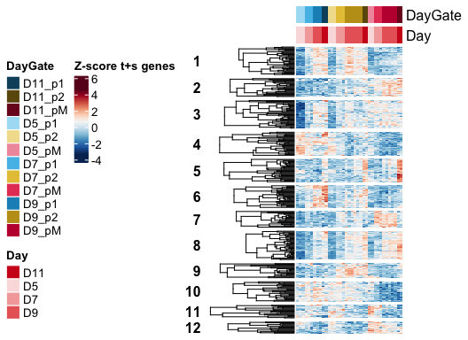
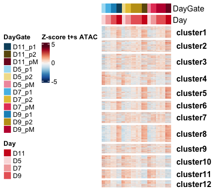

Multi_time-and-space_genes
================

## Exploring predicted element-gene pairs

``` r
rm(list=ls())

library(RColorBrewer)
library(tidyverse)
library(readxl)
library(ComplexHeatmap)
```

### Load settings

Colors, main directory

``` r
source('./r_inputs/TemporalSpatialNeuralTube_settings.R')
```

### Set dirs

Downstream of `glialmulti_8-1_figRcorrelation_AnyGeneWTSamples`

``` r
subworkinput1="outputs_glialmulti_9_figR_AnyGenes_p1/"
subworkinput2="outputs_glialmulti_9_figR_AnyGenes_p2/"
subworkinput3="outputs_glialmulti_9_figR_AnyGenes_pMN/"


outdir="outputs_glialmulti_time_space_genes_panels/"
ifelse(!dir.exists(file.path(workingdir,outdir)), dir.create(file.path(workingdir,outdir)), "Directory exists")
```

    ## [1] "Directory exists"

## Load data

### Load intervals

- vsd and annotation to plot heatmaps later

``` r
count_vsd <- read.csv(file=paste0(workingdir,"outputs_glialatac_1/","consensus_peaks.mLb.vsd.csv"),header=TRUE, stringsAsFactors = FALSE)
count_atac <- read.table(file = paste0(workingdir,"outputs_glialatac_1/","consensus_peaks.mLb.clN.normCounts.txt"),header=TRUE, stringsAsFactors = FALSE)

## Annotation table
ann_table <- read.table(file=paste0(workingdir,"inputs_glialatac_1_eda_pca/","consensus_peaks.mLb.clN.annotatePeaks.txt"), header=TRUE, stringsAsFactors = FALSE, sep = "\t")
colnames(ann_table)[1] <- "Peakid"


ann_table_clean <- ann_table %>% 
  dplyr::select(c("Peakid","Chr","Start","End","Strand","Annotation","Distance.to.TSS","Nearest.PromoterID")) %>%
  separate(Annotation, into = "Annotation_brief", sep = " ", remove = FALSE)
```

    ## Warning: Expected 1 pieces. Additional pieces discarded in 87054 rows [2, 3, 4, 8, 11,
    ## 12, 15, 16, 17, 20, 24, 28, 29, 32, 33, 35, 36, 37, 40, 42, ...].

## Import RNA

``` r
rna_vsd <- read.csv(paste0(workingdir,"outputs_glialRNA_1/","featurecounts.vsd.csv"),stringsAsFactors =FALSE)
```

## Import results from figR

``` r
# cisCor associated peaks to genes, unfiltered, with the corr and pvalZ
cisCor_p1 <- read.csv(paste0(workingdir,subworkinput1,"corr_unfiltered_500kb.csv"), stringsAsFactors =FALSE)
cisCor_p2 <- read.csv(paste0(workingdir,subworkinput2,"corr_unfiltered_500kb.csv"), stringsAsFactors =FALSE)
cisCor_pMN <- read.csv(paste0(workingdir,subworkinput3,"corr_unfiltered_500kb.csv"), stringsAsFactors =FALSE)
```

### Gene heatmap of the domain 2 or more gene list

``` r
domain2ormore <- read.csv(paste0(workingdir,"outputs_glialrna_2_time_space/","Genes_domains_two-or-more_comparisons.csv"), 
                          stringsAsFactors =FALSE)
```

Filter and make heatmap

``` r
# filter elements in imported file
vsd_hm <- rna_vsd %>%
  filter(X %in% domain2ormore$GeneID) %>%
  column_to_rownames("X") %>%
  dplyr::select(starts_with("WT"))

# Get the desired ordered columns 
ordered_filtered_samples <- data.frame(allsamples=sorted.sample.wReps.bycelltype) %>%
  filter(allsamples %in% colnames(vsd_hm))

# order columns in heamtp
vsd_hm_ordered <- vsd_hm[,ordered_filtered_samples$allsamples]


# z score
vsd_hm_z <- t(scale(t(vsd_hm_ordered))) 


genecolData_first <- data.frame(Sample_ID = colnames(vsd_hm_z))
genecolData_first <- genecolData_first %>% 
  separate(Sample_ID,into=c("Genotype","Day","Gate","NFIAgate","Rep"), sep="_", remove=FALSE) %>%
  mutate(Condition=paste(Genotype,Day,Gate,NFIAgate, sep="_"),
         DayNFIA=paste(Day,NFIAgate,Genotype,sep = "_"),
         DayGate=paste(Day,Gate,sep="_"),
         NFIAstatus=paste(NFIAgate,Genotype,sep="_"))
genecolData_first <- as.data.frame(unclass(genecolData_first))

phen_data <- genecolData_first %>%
  dplyr::select(c("Sample_ID","DayGate","Day")) %>%
  remove_rownames() %>%
  column_to_rownames("Sample_ID")

ann_color_IZ <- list(
  DayGate = c(D5_p1="#abdff4",D5_p2="#f1df9a", D5_pM="#f19aac",
              D7_p1="#55bee8",D7_p2="#e6c444",D7_pM="#e64466",
              D9_p1="#1a91c1",D9_p2="#c19e1a",D9_pM="#c11a3d",
              D11_p1="#0e506b",D11_p2="#6b570e",D11_pM="#7c1127"),
  NFIAstatus = c(NFIAn_WT="#f6f6f6",NFIAp_WT="#cecece",`100`="#808080",NFIAn_MUT="#595959"),
  Day = c(D5="#fadede",D7="#f3aaaa",D9="#e96666",D11="#cf1e1e"),
  Rep = c(R1="#ebeb77", R2="#77b1eb", R3="#eb7777"))


# Annotated heatmap with selected colors
hm_colors = colorRampPalette(rev(brewer.pal(n = 11, name = "RdBu")))(100)


# Build the annotation for the complex heatmap
colAnn <- HeatmapAnnotation(
    df = phen_data,
    which = 'col', # 'col' (samples) or 'row' (gene) annotation?
    na_col = 'white', # default colour for any NA values in the annotation data-frame, 'ann'
    col = ann_color_IZ,
    annotation_height = 0.6,
    annotation_width = unit(1, 'cm'),
    gap = unit(1, 'mm'))
```

Cluster the genes to then show the same clusters for elements

``` r
set.seed(123)  #For reproduciblity
hmap_clust <- Heatmap(vsd_hm_z,
    km=12,
    # split the genes / rows according to the PAM clusters
    #row_split = phen_intervals,
    #row_title = "cluster_%s",
    row_title_rot = 0,
    cluster_row_slices = FALSE, 
    #cluster_column_slices = FALSE,
    

    name = 'Z-score t+s genes',

    col = hm_colors,

    # row (gene) parameters
      cluster_rows = TRUE,
      show_row_dend = TRUE,
      #row_title = 'Statistically significant genes',
      row_title_side = 'left',
      row_title_gp = gpar(fontsize = 12,  fontface = 'bold'),
      #row_title_rot = 90,
      show_row_names = FALSE,
      row_names_gp = gpar(fontsize = 4, fontface = 'bold'),
      row_names_side = 'left',
      row_dend_width = unit(25,'mm'),

    # column (sample) parameters
      cluster_columns = FALSE,
      show_column_dend = TRUE,
      column_title = '',
      column_title_side = 'bottom',
      column_title_gp = gpar(fontsize = 12, fontface = 'bold'),
      column_title_rot = 0,
      show_column_names = FALSE,
      column_names_gp = gpar(fontsize = 8),
      column_names_max_height = unit(10, 'cm'),
      column_dend_height = unit(25,'mm'),

    # cluster methods for rows and columns
      clustering_distance_columns = function(x) as.dist(1 - cor(t(x))),
      clustering_method_columns = 'ward.D2',
      clustering_distance_rows = function(x) as.dist(1 - cor(t(x))),
      clustering_method_rows = 'ward.D2',

    # specify top and bottom annotations
      #left_annotation = rowAnn,
      top_annotation = colAnn)
```

``` r
set.seed(123)  #For reproduciblity

hmap_clust <- draw(hmap_clust,
    heatmap_legend_side = 'left',
    annotation_legend_side = 'left',
    row_sub_title_side = 'left')
```

<!-- -->

``` r
# print heatmap
pdf(paste0(workingdir,outdir,"Heatmap_RNA_t_and_s_Clustered.pdf"), width = 5.5, height = 4)
set.seed(123)
draw(hmap_clust,
    heatmap_legend_side = 'left',
    annotation_legend_side = 'left',
    row_sub_title_side = 'right')

dev.off()
```

    ## quartz_off_screen 
    ##                 2

``` r
r.dend <- row_dend(hmap_clust)  #Extract row dendrogram
rcl.list <- row_order(hmap_clust)  #Extract clusters (output is a list)

lapply(rcl.list, function(x) length(x))  #check/confirm size clusters
```

    ## $`1`
    ## [1] 38
    ## 
    ## $`2`
    ## [1] 25
    ## 
    ## $`3`
    ## [1] 38
    ## 
    ## $`4`
    ## [1] 32
    ## 
    ## $`5`
    ## [1] 31
    ## 
    ## $`6`
    ## [1] 30
    ## 
    ## $`7`
    ## [1] 22
    ## 
    ## $`8`
    ## [1] 39
    ## 
    ## $`9`
    ## [1] 20
    ## 
    ## $`10`
    ## [1] 27
    ## 
    ## $`11`
    ## [1] 18
    ## 
    ## $`12`
    ## [1] 16

``` r
# loop to extract genes for each cluster.
for (i in 1:length(row_order(hmap_clust))){
 if (i == 1) {
 clu <- t(t(row.names(vsd_hm_z[row_order(hmap_clust)[[i]],])))
 out <- cbind(clu, paste("cluster", i, sep=""))
 colnames(out) <- c("GeneID", "Cluster")
 } else {
 clu <- t(t(row.names(vsd_hm_z[row_order(hmap_clust)[[i]],])))
 clu <- cbind(clu, paste("cluster", i, sep=""))
 out <- rbind(out, clu)
 }
 }

gene_clusters <- as.data.frame(out)

write.csv(gene_clusters,paste0(workingdir,outdir,"clusters_tANDs_genes.csv"),quote = FALSE, row.names = FALSE)
```

### Element heatmap for the best correlated peak in same order

Get the gene order

``` r
#gene_order <- row_order(hmap)

# get order of the rows
generow <- as.data.frame(unlist(row_order(hmap_clust)))

genes_ordered <- vsd_hm_z[generow$`unlist(row_order(hmap_clust))`,] %>%
  as.data.frame() %>%
  rownames_to_column("geneid") %>%
  dplyr::select("geneid")
```

### Best cell type match per gene: significant

For each:

`cisCor_p1` `cisCor_p2` `cisCor_pMN`

- add a column for which comparison
- rowbind
- select significant and also best cell type

``` r
cisCor_p1_merge <- cisCor_p1 %>%
  mutate(celltype="p1")
cisCor_p2_merge <- cisCor_p2 %>%
  mutate(celltype="p2")
cisCor_pMN_merge <- cisCor_pMN %>%
  mutate(celltype="pMN")

cisCor_merged <- do.call(rbind, list(cisCor_p1_merge,cisCor_p2_merge,cisCor_pMN_merge))

cisCor_bestcelltype <- cisCor_merged %>%
  group_by(Peak,Gene) %>%
  filter(pvalZ==min(pvalZ)) %>% #most significant for each 
  filter(rObs==max(rObs)) # for equal pval, most corr


peaks_formatching <- ann_table_clean %>%
  mutate(PeakRanges=paste0(Chr,":",Start,"-",End)) %>%
  dplyr::select(Peakid,PeakRanges,Annotation_brief,`Nearest.PromoterID`)

cisCor_peakID <- cisCor_bestcelltype %>%
  left_join(peaks_formatching, by = "PeakRanges")
```

Match element to gene by best correlated in any cell type.

``` r
cisCor_bestcelltype <- cisCor_merged %>%
  group_by(Peak,Gene) %>%
  #filter(pvalZ==min(pvalZ)) %>% #most significant for each 
  filter(rObs==max(rObs)) %>% # for equal pval, most corr peak-gene pair across cell type comparisons
  filter(pvalZ==min(pvalZ)) # only if two are equally corr

peaks_formatching <- ann_table_clean %>%
  mutate(PeakRanges=paste0(Chr,":",Start,"-",End)) %>%
  dplyr::select(Peakid,PeakRanges,Annotation_brief,`Nearest.PromoterID`)

cisCor_peakID <- cisCor_bestcelltype %>%
  left_join(peaks_formatching, by = "PeakRanges")
```

### pvalz \< 0.1, rObs \> 0

Using `cisCorr.filt` is now for pvalZ \< 0.1

``` r
cisCorr.filt <- cisCor_peakID %>% filter(pvalZ <= 0.1)

# joining to the clustered
elements_ordered_manymatches <- gene_clusters %>% 
  inner_join(cisCorr.filt, by = c("GeneID"="Gene"))

# Best match for each gene
elements_ordered_uniquegene <- elements_ordered_manymatches %>% 
  group_by(GeneID) %>% 
  #filter(rObs==max(rObs)) %>% # if this is not selected then it'll be any significant peak
  filter(rObs > 0) %>%
  group_by(Peakid) %>% # I need each element only once for the heatmap so just in case
  filter(rObs==max(rObs)) %>%
  filter(pvalZ==min(pvalZ))


write.csv(elements_ordered_uniquegene,paste0(workingdir,outdir,"tANDs_genes_associated_elements.csv"),quote = FALSE, row.names = FALSE)
```

Annotate the temporal elements as identified independently

``` r
#get order of columns 
ordered_filtered_samples <- data.frame(allsamples=sorted.sample.wReps.bycelltype) %>%
  filter(allsamples %in% colnames(count_vsd))

atac_vsd_matrix <- count_vsd %>% column_to_rownames("X") 

# order columns
atac_vsd_filtered <- atac_vsd_matrix[,ordered_filtered_samples$allsamples]

#subset order rows
data <- as.matrix(atac_vsd_filtered)[match(elements_ordered_uniquegene$Peakid, row.names(as.matrix(atac_vsd_filtered))),]
data <- t(scale(t(data)))

# annotations Rows
cluster_intervals <- elements_ordered_uniquegene %>%
  ungroup() %>%
  column_to_rownames("Peakid") %>%
  mutate(Cluster = factor(Cluster, levels=c("cluster1","cluster2","cluster3","cluster4","cluster5",
                                               "cluster6","cluster7","cluster8","cluster9","cluster10","cluster11","cluster12"))) %>%
  select(Cluster) 
  
  


## Make metadata file from colnames
genecolData_first <- data.frame(Sample_ID = colnames(data))
genecolData_first <- genecolData_first %>% 
  separate(Sample_ID,into=c("Genotype","Day","Gate","NFIAgate","Rep"), sep="_", remove=FALSE) %>%
  mutate(Condition=paste(Day,Genotype,Gate, sep="_"),
         DayNFIA=paste(Day,NFIAgate,sep = "_"),
         NFIAstatus=paste(NFIAgate,sep = "_"),
         DayGate=paste(Day,Gate,sep="_"),
         Experiment=paste(Genotype,Rep,sep="_"))
genecolData_first <- as.data.frame(unclass(genecolData_first))

#columns
phen_data <- genecolData_first %>%
  dplyr::select(c("Sample_ID","DayGate","Day")) %>%
  remove_rownames() %>%
  column_to_rownames("Sample_ID")

ann_color_IZ <- list(
  DayGate = c(D5_p1="#abdff4",D5_p2="#f1df9a",D5_pM="#f19aac",
             D7_p1="#55bee8",D7_p2="#e6c444",D7_pM="#e64466",
            D9_p1="#1a91c1",D9_p2="#c19e1a",D9_pM="#c11a3d",
            D11_p1="#0e506b",D11_p2="#6b570e",D11_pM="#7c1127"),
  Day = c(D5="#fadede",D7="#f3aaaa",D9="#e96666",D11="#cf1e1e"))


# Build the annotation for the complex heatmap
colAnn <- HeatmapAnnotation(
    df = phen_data,
    which = 'col', # 'col' (samples) or 'row' (gene) annotation?
    na_col = 'white', # default colour for any NA values in the annotation data-frame, 'ann'
    col = ann_color_IZ,
    annotation_height = unit(1, 'cm'),
    annotation_width = unit(1, 'cm'),
    gap = unit(1, 'mm'))
```

``` r
hmap_elem_sig_corr0_clustered <- Heatmap(data,

    # split the genes / rows according to the PAM clusters
    row_split = cluster_intervals,
    #row_title = "cluster_%s",
    row_title_rot = 0,
    cluster_row_slices = FALSE, 
    #cluster_column_slices = FALSE,
    

    name = 'Z-score t+s ATAC',

    col = hm_colors,

    # row (gene) parameters
      cluster_rows = FALSE,
      show_row_dend = TRUE,
      #row_title = 'Statistically significant genes',
      row_title_side = 'left',
      row_title_gp = gpar(fontsize = 12,  fontface = 'bold'),
      #row_title_rot = 90,
      show_row_names = FALSE,
      row_names_gp = gpar(fontsize = 10, fontface = 'bold'),
      row_names_side = 'left',
      row_dend_width = unit(25,'mm'),

    # column (sample) parameters
      cluster_columns = FALSE,
      show_column_dend = TRUE,
      column_title = '',
      column_title_side = 'bottom',
      column_title_gp = gpar(fontsize = 12, fontface = 'bold'),
      column_title_rot = 0,
      show_column_names = FALSE,
      column_names_gp = gpar(fontsize = 8),
      column_names_max_height = unit(10, 'cm'),
      column_dend_height = unit(25,'mm'),

    # cluster methods for rows and columns
      clustering_distance_columns = function(x) as.dist(1 - cor(t(x))),
      clustering_method_columns = 'ward.D2',
      clustering_distance_rows = function(x) as.dist(1 - cor(t(x))),
      clustering_method_rows = 'ward.D2',

    # specify top and bottom annotations
      top_annotation = colAnn)
```

    ## `use_raster` is automatically set to TRUE for a matrix with more than
    ## 2000 rows. You can control `use_raster` argument by explicitly setting
    ## TRUE/FALSE to it.
    ## 
    ## Set `ht_opt$message = FALSE` to turn off this message.

``` r
# hmap_elem_sig_corr06 <- Heatmap(data, 
#         cluster_columns = FALSE, 
#         cluster_rows = FALSE,
#         col=hm_colors,
#         row_title_rot = 0,
#         row_names_gp = gpar(fontsize=6, fontface="italic"),
#         column_names_gp = gpar(fontsize=10),
#         name = "z-score", 
#         show_row_names = FALSE, 
#         show_column_names = FALSE, 
#         # specify top and bottom annotations
#         top_annotation = heatmap_ann,
#         right_annotation = rowAnn,  
#         cluster_row_slices = FALSE)
```

``` r
hmap_elem_sig_corr0_clustered <- draw(hmap_elem_sig_corr0_clustered,
    heatmap_legend_side = 'left',
    annotation_legend_side = 'left',
    row_sub_title_side = 'right')
```

<!-- -->

``` r
# print heatmap
pdf(paste0(workingdir,outdir,"Heatmap_atac_t_and_s_Clustered.pdf"), width = 4.5, height = 4)

draw(hmap_elem_sig_corr0_clustered,
    heatmap_legend_side = 'left',
    annotation_legend_side = 'left',
    row_sub_title_side = 'right')

dev.off()
```

    ## quartz_off_screen 
    ##                 2

``` r
sessionInfo()
```

    ## R version 4.4.0 (2024-04-24)
    ## Platform: aarch64-apple-darwin20
    ## Running under: macOS 15.2
    ## 
    ## Matrix products: default
    ## BLAS:   /Library/Frameworks/R.framework/Versions/4.4-arm64/Resources/lib/libRblas.0.dylib 
    ## LAPACK: /Library/Frameworks/R.framework/Versions/4.4-arm64/Resources/lib/libRlapack.dylib;  LAPACK version 3.12.0
    ## 
    ## locale:
    ## [1] en_US.UTF-8/en_US.UTF-8/en_US.UTF-8/C/en_US.UTF-8/en_US.UTF-8
    ## 
    ## time zone: Europe/London
    ## tzcode source: internal
    ## 
    ## attached base packages:
    ## [1] grid      stats     graphics  grDevices utils     datasets  methods  
    ## [8] base     
    ## 
    ## other attached packages:
    ##  [1] ComplexHeatmap_2.20.0 readxl_1.4.3          lubridate_1.9.3      
    ##  [4] forcats_1.0.0         stringr_1.5.1         dplyr_1.1.4          
    ##  [7] purrr_1.0.2           readr_2.1.5           tidyr_1.3.1          
    ## [10] tibble_3.2.1          ggplot2_3.5.1         tidyverse_2.0.0      
    ## [13] RColorBrewer_1.1-3   
    ## 
    ## loaded via a namespace (and not attached):
    ##  [1] utf8_1.2.4          generics_0.1.3      shape_1.4.6.1      
    ##  [4] stringi_1.8.4       hms_1.1.3           digest_0.6.35      
    ##  [7] magrittr_2.0.3      evaluate_0.23       timechange_0.3.0   
    ## [10] iterators_1.0.14    circlize_0.4.16     fastmap_1.2.0      
    ## [13] cellranger_1.1.0    foreach_1.5.2       doParallel_1.0.17  
    ## [16] GlobalOptions_0.1.2 fansi_1.0.6         scales_1.3.0       
    ## [19] codetools_0.2-20    cli_3.6.2           crayon_1.5.2       
    ## [22] rlang_1.1.4         munsell_0.5.1       withr_3.0.0        
    ## [25] yaml_2.3.8          tools_4.4.0         parallel_4.4.0     
    ## [28] tzdb_0.4.0          colorspace_2.1-0    BiocGenerics_0.50.0
    ## [31] GetoptLong_1.0.5    vctrs_0.6.5         R6_2.5.1           
    ## [34] png_0.1-8           magick_2.8.3        stats4_4.4.0       
    ## [37] matrixStats_1.3.0   lifecycle_1.0.4     S4Vectors_0.42.0   
    ## [40] IRanges_2.38.0      clue_0.3-65         cluster_2.1.6      
    ## [43] pkgconfig_2.0.3     pillar_1.9.0        gtable_0.3.5       
    ## [46] Rcpp_1.0.12         glue_1.7.0          highr_0.11         
    ## [49] xfun_0.44           tidyselect_1.2.1    rstudioapi_0.16.0  
    ## [52] knitr_1.47          rjson_0.2.21        htmltools_0.5.8.1  
    ## [55] rmarkdown_2.27      Cairo_1.6-2         compiler_4.4.0
