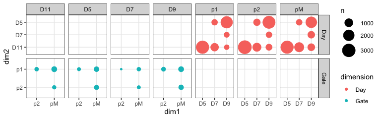
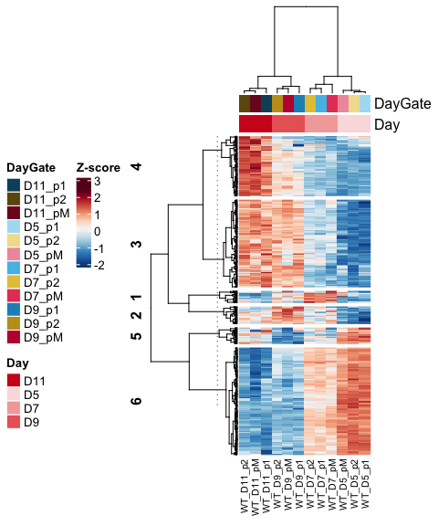

RNA_2_time_vs_domain_import
================

# RNA analysis

Start the analysis from the exported tables

``` r
rm(list=ls())

library(RColorBrewer)
library(tidyverse)
library(ComplexHeatmap)
library(UpSetR)
```

### Load settings

Colors, main directory

``` r
source('./r_inputs/TemporalSpatialNeuralTube_settings.R')
```

### Set dirs

``` r
subworkinput="outputs_glialrna_2_time_space/"

suboutdir1="output_Domain_Specific/"
suboutdir2="output_Time_Specific/"
```

## Load data

Load the diff expression from previous script.

## Load vsd to plot heatmaps later

``` r
count_vsd <- read.csv(file=paste0(workingdir,"outputs_glialRNA_1/","featurecounts.vsd.csv"),header=TRUE, stringsAsFactors = FALSE)
```

## Differential analysis between domains for each timepoint

Targeted diff analysis in subsets of samples:

Wild type only: D5: pairwise for p1, p2, pMN D7: pairwise for p1, p2,
pMN D9: pairwise for p1, p2, pMN D11: pairwise for p1, p2, pMN

Warning in DESeqDataSet(se, design = design, ignoreRank) : some
variables in design formula are characters, converting to factors \## It
is an expected warning because the R script change the type of the data
from vectors to factors.

re importing does not work because the ~/ gets converted to full name of
the dir

Change working dir to local and it’ll be fine. For not, this is the
patch.

``` r
PairWiseDEseq_domain <- lapply(list.files(path=paste0(workingdir,subworkinput,suboutdir1),pattern="Results_DESeq*", full.names=TRUE),function(x) {
  data <- read.table(x,header=T,stringsAsFactors=F) %>% as.data.frame() %>% rownames_to_column("GeneID")
  data$Comparison <- gsub(paste0(workingdir,subworkinput,suboutdir1,"/Results_DESeq_"),"", x)
  data$Comparison <- gsub(".txt","",data$Comparison)
  data
})

results_deseq_domain <- do.call(rbind,PairWiseDEseq_domain)
```

## Differential analysis between timepoints for each domain

Targeted diff analysis in subsets of samples:

Wild type only: p1: pairwise D5-D7, D7-D9, D9-D11, D5-D9, D5-D11, D7-D11
p2: pairwise D5-D7, D7-D9, D9-D11, D5-D9, D5-D11, D7-D11 pM: pairwise
D5-D7, D7-D9, D9-D11, D5-D9, D5-D11, D7-D11

``` r
PairWiseDEseq_days <- lapply(list.files(path=paste0(workingdir,subworkinput,suboutdir2),pattern="Results_DESeq*", full.names=TRUE),function(x) {
  data <- read.table(x,header=T,stringsAsFactors=F) %>% as.data.frame() %>% rownames_to_column("GeneID")
  data$Comparison <- gsub(paste0(workingdir,subworkinput,suboutdir2,"/Results_DESeq_"),"", x)
  data$Comparison <- gsub(".txt","",data$Comparison)
  data
})

results_deseq_days <- do.call(rbind,PairWiseDEseq_days)
```

### Thresholds for both time and space comparisons

Based on exploring the data, we have chosen:

`filter(padj < 0.05 & abs(log2FoldChange) > 1 & baseMean > 80)`

``` r
adjusted_pval = 0.05

log2FC = 1

minBaseMean = 80
```

### How many diff genes genes between domains?

``` r
top_domain_comparisons <- results_deseq_domain %>%
  as.data.frame() %>%
  filter(padj < adjusted_pval & abs(log2FoldChange) > log2FC & baseMean > minBaseMean)
```

### Explore genes by timepoint

### How many diff genes genes between timepoints?

``` r
top_days_comparisons <- results_deseq_days %>%
  as.data.frame() %>%
  filter(padj < adjusted_pval & abs(log2FoldChange) > log2FC & baseMean > minBaseMean)
```

### Plot number of genes changing in time and space

``` r
# head(top_days_comparisons)
# head(top_domain_comparisons)


top_combined_comparisons <- rbind(top_days_comparisons,top_domain_comparisons)

#tidy
top_combined_comparisons <- top_combined_comparisons %>%
  separate(Comparison, into = c("empty","faceting","dimension","dim1","vs","dim2"), sep = "_")  %>%
  mutate(dim2=factor(dim2, levels=c("D11","D7","D5","p2","p1")),
         dim1=factor(dim1, levels=c("p2","pM","D5","D7","D9")))

ggplot(top_combined_comparisons, aes(x=dim1, y=dim2)) +
  geom_count(aes(color=dimension)) +
  scale_size(range = c(1,9), breaks = seq(0,10000, by=1000)) + 
  facet_grid(dimension ~ faceting, scales = "free") +
  theme_bw()
```

<!-- -->

#### Domain genes

Make a table with the counts. Select genes that either

- differentially expressed in a specific comparison (pMN vs p2) at more
  than one timepoint (that was 128 genes), or
- differentially expressed in multiple comparisons (pMN vs p2 AND pMN vs
  p1) even if just one timepoint

``` r
top_combined_comparisons_count <- top_combined_comparisons %>%
  filter(dimension=="Gate") %>%
  mutate(pairwise_comparison=paste(dim1,vs,dim2)) %>% 
  group_by(dimension,pairwise_comparison,GeneID) %>%
  mutate(count_comparisons = n()) %>%
  group_by(dimension,faceting, dim1,GeneID) %>%
  mutate(count_dim1= n())

top_domain_2ormorecomparisons <- top_combined_comparisons_count %>%
  filter(count_comparisons > 1 | count_dim1 >1)
  
length(top_domain_2ormorecomparisons$GeneID %>% unique())
```

    ## [1] 336

Export this list:

``` r
write.csv(top_domain_2ormorecomparisons,
          paste0(workingdir,subworkinput,"Genes_domains_two-or-more_comparisons.csv"),
          quote = FALSE)
```

#### Temporal genes: high confidence ALL domain genes

``` r
top_temporal_comparisons_count <- top_combined_comparisons %>%
  filter(dimension=="Day") %>%
  mutate(pairwise_comparison=paste(dim1,vs,dim2)) %>% 
  group_by(dimension,pairwise_comparison,GeneID) %>%
  mutate(count_comparisons = n()) %>%
  group_by(dimension,faceting, dim1,GeneID) %>%
  mutate(count_dim1= n())

# this filters genes that are diff express in at least 1 temporal comparisons in all 3 domains
top_temporal_2ormorecomparisons <- top_temporal_comparisons_count %>%
  filter(count_comparisons == 3 & count_dim1 > 1)

# I could further add genes in fewer cell types but more comparisons
#  filter(count_comparisons > 2 | count_dim1 >1)
  
length(top_temporal_2ormorecomparisons$GeneID %>% unique())
```

    ## [1] 547

Export this list:

``` r
write.csv(top_temporal_2ormorecomparisons,
          paste0(workingdir,subworkinput,"Genes_temporal_alldomains.csv"),
          quote = FALSE)
```

### Plot the temporal all domain genes

``` r
gene_subset <- top_temporal_2ormorecomparisons$GeneID %>% unique()


# filter genes
vsd_hm_ave <- count_vsd %>%
  filter(X %in% gene_subset) %>%
  dplyr::select(starts_with("WT"),"X") %>% 
  pivot_longer(names_to = "sampleid", values_to = "normcounts", starts_with("WT")) %>%
  separate(sampleid, into=c("Genotype","Day","Gate","NFIAgate","Rep"), sep="_", remove=FALSE) %>%
  group_by(X, Genotype, Day, Gate) %>%
  summarise(avecount=mean(normcounts)) %>%
  mutate(condition=paste(Genotype,Day,Gate, sep = "_")) %>%
  ungroup() %>%
  dplyr::select(X, condition,avecount) %>%
  pivot_wider(names_from = condition, values_from = avecount) %>%
  column_to_rownames("X")
```

    ## `summarise()` has grouped output by 'X', 'Genotype', 'Day'. You can override
    ## using the `.groups` argument.

``` r
dim(vsd_hm_ave)
```

    ## [1] 547  12

``` r
# z score
vsd_hm_z <- t(scale(t(vsd_hm_ave))) 

# Annotated heatmap with selected colors
hm_colors = colorRampPalette(rev(brewer.pal(n = 11, name = "RdBu")))(100)

# metadata for the heatmap
genecolData_first <- data.frame(Sample_ID = colnames(vsd_hm_ave))
genecolData_first <- genecolData_first %>% 
  separate(Sample_ID,into=c("Genotype","Day","Gate"), sep="_", remove=FALSE) %>%
  mutate(DayGate=paste(Day,Gate,sep="_"))
genecolData_first <- as.data.frame(unclass(genecolData_first))

phen_data <- genecolData_first %>%
  dplyr::select(c("Sample_ID","DayGate","Day")) %>%
  remove_rownames() %>%
  column_to_rownames("Sample_ID")

ann_color_JD <- list(
  DayGate = c(D5_p1="#abdff4",D5_p2="#f1df9a", D5_pM="#f19aac",
              D7_p1="#55bee8",D7_p2="#e6c444",D7_pM="#e64466",
              D9_p1="#1a91c1",D9_p2="#c19e1a",D9_pM="#c11a3d",
              D11_p1="#0e506b",D11_p2="#6b570e",D11_pM="#7c1127"),
  Day = c(D5="#fadede",D7="#f3aaaa",D9="#e96666",D11="#cf1e1e"))


# Build the annotation for the complex heatmap
colAnn <- HeatmapAnnotation(
    df = phen_data,
    which = 'col', # 'col' (samples) or 'row' (gene) annotation?
    na_col = 'white', # default colour for any NA values in the annotation data-frame, 'ann'
    col = ann_color_JD,
    annotation_height = 0.6,
    annotation_width = unit(1, 'cm'),
    gap = unit(1, 'mm'))


set.seed(123)  #For reproduciblity

hmap <- Heatmap(vsd_hm_z,
              km=6,

              name = 'Z-score',

    col = hm_colors,
    
    use_raster = TRUE, ## because it has many rows

    # row (gene) parameters
      cluster_rows = TRUE,
      show_row_dend = TRUE,
      #row_title = 'Statistically significant genes',
      row_title_side = 'left',
      row_title_gp = gpar(fontsize = 12,  fontface = 'bold'),
      row_title_rot = 90,
      show_row_names = FALSE,
      row_names_gp = gpar(fontsize = 10, fontface = 'bold'),
      row_names_side = 'left',
      row_dend_width = unit(25,'mm'),

    # column (sample) parameters
      cluster_columns = TRUE,
      show_column_dend = TRUE,
      column_title = '',
      column_title_side = 'bottom',
      column_title_gp = gpar(fontsize = 12, fontface = 'bold'),
      column_title_rot = 0,
      show_column_names = TRUE,
      column_names_gp = gpar(fontsize = 8),
      column_names_max_height = unit(10, 'cm'),
      column_dend_height = unit(25,'mm'),

    # cluster methods for rows and columns
      clustering_distance_columns = function(x) as.dist(1 - cor(t(x))),
      clustering_method_columns = 'ward.D2',
      clustering_distance_rows = function(x) as.dist(1 - cor(t(x))),
      clustering_method_rows = 'ward.D2',

    # specify top and bottom annotations
      top_annotation = colAnn)
```

``` r
hmap <- draw(hmap,
    heatmap_legend_side = 'left',
    annotation_legend_side = 'left',
    row_sub_title_side = 'left')
```

<!-- -->

``` r
# print heatmap
pdf(paste0(workingdir,subworkinput,"Heatmap_TempoRNA_clusters.pdf"), width = 5, height = 6) 

draw(hmap,
    heatmap_legend_side = 'left',
    annotation_legend_side = 'left',
    row_sub_title_side = 'left')

dev.off()
```

    ## quartz_off_screen 
    ##                 2

``` r
r.dend <- row_dend(hmap)  #Extract row dendrogram
rcl.list <- row_order(hmap)  #Extract clusters (output is a list)

lapply(rcl.list, function(x) length(x))  #check/confirm size clusters
```

    ## $`4`
    ## [1] 109
    ## 
    ## $`3`
    ## [1] 159
    ## 
    ## $`1`
    ## [1] 22
    ## 
    ## $`2`
    ## [1] 32
    ## 
    ## $`5`
    ## [1] 30
    ## 
    ## $`6`
    ## [1] 195

``` r
# loop to extract genes for each cluster.
for (i in 1:length(row_order(hmap))){
 if (i == 1) {
 clu <- t(t(row.names(vsd_hm_z[row_order(hmap)[[i]],])))
 out <- cbind(clu, paste("cluster", names(rcl.list[i]), sep=""))
 colnames(out) <- c("GeneID", "Cluster")
 } else {
 clu <- t(t(row.names(vsd_hm_z[row_order(hmap)[[i]],])))
 clu <- cbind(clu, paste("cluster", names(rcl.list[i]), sep=""))
 out <- rbind(out, clu)
 }
 }


write.csv(out, file =paste0(workingdir,subworkinput,"TemporalALLgenes_clustered.csv"),
          quote = FALSE )
```

``` r
sessionInfo()
```

    ## R version 4.4.0 (2024-04-24)
    ## Platform: aarch64-apple-darwin20
    ## Running under: macOS 15.2
    ## 
    ## Matrix products: default
    ## BLAS:   /Library/Frameworks/R.framework/Versions/4.4-arm64/Resources/lib/libRblas.0.dylib 
    ## LAPACK: /Library/Frameworks/R.framework/Versions/4.4-arm64/Resources/lib/libRlapack.dylib;  LAPACK version 3.12.0
    ## 
    ## locale:
    ## [1] en_US.UTF-8/en_US.UTF-8/en_US.UTF-8/C/en_US.UTF-8/en_US.UTF-8
    ## 
    ## time zone: Europe/London
    ## tzcode source: internal
    ## 
    ## attached base packages:
    ## [1] grid      stats     graphics  grDevices utils     datasets  methods  
    ## [8] base     
    ## 
    ## other attached packages:
    ##  [1] UpSetR_1.4.0          ComplexHeatmap_2.20.0 lubridate_1.9.3      
    ##  [4] forcats_1.0.0         stringr_1.5.1         dplyr_1.1.4          
    ##  [7] purrr_1.0.2           readr_2.1.5           tidyr_1.3.1          
    ## [10] tibble_3.2.1          ggplot2_3.5.1         tidyverse_2.0.0      
    ## [13] RColorBrewer_1.1-3   
    ## 
    ## loaded via a namespace (and not attached):
    ##  [1] gtable_0.3.5        circlize_0.4.16     shape_1.4.6.1      
    ##  [4] rjson_0.2.21        xfun_0.44           GlobalOptions_0.1.2
    ##  [7] tzdb_0.4.0          Cairo_1.6-2         vctrs_0.6.5        
    ## [10] tools_4.4.0         generics_0.1.3      stats4_4.4.0       
    ## [13] parallel_4.4.0      fansi_1.0.6         highr_0.11         
    ## [16] cluster_2.1.6       pkgconfig_2.0.3     S4Vectors_0.42.0   
    ## [19] lifecycle_1.0.4     compiler_4.4.0      farver_2.1.2       
    ## [22] munsell_0.5.1       codetools_0.2-20    clue_0.3-65        
    ## [25] htmltools_0.5.8.1   yaml_2.3.8          pillar_1.9.0       
    ## [28] crayon_1.5.2        magick_2.8.3        iterators_1.0.14   
    ## [31] foreach_1.5.2       tidyselect_1.2.1    digest_0.6.35      
    ## [34] stringi_1.8.4       fastmap_1.2.0       colorspace_2.1-0   
    ## [37] cli_3.6.2           magrittr_2.0.3      utf8_1.2.4         
    ## [40] withr_3.0.0         scales_1.3.0        timechange_0.3.0   
    ## [43] rmarkdown_2.27      matrixStats_1.3.0   gridExtra_2.3      
    ## [46] png_0.1-8           GetoptLong_1.0.5    hms_1.1.3          
    ## [49] evaluate_0.23       knitr_1.47          IRanges_2.38.0     
    ## [52] doParallel_1.0.17   rlang_1.1.4         Rcpp_1.0.12        
    ## [55] glue_1.7.0          BiocGenerics_0.50.0 rstudioapi_0.16.0  
    ## [58] R6_2.5.1            plyr_1.8.9
