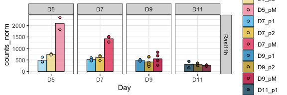
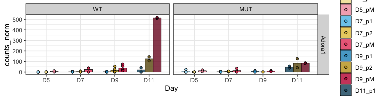
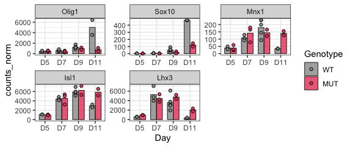
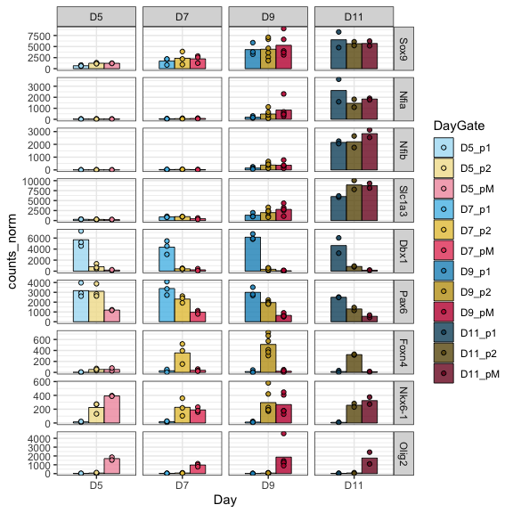

RNA_3_import_plot_genes
================

# RNA analysis

Start the analysis from the exported tables

``` r
rm(list=ls())

library(RColorBrewer)
library(tidyverse)
```

### Load settings

Colors, main directory

``` r
source('./r_inputs/TemporalSpatialNeuralTube_settings.R')
```

### Set dirs

``` r
subworkinput="outputs_glialRNA_1/"

outdir="outputs_glialRNA_3_countplots/"
ifelse(!dir.exists(file.path(workingdir,outdir)), dir.create(file.path(workingdir,outdir)), "Directory exists")
```

    ## [1] "Directory exists"

## Load data

Load the normalized RNA counts table from RNA 1

``` r
dds_counts <- read.table(paste0(workingdir,subworkinput,"featurecounts.normCounts.txt"),stringsAsFactors =FALSE)
```

## Tidy table

``` r
dds_counts_plot <- dds_counts %>% 
  as.data.frame() %>%
  rownames_to_column("geneid") %>%
  gather(sampleid, counts_norm, MUT_D11_p1_NFIAn_R2:WT_D9_pM_NFIAp_R3) %>%
  separate(sampleid,into=c("Genotype","Day","Gate","NFIAgate","Rep"), sep="_", remove=FALSE) %>%
  mutate(Condition=paste(Genotype,Day,Gate,NFIAgate, sep="_"),
         DayNFIA=factor(paste(Day,NFIAgate,Genotype,sep = "_"), levels=sorted.dayNfia),
         NFIAstatus=paste(NFIAgate,Genotype,sep="_"),
         NFIAstatus=factor(NFIAstatus, levels = nfiaStatus_order),
         DayGate=factor(paste(Day,Gate,sep="_"), levels = sorted.DayGate),
         Experiment=paste(Genotype,Rep,sep="_"),
         Day=factor(Day, levels = sorted.day),
         Genotype=factor(Genotype, levels = c("WT","MUT")))
```

### Fig 5

``` r
geneOI <- c("Rasl11b")

genes_wt_ts <- ggplot(dds_counts_plot %>% filter(geneid %in% geneOI & Genotype=="WT") %>%
         mutate(geneid=factor(geneid, levels=geneOI)), 
        aes(x=Day,y=counts_norm)) +
  stat_summary(aes(fill=DayGate),
    fun = mean, geom="bar", alpha=0.8, width=0.7,position=position_dodge(0.7), color="black",linewidth=0.3) +
  geom_point(aes(fill=DayGate), alpha=0.9, position = position_dodge(width = 0.7),color="black", shape=21) +
  #geom_col(position="dodge",aes(fill=DayGate)) +
  scale_fill_manual(values=colorIZ) +
  scale_color_manual(values=colorIZ) +
  scale_shape_manual(values=shapes4_fill_manual) +
  facet_grid(geneid ~ Day, scales = "free") +
  theme_bw()

ggsave(plot=genes_wt_ts, filename=paste0(workingdir,outdir,"Barplots_genes_WT_timespace.pdf"), device = "pdf",
             width=6, height=2, units="in", useDingbats=FALSE)

genes_wt_ts
```

<!-- -->

``` r
geneOI <- c("Adora1")

genes_ko <- ggplot(dds_counts_plot %>% filter(geneid %in% geneOI) %>%
         mutate(geneid=factor(geneid, levels=geneOI)), 
        aes(x=Day,y=counts_norm)) +
  stat_summary(aes(fill=DayGate),
    fun = mean, geom="bar", alpha=0.8, width=0.7,position=position_dodge(0.7), color="black",linewidth=0.3) +
  geom_point(aes(fill=DayGate), alpha=0.9, position = position_dodge(width = 0.7),color="black", shape=21) +
  #geom_col(position="dodge",aes(fill=DayGate)) +
  scale_fill_manual(values=colorIZ) +
  scale_color_manual(values=colorIZ) +
  scale_shape_manual(values=shapes4_fill_manual) +
  facet_grid(geneid ~ Genotype, scales = "free") +
  theme_bw()


ggsave(plot=genes_ko, filename=paste0(workingdir,outdir,"Barplots_genes_WT_KO.pdf"), device = "pdf",
             width=8, height=2, units="in", useDingbats=FALSE)

genes_ko
```

<!-- -->

### fig 6

``` r
geneOI <- c("Olig1","Sox10","Mnx1","Isl1","Lhx3")

genes_NFIABKO <- ggplot(dds_counts_plot %>% filter(geneid %in% geneOI & Gate=="pM") %>%
         mutate(geneid=factor(geneid, levels=geneOI)), 
        aes(x=Day,y=counts_norm)) +
  stat_summary(aes(fill=Genotype),
    fun = mean, geom="bar", alpha=0.8, width=0.7,position=position_dodge(0.7), color="black",linewidth=0.3) +
  geom_point(aes(fill=Genotype), alpha=0.9, position = position_dodge(width = 0.7),color="black", shape=21) +
  scale_fill_manual(values=c("grey60","#e64466")) +
  scale_color_manual(values=c("grey60","#e64466")) +
  scale_shape_manual(values=shapes4_fill_manual) +
  facet_wrap(~ geneid , scales = "free") +
  theme_bw()

ggsave(plot=genes_NFIABKO, filename=paste0(workingdir,outdir,"Barplots_MNgenes_pMN_WT_KO.pdf"), device = "pdf",
             width=7, height=3, units="in", useDingbats=FALSE)

genes_NFIABKO
```

<!-- -->
\### Revision QC of model

Temporal and dorsoventral genes

``` r
geneOI <- c("Sox9","Nfia","Nfib","Slc1a3","Dbx1","Pax6","Foxn4","Nkx6-1","Olig2")

genes_qc <- ggplot(dds_counts_plot %>% filter(geneid %in% geneOI & Genotype=="WT") %>%
         mutate(geneid=factor(geneid, levels=geneOI)), 
        aes(x=Day,y=counts_norm)) +
  stat_summary(aes(fill=DayGate),
    fun = mean, geom="bar", alpha=0.8, width=0.7,position=position_dodge(0.7), color="black",linewidth=0.3) +
  geom_point(aes(fill=DayGate), alpha=0.9, position = position_dodge(width = 0.7),color="black", shape=21) +
  #geom_col(position="dodge",aes(fill=DayGate)) +
  scale_fill_manual(values=colorIZ) +
  scale_color_manual(values=colorIZ) +
  scale_shape_manual(values=shapes4_fill_manual) +
  facet_grid(geneid ~ Day, scales = "free") +
  theme_bw()


ggsave(plot=genes_qc, filename=paste0(workingdir,outdir,"Barplots_ESmodel_QC.pdf"), device = "pdf",
             width=6, height=6, units="in", useDingbats=FALSE)

genes_qc
```

<!-- -->

``` r
sessionInfo()
```

    ## R version 4.4.0 (2024-04-24)
    ## Platform: aarch64-apple-darwin20
    ## Running under: macOS 15.2
    ## 
    ## Matrix products: default
    ## BLAS:   /Library/Frameworks/R.framework/Versions/4.4-arm64/Resources/lib/libRblas.0.dylib 
    ## LAPACK: /Library/Frameworks/R.framework/Versions/4.4-arm64/Resources/lib/libRlapack.dylib;  LAPACK version 3.12.0
    ## 
    ## locale:
    ## [1] en_US.UTF-8/en_US.UTF-8/en_US.UTF-8/C/en_US.UTF-8/en_US.UTF-8
    ## 
    ## time zone: Europe/London
    ## tzcode source: internal
    ## 
    ## attached base packages:
    ## [1] stats     graphics  grDevices utils     datasets  methods   base     
    ## 
    ## other attached packages:
    ##  [1] lubridate_1.9.3    forcats_1.0.0      stringr_1.5.1      dplyr_1.1.4       
    ##  [5] purrr_1.0.2        readr_2.1.5        tidyr_1.3.1        tibble_3.2.1      
    ##  [9] ggplot2_3.5.1      tidyverse_2.0.0    RColorBrewer_1.1-3
    ## 
    ## loaded via a namespace (and not attached):
    ##  [1] gtable_0.3.5      highr_0.11        compiler_4.4.0    tidyselect_1.2.1 
    ##  [5] textshaping_0.4.0 systemfonts_1.1.0 scales_1.3.0      yaml_2.3.8       
    ##  [9] fastmap_1.2.0     R6_2.5.1          labeling_0.4.3    generics_0.1.3   
    ## [13] knitr_1.47        munsell_0.5.1     pillar_1.9.0      tzdb_0.4.0       
    ## [17] rlang_1.1.4       utf8_1.2.4        stringi_1.8.4     xfun_0.44        
    ## [21] timechange_0.3.0  cli_3.6.2         withr_3.0.0       magrittr_2.0.3   
    ## [25] digest_0.6.35     grid_4.4.0        rstudioapi_0.16.0 hms_1.1.3        
    ## [29] lifecycle_1.0.4   vctrs_0.6.5       evaluate_0.23     glue_1.7.0       
    ## [33] farver_2.1.2      ragg_1.3.2        fansi_1.0.6       colorspace_2.1-0 
    ## [37] rmarkdown_2.27    tools_4.4.0       pkgconfig_2.0.3   htmltools_0.5.8.1
