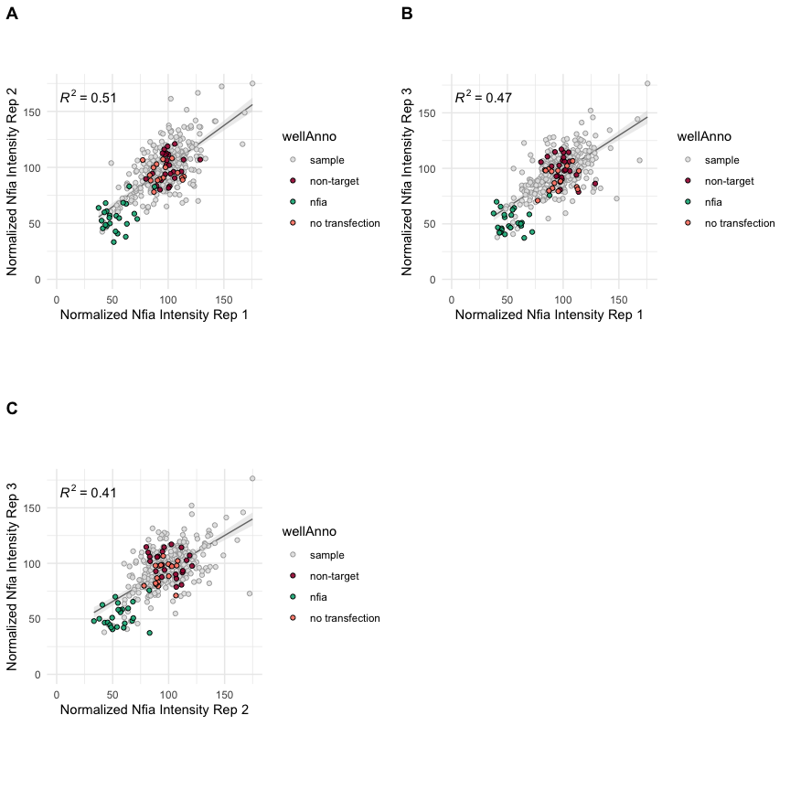
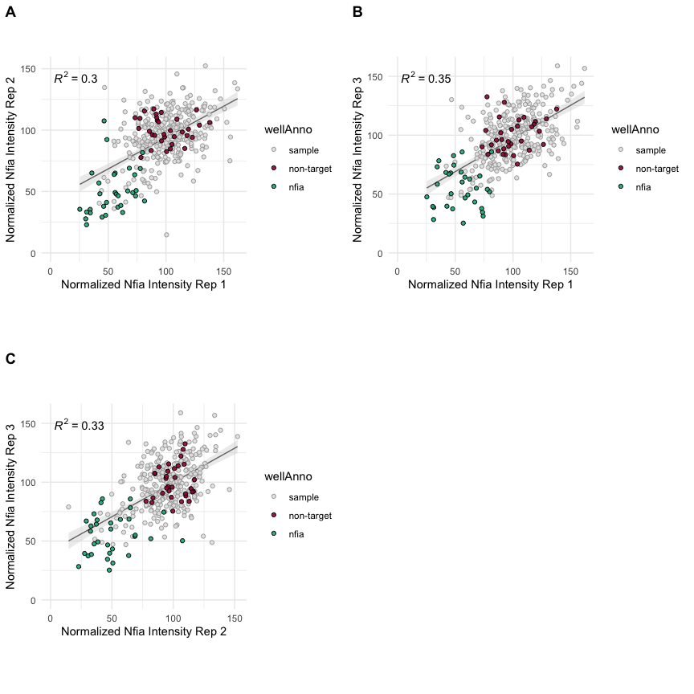
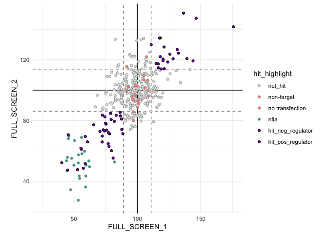
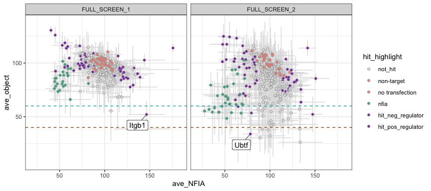
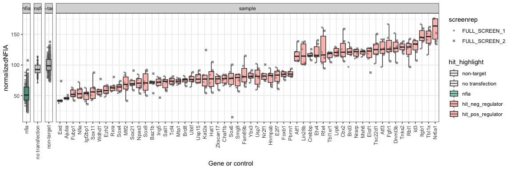

Glial_CRISPR_Screen
================

# dplyr::selecting CRISPR hits

``` r
rm(list=ls())
library(tidyverse)
```

    ## Warning: package 'tidyr' was built under R version 4.2.3

    ## Warning: package 'readr' was built under R version 4.2.3

    ## Warning: package 'dplyr' was built under R version 4.2.3

    ## Warning: package 'stringr' was built under R version 4.2.3

``` r
library(ggpubr)
library(ggrepel)
```

    ## Warning: package 'ggrepel' was built under R version 4.2.3

### Load settings

Colors, main directory

``` r
source('./r_inputs/TemporalSpatialNeuralTube_settings.R')
```

### Set dirs

``` r
subworkinput="inputs_glialscreen_1/"
outdir="outputs_glialscreen_1/"
ifelse(!dir.exists(file.path(workingdir,outdir)), dir.create(file.path(workingdir,outdir)), "Directory exists")
```

    ## [1] "Directory exists"

## Load data

``` r
nfia_intensities <- lapply(list.files(path=paste0(workingdir,subworkinput),
                                      pattern="topTable_MEAN_CircAvgIntenCh2_POC*", recursive = TRUE, full.names=TRUE),function(x) {
  data <- read.table(x,header=T,stringsAsFactors=F,sep = "\t") %>% filter(wellAnno!="empty well")
  data$screenrep <- gsub(paste0(workingdir,subworkinput,"/"),"", x) 
  data$screenrep <- gsub("/topTable_MEAN_CircAvgIntenCh2_POC.txt","",data$screenrep)
  data
})

valid_object <- lapply(list.files(path=paste0(workingdir,subworkinput),
                                      pattern="topTable_ValidObjectCount_POC*", recursive = TRUE, full.names=TRUE),function(x) {
  data <- read.table(x,header=T,stringsAsFactors=F,sep = "\t") %>% filter(wellAnno!="empty well")
  data$screenrep <- gsub(paste0(workingdir,subworkinput,"/"),"", x) 
  data$screenrep <- gsub("/topTable_ValidObjectCount_POC.txt","",data$screenrep)
  data
})
```

## NFIA intensities across technical replicates

The function plots all pairwise technical replicates for both screen 1
and 2 (biological replicates)

``` r
lapply(c(1:length(nfia_intensities)), function(x){

  r1_r2 <-  ggplot(nfia_intensities[[x]] %>% 
           mutate(wellAnno=factor(wellAnno, levels=c("sample","non-target","nfia","no transfection"))) %>% 
           arrange(wellAnno), aes(x=normalized_r1_ch1, y=normalized_r2_ch1)) + 
            geom_smooth(method = "lm", formula = y ~ x, se=TRUE, level=0.95, color="#767676",fill="lightgrey",size=0.5) +
            geom_point(alpha=0.9,shape=21, aes(fill=wellAnno, color=wellAnno)) +
            scale_fill_manual(values=color_screen) +
            scale_color_manual(values=color_circlesscreen)+
            expand_limits(y=0,x=0) +
            stat_cor(aes(label = ..rr.label..), label.x = 3) +
            labs(x = "Normalized Nfia Intensity Rep 1") +
            labs(y = "Normalized Nfia Intensity Rep 2") +
            theme_minimal() + 
            theme(aspect.ratio=1)

  r1_r3 <-  ggplot(nfia_intensities[[x]] %>% 
             mutate(wellAnno=factor(wellAnno, levels=c("sample","non-target","nfia","no transfection"))) %>% 
             arrange(wellAnno), aes(x=normalized_r1_ch1, y=normalized_r3_ch1)) + 
             geom_smooth(method = "lm", formula = y ~ x, se=TRUE, level=0.95, color="#767676",fill="lightgrey",size=0.5) +
             geom_point(alpha=0.9,shape=21, aes(fill=wellAnno, color=wellAnno)) +
             scale_fill_manual(values=color_screen) +
             scale_color_manual(values=color_circlesscreen)+
              expand_limits(y=0,x=0) +
              stat_cor(aes(label = ..rr.label..), label.x = 3) +
              labs(x = "Normalized Nfia Intensity Rep 1") +
              labs(y = "Normalized Nfia Intensity Rep 3") +
              theme_minimal() + 
              theme(aspect.ratio=1)
  
  r2_r3 <-  ggplot(nfia_intensities[[x]] %>% 
             mutate(wellAnno=factor(wellAnno, levels=c("sample","non-target","nfia","no transfection"))) %>% 
             arrange(wellAnno), aes(x=normalized_r2_ch1, y=normalized_r3_ch1)) + 
              geom_smooth(method = "lm", formula = y ~ x, se=TRUE, level=0.95, color="#767676",fill="lightgrey",size=0.5) +
             geom_point(alpha=0.9,shape=21, aes(fill=wellAnno, color=wellAnno)) +
             scale_fill_manual(values=color_screen) +
             scale_color_manual(values=color_circlesscreen)+
              expand_limits(y=0,x=0) +
              stat_cor(aes(label = ..rr.label..), label.x = 3) +
              labs(x = "Normalized Nfia Intensity Rep 2") +
              labs(y = "Normalized Nfia Intensity Rep 3") +
              theme_minimal() + 
              theme(aspect.ratio=1)
  
  
  figure_panel <- ggarrange(r1_r2, r1_r3, r2_r3,
                      labels = c("A", "B", "C"),
                      ncol = 2, nrow = 2)
  
  ggsave(paste0(workingdir,outdir,"RepsTech_Screen_",x,".pdf"), plot=figure_panel,
             width=9, height=9, units="in", useDingbats=FALSE)
  
  figure_panel

  
})
```

    ## Warning: Using `size` aesthetic for lines was deprecated in ggplot2 3.4.0.
    ## ℹ Please use `linewidth` instead.
    ## This warning is displayed once every 8 hours.
    ## Call `lifecycle::last_lifecycle_warnings()` to see where this warning was
    ## generated.

    ## Warning: The dot-dot notation (`..rr.label..`) was deprecated in ggplot2 3.4.0.
    ## ℹ Please use `after_stat(rr.label)` instead.
    ## This warning is displayed once every 8 hours.
    ## Call `lifecycle::last_lifecycle_warnings()` to see where this warning was
    ## generated.

    ## [[1]]

<!-- -->

    ## 
    ## [[2]]

<!-- -->

### Use average mean intensity of non-targetted to dplyr::select hits

Candidates considered as hits if more than 1 sd away from mean

``` r
# validation_set <- c("Nr6a1","Id2","Id3","Atf3","Rfx2","Rfx4","Tb1xr1","Lin28a","Lin28b","Hmgb2","Nr2f1","Brd8","Tcf4","Sall1","Baz1b",
#                     "Sox9","Npas3","Sox21","Mtf2","Sox4","Rxra","Sox11","Eed","Ezh2","Tsc22d1")
# 


nfia_intensities_table <- do.call(rbind, nfia_intensities)

nfia_intensities_summary <- nfia_intensities_table %>% dplyr::select(plate,position,wellAnno,annotatedTargetSymbol,screenrep, matches("normalized_r.*_ch1")) %>% 
  pivot_longer(starts_with("normalized"),names_to = "techreplicate",values_to="normalizedNFIA") %>%
  mutate(gene_or_control=case_when(is.na(annotatedTargetSymbol)~wellAnno, TRUE~annotatedTargetSymbol)) %>%
  group_by(plate,position,wellAnno,annotatedTargetSymbol,screenrep,gene_or_control) %>%
  summarise(averageNFIA=mean(normalizedNFIA),
            sdNFIA=sd(normalizedNFIA))
```

    ## `summarise()` has grouped output by 'plate', 'position', 'wellAnno',
    ## 'annotatedTargetSymbol', 'screenrep'. You can override using the `.groups`
    ## argument.

``` r
# get the non target mean and std
nfia_intensities_controls <- nfia_intensities_table %>% 
  dplyr::select(wellAnno,annotatedTargetSymbol,screenrep, matches("normalized_r.*_ch1")) %>% 
  filter(wellAnno=="non-target") %>%
  pivot_longer(starts_with("normalized"),names_to = "techreplicate",values_to="normalizedNFIA") %>%
  mutate(gene_or_control=case_when(is.na(annotatedTargetSymbol)~wellAnno, TRUE~annotatedTargetSymbol)) %>%
  group_by(wellAnno,annotatedTargetSymbol,screenrep,gene_or_control) %>%
  summarise(averageNFIA=mean(normalizedNFIA),
            sdNFIA=sd(normalizedNFIA)) %>%
  mutate(upper_thres=averageNFIA+1*sdNFIA,
         lower_thres=averageNFIA-1*sdNFIA)
```

    ## `summarise()` has grouped output by 'wellAnno', 'annotatedTargetSymbol',
    ## 'screenrep'. You can override using the `.groups` argument.

``` r
# save the threshold for cleaner coding
screen1_upperthresh <- subset(nfia_intensities_controls,screenrep=="FULL_SCREEN_1",upper_thres) %>% as.numeric()
screen1_lowthresh <- subset(nfia_intensities_controls,screenrep=="FULL_SCREEN_1",lower_thres) %>% as.numeric()
screen2_upperthresh <- subset(nfia_intensities_controls,screenrep=="FULL_SCREEN_2",upper_thres) %>% as.numeric()
screen2_lowthresh <- subset(nfia_intensities_controls,screenrep=="FULL_SCREEN_2",lower_thres) %>% as.numeric()


nfia_intensities_plot <- nfia_intensities_summary %>% 
  dplyr::select(-sdNFIA) %>%
  pivot_wider(names_from = "screenrep",values_from = "averageNFIA") %>%
  mutate(hit_highlight=case_when(is.na(annotatedTargetSymbol)~wellAnno,
                                 FULL_SCREEN_1 > screen1_upperthresh & FULL_SCREEN_2 > screen2_upperthresh ~ "hit_neg_regulator",
                                     FULL_SCREEN_1 < screen1_lowthresh & FULL_SCREEN_2 < screen2_lowthresh ~ "hit_pos_regulator",
                                     TRUE ~ "not_hit")) %>%
  mutate(hit_highlight=factor(hit_highlight,
                              levels=c("not_hit","non-target","no transfection","nfia","hit_neg_regulator","hit_pos_regulator"))) %>%
  arrange(hit_highlight)


ggplot(nfia_intensities_plot, aes(x=FULL_SCREEN_1, y=FULL_SCREEN_2, label=annotatedTargetSymbol)) +
  geom_vline(xintercept = as.numeric(nfia_intensities_controls[nfia_intensities_controls$screenrep=="FULL_SCREEN_1","averageNFIA"])) +
  geom_hline(yintercept = as.numeric(nfia_intensities_controls[nfia_intensities_controls$screenrep=="FULL_SCREEN_2","averageNFIA"])) +
  geom_vline(xintercept = screen1_upperthresh, color = "#808080", linetype = "dashed") +
  geom_vline(xintercept = screen1_lowthresh, color = "#808080", linetype = "dashed") +
  geom_hline(yintercept = screen2_upperthresh, color = "#808080", linetype = "dashed") +
  geom_hline(yintercept = screen2_lowthresh, color = "#808080", linetype = "dashed") +
  geom_point(aes(fill=hit_highlight, color=hit_highlight),shape=21, ) +
  scale_fill_manual(values=c("#e2e2e2","#FF8370","#FF8370","#00b184","#8400b1","#8400b1")) +
  scale_color_manual(values=c("#a7a7a7","#a7a7a7","#a7a7a7","#a7a7a7","black","black")) +
  expand_limits(y=25,x=25) +
  theme_minimal() + 
  theme(aspect.ratio=1)
```

    ## Warning: Removed 32 rows containing missing values or values outside the scale range
    ## (`geom_point()`).

<!-- -->

## Exclude candidates with suspected viability effects

- Use the object count to filter this.

Merging the valid object count table with NFIA intensity, per well.

``` r
valid_object_table <- do.call(rbind,valid_object) 

valid_object_table_tidy <- valid_object_table %>% 
  dplyr::select(plate,position,wellAnno,annotatedTargetSymbol,screenrep, matches("normalized_r.*_ch1")) %>% 
  pivot_longer(starts_with("normalized"),names_to = "techreplicate",values_to="objectcount")

nfia_intensities_bothreps_withwell <- nfia_intensities_table %>% 
  dplyr::select(plate,position,wellAnno,annotatedTargetSymbol,screenrep, matches("normalized_r.*_ch1")) %>% 
  pivot_longer(starts_with("normalized"),names_to = "techreplicate",values_to="normalizedNFIA") %>%
  mutate(gene_or_control=case_when(is.na(annotatedTargetSymbol)~wellAnno, TRUE~annotatedTargetSymbol))

valid_object_NFIA_merge <- nfia_intensities_bothreps_withwell %>%
  full_join(valid_object_table_tidy, by=c("plate","position","wellAnno","annotatedTargetSymbol","screenrep","techreplicate")) %>%
  left_join(nfia_intensities_plot %>% ungroup() %>% 
              dplyr::select(plate, position, gene_or_control,hit_highlight), by=c("gene_or_control","plate","position")) %>%
  mutate(wellAnno=factor(wellAnno, levels=c("sample","non-target","nfia","no transfection"))) %>% 
  arrange(wellAnno)

valid_object_NFIA_summary <- valid_object_NFIA_merge %>%
  group_by(plate,position,wellAnno,annotatedTargetSymbol,screenrep,hit_highlight) %>%
  summarise(ave_NFIA=mean(normalizedNFIA),
            sd_NFIA=sd(normalizedNFIA),
            ave_object=mean(objectcount),
            sd_object=sd(objectcount)) %>%
  mutate(wellAnno=factor(wellAnno, levels=c("sample","non-target","nfia","no transfection"))) %>% 
  arrange(wellAnno)
```

    ## `summarise()` has grouped output by 'plate', 'position', 'wellAnno',
    ## 'annotatedTargetSymbol', 'screenrep'. You can override using the `.groups`
    ## argument.

Each individual well plotted

Green line shows threshold for Screen 1

Orange line shows threshold for Screen 2. Using NFIA as a guide for what
is an expected depletion in object coutns.

``` r
threshold_object_screen1=60
threshold_object_screen2=40
```

Hits that will fall below the object count threshold for either Screen 1
or 2 have been labelled.

``` r
plot_exclude_validobject <- ggplot(valid_object_NFIA_summary, aes(x=ave_NFIA, y=ave_object, label=annotatedTargetSymbol)) +
  geom_linerange(aes(xmin = ave_NFIA-sd_NFIA,xmax = ave_NFIA+sd_NFIA), color="#dfdfdf") + 
  geom_linerange(aes(ymin = ave_object+sd_object,ymax = ave_object-sd_object), color="#dfdfdf") + 
  geom_point(alpha=0.9,shape=21, color="#a7a7a7", aes(fill=hit_highlight)) +
  geom_hline(yintercept = threshold_object_screen1, color = "#00B1B0", linetype = "dashed") +
  geom_hline(yintercept = threshold_object_screen2, color = "#b15700", linetype = "dashed") +
  geom_label_repel(data = subset(valid_object_NFIA_summary, hit_highlight !="not_hit" & ((screenrep=="FULL_SCREEN_1" & ave_object < threshold_object_screen1) | (screenrep=="FULL_SCREEN_2" & ave_object < threshold_object_screen2))),
                    nudge_y = -10,
                    nudge_x=-10,
                    #force_pull   = 10,
                    force         = 80,
                    max.overlaps = Inf,
                    box.padding = 0.5,
                    segment.color = "grey50",
                    direction     = "both") +
  scale_fill_manual(values=c("#e2e2e2","#FF8370","#FF8370","#00b184","#8400b1","#8400b1")) +
  scale_color_manual(values=c("#a7a7a7","#a7a7a7","#a7a7a7","#a7a7a7","black","black")) +
  facet_wrap( ~ screenrep) +
  theme_bw()


ggsave(paste0(workingdir,outdir,"ValidObject_excluded_hits.pdf"), plot=plot_exclude_validobject,
             width=9, height=4, units="in", useDingbats=FALSE)

plot_exclude_validobject
```

<!-- -->

## Print list of final hits

First print final list of hits

``` r
hits_list <- valid_object_NFIA_summary %>%
  dplyr::select(-c(sd_NFIA,sd_object)) %>%
  filter(wellAnno=="sample") %>%
  pivot_wider(names_from = "screenrep",values_from = c("ave_NFIA","ave_object")) %>%
  mutate(finalhit=case_when(hit_highlight!="not_hit" & ave_object_FULL_SCREEN_1 > threshold_object_screen1 & ave_object_FULL_SCREEN_2 >threshold_object_screen2 ~ "hit", TRUE ~ "not_or_excluded")) %>%
  dplyr::select(-c(ave_object_FULL_SCREEN_1,ave_object_FULL_SCREEN_2)) 

hits_list_out <- hits_list %>%
  filter(finalhit=="hit") %>%
  ungroup() %>%
  dplyr::select(annotatedTargetSymbol,hit_highlight,ave_NFIA_FULL_SCREEN_1,ave_NFIA_FULL_SCREEN_2)


write.csv(hits_list_out, file = paste0(workingdir,outdir,"Screen_hits.csv"),quote = FALSE, row.names = FALSE)
```

## Print plots of internsities for hits and dplyr::selected validation set

Continue with `nfia_intensities_bothreps_withwell` generated above, but
add annotation of which ones are hits or validation set.

Rationale for `validation_set` explained in manuscript.

``` r
hits <- hits_list_out %>% filter(hit_highlight!="not_hit") %>% ungroup()

# validation_set <- c("Nr6a1","Id2","Id3","Atf3","Rfx2","Rfx4","Tbl1xr1","Lin28a","Lin28b","E2f7","Nr2f1","Brd8","Tcf4","Sall1","Baz1b",
#                     "Sox9","Npas3","Sox21","Mtf2","Sox4","Rxra","Sox11","Eed","Ezh2","Tsc22d1")


nfia_bothwells_merge <- nfia_intensities_bothreps_withwell %>%
  left_join(nfia_intensities_plot %>% ungroup() %>% 
  dplyr::select(plate, position, gene_or_control,hit_highlight), by=c("gene_or_control","plate","position")) %>%
  mutate(hit_highlight=factor(hit_highlight,
          levels=c("not_hit","non-target","no transfection","nfia","hit_neg_regulator","hit_pos_regulator"))) %>%
  arrange(hit_highlight)
```

Hits and controls colored

``` r
## hits with validation set colored 
plot_boxplot_nfia_hits <- ggplot(nfia_bothwells_merge %>% 
         filter(hit_highlight !="not_hit" | wellAnno %in% c("non-target","nfia")), 
       aes(y=normalizedNFIA, x=reorder(gene_or_control,normalizedNFIA,FUN=median))) +
  geom_point(position=position_dodge(width=0.75), aes(shape=screenrep, group=screenrep), alpha=0.8, color="#818181") +
  geom_boxplot(aes(fill=hit_highlight),outlier.shape = NA, alpha=0.5) +
  scale_shape_manual(values = shapes4_manual) +
  scale_fill_manual(values=c("#e2e2e2","#e2e2e2","#00b184","#FF8370","#FF8370","#8400b1")) +
  facet_grid(~ wellAnno, scales = "free_x",space = "free_x")+
  xlab("Gene or control") +
  theme_bw() +
  theme(axis.text.x = element_text(angle = 90, vjust = 0.5, hjust=1))


ggsave(paste0(workingdir,outdir,"Boxplot_nfia_hits_validation.pdf"), plot=plot_boxplot_nfia_hits,
             width=12, height=4, units="in", useDingbats=FALSE)

plot_boxplot_nfia_hits
```

<!-- -->

## Plot screen results highlighting relevant hits

``` r
relevant_set <- c("Nr6a1","Atf3","Rfx4","E2f7","Brd8","Baz1b",
                  "Sox9","Npas3","Rxra","Sox11","Eed","Ezh2",
                  "Sox6","Foxb1")


nfia_intensities_relevant <- nfia_intensities_plot %>%
  mutate(hit_highlight=case_when(annotatedTargetSymbol %in% relevant_set~"Relevant Set",
                                   TRUE~hit_highlight)) %>%
  mutate(hit_highlight=factor(hit_highlight,
          levels=c("not_hit","non-target","no transfection","nfia","hit_neg_regulator","hit_pos_regulator","Relevant Set"))) %>%
  arrange(hit_highlight)
```

``` r
plot_nfia_scatter_hits_relevant <- ggplot(nfia_intensities_relevant, aes(x=FULL_SCREEN_1, y=FULL_SCREEN_2, label=annotatedTargetSymbol)) +
  geom_vline(xintercept = as.numeric(nfia_intensities_controls[nfia_intensities_controls$screenrep=="FULL_SCREEN_1","averageNFIA"])) +
  geom_hline(yintercept = as.numeric(nfia_intensities_controls[nfia_intensities_controls$screenrep=="FULL_SCREEN_2","averageNFIA"])) +
  geom_vline(xintercept = screen1_upperthresh, color = "#808080", linetype = "dashed") +
  geom_vline(xintercept = screen1_lowthresh, color = "#808080", linetype = "dashed") +
  geom_hline(yintercept = screen2_upperthresh, color = "#808080", linetype = "dashed") +
  geom_hline(yintercept = screen2_lowthresh, color = "#808080", linetype = "dashed") +
  geom_point(aes(fill=hit_highlight, color=hit_highlight),shape=21, ) +
  geom_label_repel(data = subset(nfia_intensities_relevant, annotatedTargetSymbol %in% relevant_set),
                     nudge_y = 10,
                    nudge_x=10,
                    #force_pull   = 10,
                    force         = 80,
                    max.overlaps = Inf,
                    box.padding = 0.5,
                    segment.color = "grey50",
                    direction     = "both") +
  scale_fill_manual(values=c("#e2e2e2","#FF8370","#FF8370","#00b184","#e69dff","#e69dff","#8400b1")) +
  scale_color_manual(values=c("#a7a7a7","#a7a7a7","#a7a7a7","#a7a7a7","#a7a7a7","#a7a7a7","black")) +
  expand_limits(y=10,x=10) +
  expand_limits(y=200,x=200) +
  theme_minimal() + 
  theme(aspect.ratio=1)


ggsave(paste0(workingdir,outdir,"scatterplot_nfia_2screens_hits_relevant.pdf"), plot=plot_nfia_scatter_hits_relevant,
             width=6, units="in", useDingbats=FALSE)
```

    ## Saving 6 x 5 in image

    ## Warning: Removed 32 rows containing missing values or values outside the scale range
    ## (`geom_point()`).

``` r
plot_nfia_scatter_hits_relevant
```

    ## Warning: Removed 32 rows containing missing values or values outside the scale range
    ## (`geom_point()`).

<!-- -->

``` r
sessionInfo()
```

    ## R version 4.2.2 (2022-10-31)
    ## Platform: aarch64-apple-darwin20 (64-bit)
    ## Running under: macOS 14.4.1
    ## 
    ## Matrix products: default
    ## BLAS:   /Library/Frameworks/R.framework/Versions/4.2-arm64/Resources/lib/libRblas.0.dylib
    ## LAPACK: /Library/Frameworks/R.framework/Versions/4.2-arm64/Resources/lib/libRlapack.dylib
    ## 
    ## locale:
    ## [1] en_US.UTF-8/en_US.UTF-8/en_US.UTF-8/C/en_US.UTF-8/en_US.UTF-8
    ## 
    ## attached base packages:
    ## [1] stats     graphics  grDevices utils     datasets  methods   base     
    ## 
    ## other attached packages:
    ##  [1] ggrepel_0.9.5   ggpubr_0.6.0    lubridate_1.9.3 forcats_1.0.0  
    ##  [5] stringr_1.5.1   dplyr_1.1.4     purrr_1.0.2     readr_2.1.5    
    ##  [9] tidyr_1.3.1     tibble_3.2.1    ggplot2_3.5.1   tidyverse_2.0.0
    ## 
    ## loaded via a namespace (and not attached):
    ##  [1] tidyselect_1.2.1  xfun_0.43         splines_4.2.2     lattice_0.22-6   
    ##  [5] carData_3.0-5     colorspace_2.1-0  vctrs_0.6.5       generics_0.1.3   
    ##  [9] htmltools_0.5.8.1 yaml_2.3.8        mgcv_1.9-1        utf8_1.2.4       
    ## [13] rlang_1.1.3       pillar_1.9.0      glue_1.7.0        withr_3.0.0      
    ## [17] lifecycle_1.0.4   munsell_0.5.1     ggsignif_0.6.4    gtable_0.3.5     
    ## [21] ragg_1.3.0        evaluate_0.23     labeling_0.4.3    knitr_1.46       
    ## [25] tzdb_0.4.0        fastmap_1.1.1     fansi_1.0.6       highr_0.10       
    ## [29] broom_1.0.5       Rcpp_1.0.12       scales_1.3.0      backports_1.4.1  
    ## [33] abind_1.4-5       systemfonts_1.0.6 farver_2.1.1      textshaping_0.3.7
    ## [37] hms_1.1.3         digest_0.6.35     stringi_1.8.3     rstatix_0.7.2    
    ## [41] grid_4.2.2        cowplot_1.1.3     cli_3.6.2         tools_4.2.2      
    ## [45] magrittr_2.0.3    crayon_1.5.2      car_3.1-2         pkgconfig_2.0.3  
    ## [49] Matrix_1.6-5      timechange_0.3.0  rmarkdown_2.26    rstudioapi_0.16.0
    ## [53] R6_2.5.1          nlme_3.1-164      compiler_4.2.2
