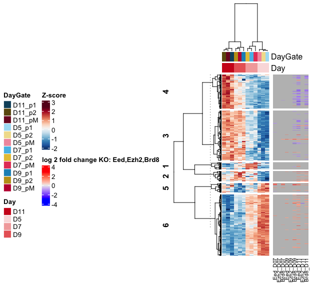
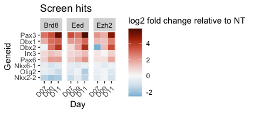
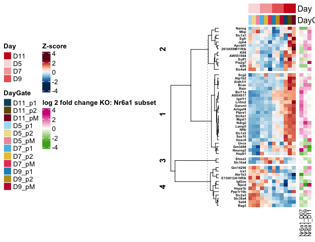
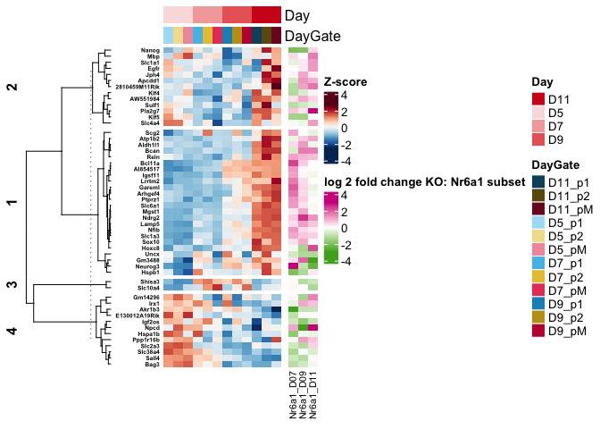
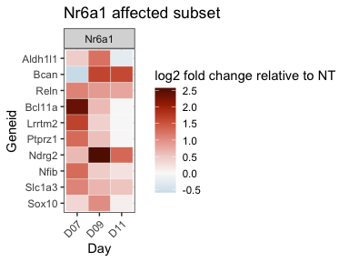
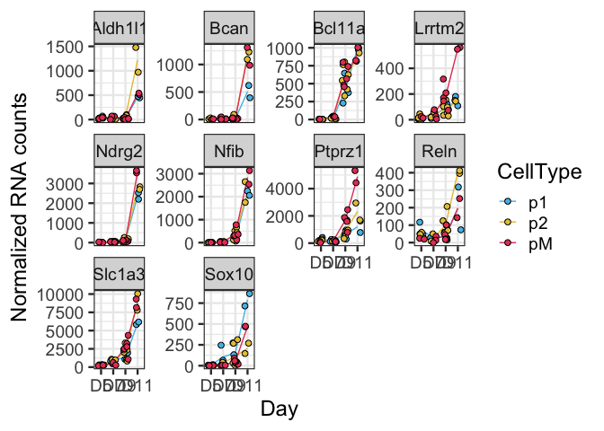
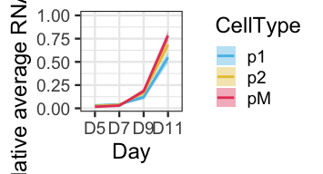

Screen hits KO RNAseq
================

# RNA analysis

Analysis after nf-core/rnaseq 3.5

``` r
rm(list=ls())

library(DESeq2)
library(RColorBrewer)
library(tidyverse)
library(ComplexHeatmap)
library(tximport)
library(UpSetR)
library(colorspace)
library(circlize)
```

### Load settings

Colors, main directory

``` r
source('./r_inputs/TemporalSpatialNeuralTube_settings.R')
```

### Set dirs

``` r
subworkinput="inputs_glialScreen_3/"

outdir="outputs_glialScreen_3_3_diffexpress/"
ifelse(!dir.exists(file.path(workingdir,outdir)), dir.create(file.path(workingdir,outdir)), "Directory exists")
```

    ## [1] "Directory exists"

## Load data

I am using the output of star_salmon so the import to deseq is a bit
more complicated.

``` r
#salmon counts from pipeline, import
path_files =  list.files(paste0(workingdir,subworkinput)) 
samples = data.frame(run=path_files, stringsAsFactors = FALSE) %>%
  filter(str_detect(run, "D"))

files <- file.path(paste0(workingdir,subworkinput), samples$run, "quant.sf")
names(files) <- samples$run
all(file.exists(files))
```

    ## [1] TRUE

``` r
#from pipeline
tx2gene = read_tsv(paste0(paste0(workingdir,subworkinput),"/salmon_tx2gene.tsv"))
```

    ## New names:
    ## Rows: 35118 Columns: 3
    ## ── Column specification
    ## ──────────────────────────────────────────────────────── Delimiter: "\t" chr
    ## (3): NM_001011874, Xkr4...2, Xkr4...3
    ## ℹ Use `spec()` to retrieve the full column specification for this data. ℹ
    ## Specify the column types or set `show_col_types = FALSE` to quiet this message.
    ## • `Xkr4` -> `Xkr4...2`
    ## • `Xkr4` -> `Xkr4...3`

``` r
txi.salmon <- tximport(files, type = "salmon", tx2gene = tx2gene)
```

    ## reading in files with read_tsv
    ## 1 2 3 4 5 6 7 8 9 10 11 12 13 14 15 16 17 18 19 20 21 22 23 24 25 26 27 28 29 30 31 32 33 34 35 36 37 38 39 40 41 
    ## transcripts missing from tx2gene: 1
    ## summarizing abundance
    ## summarizing counts
    ## summarizing length

``` r
#head(txi.salmon$counts)

count.table <- txi.salmon$counts
```

import tables: counts for this validation RNAseq

``` r
# dds_counts <- read.table(paste0(workingdir,"outputs_glialScreen_3/","featurecounts.normCounts.txt"),stringsAsFactors =FALSE)
```

vsd of CaTS-RNA for heatmaps

``` r
count_vsd <- read.csv(file=paste0(workingdir,"outputs_glialRNA_1/","featurecounts.vsd.csv"),header=TRUE, stringsAsFactors = FALSE)
```

counts of CaTS-RNA for thresholding

``` r
count_cats <- read.table(file=paste0(workingdir,"outputs_glialRNA_1/","featurecounts.normCounts.txt"),header=TRUE, stringsAsFactors = FALSE)
```

## Colors and shapes

Before more plotting, let’s get some metadata organised

``` r
# 
# geneKO <- c("NT","Eed","Ezh2","Brd8","Rxra","Atf3","Nr6a1")
# metaKOs <- data.frame(GeneKO=geneKO, hit_type=c("Control",rep("Pos_regulator",4),rep("Neg_regulator",2)))
# colorKOs <- c("#b7b7b7","#ff2e0e","#ff6149","#FF8370","#ffb6ab","#00d8a1","#007658")
# 
# shapes4_manual = c(18,15,16,17) # these are block
# shapes5_manual = c(25,21,22,23,24) # these are filled
# shapes4_fill_manual = c(23,21,22,24)
# 
# sorted_DayGate <- c("D5_p1","D5_p2","D5_pM",
#                     "D7_p1","D7_p2","D7_pM",
#                     "D9_p1","D9_p2","D9_pM",
#                     "D11_p1","D11_p2","D11_pM")
# 
# sorted_WTDayGate <- paste("WT",sorted_DayGate, sep="_")
```

## Differential analysis

``` r
#matrix
count_matrix <- count.table %>%
  as.data.frame()

#this is for uploading to GEO
write.table(count_matrix,
      file = paste0(workingdir,outdir,"CountsRaw_all.txt"), quote = FALSE)


#subset 
timepoint=c("D07_","D09_","D11_")
#matrix
comparisons=matrix(c(rep("NT",4),"Eed","Ezh2","Brd8","Nr6a1"),
                 nrow=4,
                 ncol=2)


PairWiseDEseq <- lapply(c(1:length(timepoint)),function (x) {
  lapply(c(1:nrow(comparisons)), function (y) {
      timepoints <- timepoint[x]
      subKO <- comparisons[y,]
      sub_counts <- count_matrix %>%
        dplyr::select(contains(subKO) & contains(timepoints))
      
      ## Make metadata file for DESeq
      genecolData_sub <- data.frame(Sample_ID = colnames(sub_counts))
      genecolData_sub <- genecolData_sub %>% 
          separate(Sample_ID,into=c("Day","GeneKO","Rep"), sep="_", remove=FALSE)
      genecolData_sub <- as.data.frame(unclass(genecolData_sub))
      
      
      dds_sub <- DESeqDataSetFromMatrix(countData =  round(sub_counts),
                              colData = genecolData_sub,
                              design = ~ GeneKO)
          
      dds_sub$GeneKO <- factor(dds_sub$GeneKO, levels = subKO)
      
      dds_sub <- DESeq(dds_sub)
      
      vsd_sub <- varianceStabilizingTransformation(dds_sub,blind = FALSE)
      
      # Export normalized tables for plotting elsewhere
      dds_sub_counts <- counts(dds_sub, normalized = TRUE)
      vsd_sub_data <- assay(vsd_sub)
      
      results_sub <- results(dds_sub)

      # plotMA(results_sub,ylim=c(-8,8))

      ## Export files
      
      write.table(dds_sub_counts,
      file = paste0(workingdir,outdir,"CountsNormalized_",timepoints,resultsNames(dds_sub)[2],".txt"),
          quote = FALSE, row.names = TRUE)
      write.csv(vsd_sub_data,
          paste0(workingdir,outdir,"VSData_",timepoints,resultsNames(dds_sub)[2],".csv"),
          quote = FALSE)
      write.table(results_sub,
          file = paste0(workingdir,outdir,"Results_DESeq_",timepoints,resultsNames(dds_sub)[2],".txt"),
          quote = FALSE, row.names = TRUE)

      results_return <- results_sub %>% as.data.frame() %>% rownames_to_column("Geneid")
      results_return$Comparison <- paste0("Comp_",timepoints,resultsNames(dds_sub)[2])
      results_return

  })
}) 
```

    ## converting counts to integer mode

    ## Warning in DESeqDataSet(se, design = design, ignoreRank): some variables in
    ## design formula are characters, converting to factors

    ## estimating size factors

    ## estimating dispersions

    ## gene-wise dispersion estimates

    ## mean-dispersion relationship

    ## final dispersion estimates

    ## fitting model and testing

    ## converting counts to integer mode

    ## Warning in DESeqDataSet(se, design = design, ignoreRank): some variables in
    ## design formula are characters, converting to factors

    ## estimating size factors

    ## estimating dispersions

    ## gene-wise dispersion estimates

    ## mean-dispersion relationship

    ## final dispersion estimates

    ## fitting model and testing

    ## converting counts to integer mode

    ## Warning in DESeqDataSet(se, design = design, ignoreRank): some variables in
    ## design formula are characters, converting to factors

    ## estimating size factors

    ## estimating dispersions

    ## gene-wise dispersion estimates

    ## mean-dispersion relationship

    ## final dispersion estimates

    ## fitting model and testing

    ## converting counts to integer mode

    ## Warning in DESeqDataSet(se, design = design, ignoreRank): some variables in
    ## design formula are characters, converting to factors

    ## estimating size factors

    ## estimating dispersions

    ## gene-wise dispersion estimates

    ## mean-dispersion relationship

    ## final dispersion estimates

    ## fitting model and testing

    ## converting counts to integer mode

    ## Warning in DESeqDataSet(se, design = design, ignoreRank): some variables in
    ## design formula are characters, converting to factors

    ## estimating size factors

    ## estimating dispersions

    ## gene-wise dispersion estimates

    ## mean-dispersion relationship

    ## final dispersion estimates

    ## fitting model and testing

    ## converting counts to integer mode

    ## Warning in DESeqDataSet(se, design = design, ignoreRank): some variables in
    ## design formula are characters, converting to factors

    ## estimating size factors

    ## estimating dispersions

    ## gene-wise dispersion estimates

    ## mean-dispersion relationship

    ## final dispersion estimates

    ## fitting model and testing

    ## converting counts to integer mode

    ## Warning in DESeqDataSet(se, design = design, ignoreRank): some variables in
    ## design formula are characters, converting to factors

    ## estimating size factors

    ## estimating dispersions

    ## gene-wise dispersion estimates

    ## mean-dispersion relationship

    ## final dispersion estimates

    ## fitting model and testing

    ## converting counts to integer mode

    ## Warning in DESeqDataSet(se, design = design, ignoreRank): some variables in
    ## design formula are characters, converting to factors

    ## estimating size factors

    ## estimating dispersions

    ## gene-wise dispersion estimates

    ## mean-dispersion relationship

    ## final dispersion estimates

    ## fitting model and testing

    ## converting counts to integer mode

    ## Warning in DESeqDataSet(se, design = design, ignoreRank): some variables in
    ## design formula are characters, converting to factors

    ## estimating size factors

    ## estimating dispersions

    ## gene-wise dispersion estimates

    ## mean-dispersion relationship

    ## final dispersion estimates

    ## fitting model and testing

    ## converting counts to integer mode

    ## Warning in DESeqDataSet(se, design = design, ignoreRank): some variables in
    ## design formula are characters, converting to factors

    ## estimating size factors

    ## estimating dispersions

    ## gene-wise dispersion estimates

    ## mean-dispersion relationship

    ## final dispersion estimates

    ## fitting model and testing

    ## converting counts to integer mode

    ## Warning in DESeqDataSet(se, design = design, ignoreRank): some variables in
    ## design formula are characters, converting to factors

    ## estimating size factors

    ## estimating dispersions

    ## gene-wise dispersion estimates

    ## mean-dispersion relationship

    ## final dispersion estimates

    ## fitting model and testing

    ## converting counts to integer mode

    ## Warning in DESeqDataSet(se, design = design, ignoreRank): some variables in
    ## design formula are characters, converting to factors

    ## estimating size factors

    ## estimating dispersions

    ## gene-wise dispersion estimates

    ## mean-dispersion relationship

    ## final dispersion estimates

    ## fitting model and testing

### Thresholds for Mutant vs Control comparisons

Based on exploring the data, we have chosen:

`filter(padj < 0.05 & abs(log2FoldChange) > 1 & baseMean > 80)`

``` r
adjusted_pval = 0.05

log2FC = 1

minBaseMean = 80
```

``` r
list_allcomparisons <- unlist(PairWiseDEseq,recursive=FALSE)
results_deseq <- do.call(rbind,list_allcomparisons)

top_comparisons <- results_deseq %>%
  as.data.frame() %>%
  filter(padj < adjusted_pval & abs(log2FoldChange) > log2FC & baseMean > minBaseMean)
```

Print list

``` r
write.csv(top_comparisons, file = paste0(workingdir,outdir,"Top_filtered_Results_DESeq2.csv"), quote = FALSE, row.names = FALSE)
```

# Systematic explorarion of each candidate

Plot usual expression of CaTS ATAC heatmap side by side with log2FC in
KO

For each KO, just plot the affected genes

``` r
top_comparisons_prep <- top_comparisons %>%
  separate(Comparison, into = c("constantComp","Day","constantGeneKO","GeneKO","constantvs","constantNT"), remove = FALSE) %>%
  dplyr::select(-starts_with("constant"))


KOvector <- top_comparisons_prep$GeneKO %>% unique()

ht_RNA_KOfoldchange <- lapply(c(1:length(KOvector)),function (x) {
          whichKO <- KOvector[x]
          sub_topcomparisons <- top_comparisons_prep %>% filter(GeneKO==whichKO)
          
          
          
          # make a heatmap of CaTS-RNA: this heatmap filters rows of genes with sd zero
          # filter genes
          vsd_hm <- count_vsd %>%
            filter(X %in% sub_topcomparisons$Geneid) %>%
            column_to_rownames("X") %>%
            dplyr::select(starts_with("WT"))
          
          dim(vsd_hm)
          
          vsd_hm_z1 <- t(scale(t(vsd_hm))) 
          nonzero = rowSds(vsd_hm_z1, useNames = TRUE) %>% as.data.frame() %>% rownames_to_column("geneid")
          colnames(nonzero) = c("geneid","calculated_rowsds")
          nonzero_filtered = nonzero %>% filter(calculated_rowsds != 0) %>% dplyr::select(geneid)
          vsd_hm_z <- vsd_hm_z1[nonzero_filtered$geneid,]
          
          # metadata for the heatmap
          genecolData_first <- data.frame(Sample_ID = colnames(vsd_hm_z1))
          genecolData_first <- genecolData_first %>% 
            separate(Sample_ID,into=c("Genotype","Day","Gate","NFIAgate","Rep"), sep="_", remove=FALSE) %>%
            mutate(Condition=paste(Genotype,Day,Gate,NFIAgate, sep="_"),
                   DayNFIA=paste(Day,NFIAgate,Genotype,sep = "_"),
                   DayGate=paste(Day,Gate,sep="_"),
                   Experiment=paste(Genotype,Rep,sep="_"),
                   NFIAstatus=paste(NFIAgate,Genotype,sep="_"))
          genecolData_first <- as.data.frame(unclass(genecolData_first))
          
          phen_data <- genecolData_first %>%
            dplyr::select(c("Sample_ID","DayGate","Day","NFIAstatus","Rep")) %>%
            remove_rownames() %>%
            column_to_rownames("Sample_ID")
          
          ann_color_JD <- list(
            DayGate = c(D5_p1="#abdff4",D5_p2="#f1df9a", D5_pM="#f19aac",
                        D7_p1="#55bee8",D7_p2="#e6c444",D7_pM="#e64466",
                        D9_p1="#1a91c1",D9_p2="#c19e1a",D9_pM="#c11a3d",
                        D11_p1="#0e506b",D11_p2="#6b570e",D11_pM="#7c1127"),
            NFIAstatus = c(NFIAn_WT="#f6f6f6",NFIAp_WT="#cecece",`100`="#808080",NFIAn_MUT="#595959"),
            Day = c(D5="#fadede",D7="#f3aaaa",D9="#e96666",D11="#cf1e1e"),
            Rep = c(R1="#ebeb77", R2="#77b1eb", R3="#eb7777"))
          
          # Build the annotation for the complex heatmap
          colAnn <- HeatmapAnnotation(
              df = phen_data,
              which = 'col', # 'col' (samples) or 'row' (gene) annotation?
              na_col = 'white', # default colour for any NA values in the annotation data-frame, 'ann'
              col = ann_color_JD,
              annotation_height = 0.6,
              annotation_width = unit(1, 'cm'),
              gap = unit(1, 'mm'))

          # Annotated heatmap with dplyr::selected colors
          hm_colors = colorRampPalette(rev(brewer.pal(n = 11, name = "RdBu")))(100)
            
          hmap_catsRNA <- Heatmap(vsd_hm_z,
          
              name = 'Z-score',
          
              col = hm_colors,
          
              # row (gene) parameters
                cluster_rows = TRUE,
                show_row_dend = TRUE,
                #row_title = 'Statistically significant genes',
                row_title_side = 'left',
                row_title_gp = gpar(fontsize = 12,  fontface = 'bold'),
                row_title_rot = 90,
                show_row_names = TRUE,
                row_names_gp = gpar(fontsize = 5, fontface = 'bold'),
                row_names_side = 'left',
                row_dend_width = unit(25,'mm'),
          
              # column (sample) parameters
                cluster_columns = TRUE,
                show_column_dend = TRUE,
                column_title = '',
                column_title_side = 'bottom',
                column_title_gp = gpar(fontsize = 12, fontface = 'bold'),
                column_title_rot = 0,
                show_column_names = TRUE,
                column_names_gp = gpar(fontsize = 8),
                column_names_max_height = unit(10, 'cm'),
                column_dend_height = unit(25,'mm'),
          
              # cluster methods for rows and columns
                clustering_distance_columns = function(x) as.dist(1 - cor(t(x))),
                clustering_method_columns = 'ward.D2',
                clustering_distance_rows = function(x) as.dist(1 - cor(t(x))),
                clustering_method_rows = 'ward.D2',
          
              # specify top and bottom annotations
                top_annotation = colAnn)
          
          
              ## subset to make a heatmap of log2FC
              sub_log2fc <- sub_topcomparisons %>% dplyr::select(Geneid,log2FoldChange, Day) %>%
                pivot_wider(values_from = log2FoldChange, names_from = Day) # this table has 3 columns for the three days with NAs for those genes that are significant at a particular timepoint 
              log2fc_matrix_full <- sub_log2fc %>% column_to_rownames("Geneid")
              log2fc_matrix_catsfiltered <- log2fc_matrix_full[nonzero_filtered$geneid,]
                
              # make a heatmap of log2FC        
              hmap_foldchange <- Heatmap(log2fc_matrix_catsfiltered,
                  name = paste0('log 2 fold change KO: ', whichKO),
                  #col = hm_colors,
                  # row (gene) parameters
                    cluster_rows = FALSE,
                    show_row_dend = TRUE,
                    #row_title = 'Statistically significant genes',
                    row_title_side = 'left',
                    row_title_gp = gpar(fontsize = 12,  fontface = 'bold'),
                    row_title_rot = 90,
                    show_row_names = TRUE,
                    row_names_gp = gpar(fontsize = 5, fontface = 'bold'),
                    row_names_side = 'left',
                    row_dend_width = unit(25,'mm'),
              
                  # column (sample) parameters
                    cluster_columns = FALSE,
                    show_column_dend = TRUE,
                    column_title = '',
                    column_title_side = 'bottom',
                    column_title_gp = gpar(fontsize = 12, fontface = 'bold'),
                    column_title_rot = 0,
                    show_column_names = TRUE,
                    column_names_gp = gpar(fontsize = 8),
                    column_names_max_height = unit(10, 'cm'),
                    column_dend_height = unit(25,'mm'),
              
                  # cluster methods for rows and columns
                    clustering_distance_columns = function(x) as.dist(1 - cor(t(x))),
                    clustering_method_columns = 'ward.D2',
                    clustering_distance_rows = function(x) as.dist(1 - cor(t(x))),
                    clustering_method_rows = 'ward.D2')
   
          # draw(hmap_catsRNA + hmap_foldchange,
          #     heatmap_legend_side = 'left',
          #     annotation_legend_side = 'left',
          #     row_sub_title_side = 'left')    
          
          # print heatmap
          pdf(paste0(workingdir,outdir,"Heatmap_geneKO_",whichKO,".pdf"), width = 15, height = 20) 

          draw(hmap_catsRNA + hmap_foldchange,
              heatmap_legend_side = 'left',
              annotation_legend_side = 'left',
              row_sub_title_side = 'left')

          dev.off()

  
})
```

    ## Warning: The input is a data frame-like object, convert it to a matrix.
    ## Warning: The input is a data frame-like object, convert it to a matrix.
    ## Warning: The input is a data frame-like object, convert it to a matrix.

    ## The automatically generated colors map from the minus and plus 99^th of
    ## the absolute values in the matrix. There are outliers in the matrix
    ## whose patterns might be hidden by this color mapping. You can manually
    ## set the color to `col` argument.
    ## 
    ## Use `suppressMessages()` to turn off this message.

    ## Warning: The input is a data frame-like object, convert it to a matrix.

# CUSTOM for some genes

``` r
# dds_counts_plot <- dds_counts %>% 
#   as.data.frame() %>%
#   rownames_to_column("geneid") %>%
#   gather(sampleid, counts_norm, starts_with("D"))%>% 
#   separate(sampleid,into=c("Day","GeneKO","Rep"), sep="_", remove=FALSE) %>%
#   left_join(metaKOs, by="GeneKO") %>%
#   mutate(Condition=paste(GeneKO,Day, sep="_"),
#          GeneKO=factor(GeneKO, levels=geneKO))
#   
```

## Fig: polycomb + Brd8

- Beyond just NFIA: Polycomb + Brd8 promote temporal progression, e.g. 
  - Bars: other hits in the screen
  - Heatmap: all temporal genes
- But they are changing the DV identity of the neural progenitors

#### Hits in the screen

``` r
geneOI <- c("E2f7","Foxb1","Sox6","Rfx4","Nfia")
```

### Temporal genes

which ones are affected by Eed, Ezh2 and Brd8?

first plot the dependent genes

the heatmap with just average by condition for the original cats-rna

``` r
top_comparisons_prep_multi <- top_comparisons_prep %>% 
  mutate(GeneKO_day=paste(GeneKO, Day, sep="_")) %>%
  filter(GeneKO %in% c("Eed","Ezh2","Brd8"))

## make averages by condition

count_vsd_ave <- count_vsd %>%
  pivot_longer(values_to = "vsd", names_to = "sampleid", MUT_D11_p1_NFIAn_R2:WT_D9_pM_NFIAp_R3) %>%
  separate(sampleid, into = c("geno","day","gate","nfia","rep")) %>%
  mutate(condition=paste(geno,day,gate, sep="_")) %>%
  group_by(X,condition) %>%
  summarise(vsd_ave=mean(vsd)) %>%
  pivot_wider(values_from = vsd_ave, names_from = condition)
```

    ## `summarise()` has grouped output by 'X'. You can override using the `.groups`
    ## argument.

Now all temporal genes!

``` r
top_comparisons_prep_multi <- top_comparisons_prep %>% 
  mutate(GeneKO_day=paste(GeneKO, Day, sep="_")) %>%
  filter(GeneKO %in% c("Eed","Ezh2","Brd8"))

tempALL_genes <- read.csv(file=paste0(workingdir,"outputs_glialrna_2_time_space/","Genes_temporal_alldomains.csv"), header = TRUE, stringsAsFactors = FALSE)


# make a heatmap of CaTS-RNA: this heatmap filters rows of genes with sd zero
# using average values
# filter genes
vsd_hm <- count_vsd_ave %>%
  filter(X %in% tempALL_genes$GeneID) %>%
  column_to_rownames("X") %>%
  dplyr::select(starts_with("WT"))

dim(vsd_hm)
```

    ## [1] 547  12

``` r
vsd_hm_z <- t(scale(t(vsd_hm))) 

# metadata for the heatmap
genecolData_first <- data.frame(Sample_ID = colnames(vsd_hm_z))
genecolData_first <- genecolData_first %>% 
  separate(Sample_ID,into=c("Genotype","Day","Gate"), sep="_", remove=FALSE) %>%
  mutate(DayGate=paste(Day,Gate,sep="_"))
genecolData_first <- as.data.frame(unclass(genecolData_first))

phen_data <- genecolData_first %>%
  dplyr::select(c("Sample_ID","DayGate","Day")) %>%
  remove_rownames() %>%
  column_to_rownames("Sample_ID")

ann_color_JD <- list(
  DayGate = c(D5_p1="#abdff4",D5_p2="#f1df9a", D5_pM="#f19aac",
              D7_p1="#55bee8",D7_p2="#e6c444",D7_pM="#e64466",
              D9_p1="#1a91c1",D9_p2="#c19e1a",D9_pM="#c11a3d",
              D11_p1="#0e506b",D11_p2="#6b570e",D11_pM="#7c1127"),
  NFIAstatus = c(NFIAn_WT="#f6f6f6",NFIAp_WT="#cecece",`100`="#808080",NFIAn_MUT="#595959"),
  Day = c(D5="#fadede",D7="#f3aaaa",D9="#e96666",D11="#cf1e1e"),
  Rep = c(R1="#ebeb77", R2="#77b1eb", R3="#eb7777"))

# Build the annotation for the complex heatmap
colAnn <- HeatmapAnnotation(
    df = phen_data,
    which = 'col', # 'col' (samples) or 'row' (gene) annotation?
    na_col = 'white', # default colour for any NA values in the annotation data-frame, 'ann'
    col = ann_color_JD,
    annotation_height = 0.6,
    annotation_width = unit(1, 'cm'),
    gap = unit(1, 'mm'))

# Annotated heatmap with dplyr::selected colors
hm_colors = colorRampPalette(rev(brewer.pal(n = 11, name = "RdBu")))(100)

set.seed(123)  #For reproduciblity

hmap_catsRNA <- Heatmap(vsd_hm_z,
    use_raster = TRUE, 
    km=6,
    name = 'Z-score',

    col = hm_colors,

    # row (gene) parameters
      cluster_rows = TRUE,
      show_row_dend = TRUE,
      #row_title = 'Statistically significant genes',
      row_title_side = 'left',
      row_title_gp = gpar(fontsize = 12,  fontface = 'bold'),
      row_title_rot = 90,
      show_row_names = FALSE,
      row_names_gp = gpar(fontsize = 5, fontface = 'bold'),
      row_names_side = 'left',
      row_dend_width = unit(25,'mm'),

    # column (sample) parameters
      cluster_columns = TRUE,
      show_column_dend = TRUE,
      column_title = '',
      column_title_side = 'bottom',
      column_title_gp = gpar(fontsize = 12, fontface = 'bold'),
      column_title_rot = 0,
      show_column_names = FALSE,
      column_names_gp = gpar(fontsize = 8),
      column_names_max_height = unit(10, 'cm'),
      column_dend_height = unit(25,'mm'),

    # cluster methods for rows and columns
      clustering_distance_columns = function(x) as.dist(1 - cor(t(x))),
      clustering_method_columns = 'ward.D2',
      clustering_distance_rows = function(x) as.dist(1 - cor(t(x))),
      clustering_method_rows = 'ward.D2',

    # specify top and bottom annotations
      top_annotation = colAnn)
```

    ## 'magick' package is suggested to install to give better rasterization.
    ## 
    ## Set `ht_opt$message = FALSE` to turn off this message.

``` r
    ## subset to make a heatmap of log2FC: there will be genes with NA throughout 
  sub_log2fc <- top_comparisons_prep_multi %>% dplyr::select(Geneid,log2FoldChange, GeneKO_day) %>%
      pivot_wider(values_from = log2FoldChange, names_from = GeneKO_day) # this table has 3 columns for the three days with NAs for those genes that are significant at a particular timepoint   

  expanded_log2fc <- vsd_hm %>% rownames_to_column("Geneid") %>%
    dplyr::select("Geneid") %>%
    left_join(sub_log2fc, by="Geneid") %>% 
    column_to_rownames("Geneid")
  #row order
    log2fc_matrix_catsfiltered <- expanded_log2fc[rownames(vsd_hm),]
    log2fc_matrix_catsfiltered <- as.matrix(log2fc_matrix_catsfiltered)
      
    # make a heatmap of log2FC        
    hmap_foldchange <- Heatmap(log2fc_matrix_catsfiltered,
        name = 'log 2 fold change KO: Eed,Ezh2,Brd8',
        #col = hm_colors,
        # row (gene) parameters
          cluster_rows = FALSE,
          show_row_dend = TRUE,
          #row_title = 'Statistically significant genes',
          row_title_side = 'left',
          row_title_gp = gpar(fontsize = 12,  fontface = 'bold'),
          row_title_rot = 90,
          show_row_names = FALSE,
          row_names_gp = gpar(fontsize = 5, fontface = 'bold'),
          row_names_side = 'left',
          row_dend_width = unit(25,'mm'),
    
        # column (sample) parameters
          cluster_columns = FALSE,
          show_column_dend = TRUE,
          column_title = '',
          column_title_side = 'bottom',
          column_title_gp = gpar(fontsize = 12, fontface = 'bold'),
          column_title_rot = 0,
          show_column_names = TRUE,
          column_names_gp = gpar(fontsize = 8),
          column_names_max_height = unit(10, 'cm'),
          column_dend_height = unit(25,'mm'),
    
        # cluster methods for rows and columns
          clustering_distance_columns = function(x) as.dist(1 - cor(t(x))),
          clustering_method_columns = 'ward.D2',
          clustering_distance_rows = function(x) as.dist(1 - cor(t(x))),
          clustering_method_rows = 'ward.D2')

draw(hmap_catsRNA + hmap_foldchange,
    heatmap_legend_side = 'left',
    annotation_legend_side = 'left',
    row_sub_title_side = 'left')    
```

<!-- -->

``` r
# print heatmap
pdf(paste0(workingdir,outdir,"Heatmap_ALLtempgenes_PRC_Brd8.pdf"), width = 7, height = 6) 

draw(hmap_catsRNA + hmap_foldchange,
    heatmap_legend_side = 'left',
    annotation_legend_side = 'left',
    row_sub_title_side = 'left')

dev.off()
```

    ## quartz_off_screen 
    ##                 2

### D-V markers

``` r
geneOI <- c("Pax3","Dbx1","Dbx2","Irx3","Pax6","Nkx6-1","Olig2","Nkx2-2")
```

Heatmap of the D-V markers

``` r
results_deseq_metadata <- results_deseq %>%
  separate(Comparison, into = c("constantComp","Day","constantGeneKO","GeneKO","constantvs","constantNT"), remove = FALSE) %>%
  dplyr::select(-starts_with("constant"))


plot_heatmap_KO <- results_deseq_metadata %>% filter(Geneid %in% geneOI & GeneKO %in% c("NT","Eed","Ezh2","Brd8")) %>%
         mutate(Geneid=factor(Geneid, levels=rev(geneOI))) 


hm_plot_dvmarkers <- ggplot(plot_heatmap_KO, aes(x=Day,y=Geneid)) +
  geom_tile(color="white", aes(fill= log2FoldChange)) +
  scale_fill_continuous_divergingx(palette = 'RdBu', rev=TRUE, mid = 0,
                       name="log2 fold change relative to NT") +
  facet_grid( ~ GeneKO, scales="free_y") +
  ggtitle("Screen hits") +
  theme(axis.text.x = element_text(angle = 45, hjust = 1, vjust = 1))


ggsave(paste0(workingdir,outdir,"Heatmap_DV_markers_PRC-Brd8KO.pdf"), plot=hm_plot_dvmarkers,
             width=4.5, height=2, units="in", useDingbats=FALSE)

hm_plot_dvmarkers
```

<!-- -->

### heatmap of the temporal progression hits

``` r
geneOI <- c("E2f7","Foxb1","Sox6","Rfx4","Nfia")
```

Space time vis for original RNAseq

With ggplot to place the cell types in the Y axis

``` r
# make a heatmap of CaTS-RNA: this heatmap filters rows of genes with sd zero
# filter genes
vsd_hm <- count_vsd_ave %>%
  filter(X %in% geneOI) %>%
  column_to_rownames("X") %>%
  dplyr::select(starts_with("WT"))

dim(vsd_hm)
```

    ## [1]  5 12

``` r
vsd_hm_z <- t(scale(t(vsd_hm))) 

# order the columns
vsd_hm_z <- vsd_hm_z[,sorted_WTDayGate]

# metadata for the heatmap
genecolData_first <- data.frame(Sample_ID = colnames(vsd_hm_z))
genecolData_first <- genecolData_first %>% 
  separate(Sample_ID,into=c("Genotype","Day","Gate"), sep="_", remove=FALSE) %>%
  mutate(DayGate=paste(Day,Gate,sep="_"))
genecolData_first <- as.data.frame(unclass(genecolData_first))

phen_data <- genecolData_first %>%
  dplyr::select(c("Sample_ID","DayGate","Day")) %>%
  remove_rownames() %>%
  column_to_rownames("Sample_ID")

ann_color_JD <- list(
  DayGate = c(D5_p1="#abdff4",D5_p2="#f1df9a", D5_pM="#f19aac",
              D7_p1="#55bee8",D7_p2="#e6c444",D7_pM="#e64466",
              D9_p1="#1a91c1",D9_p2="#c19e1a",D9_pM="#c11a3d",
              D11_p1="#0e506b",D11_p2="#6b570e",D11_pM="#7c1127"),
  Day = c(D5="#fadede",D7="#f3aaaa",D9="#e96666",D11="#cf1e1e"))

# Build the annotation for the complex heatmap
colAnn <- HeatmapAnnotation(
    df = phen_data,
    which = 'col', # 'col' (samples) or 'row' (gene) annotation?
    na_col = 'white', # default colour for any NA values in the annotation data-frame, 'ann'
    col = ann_color_JD,
    annotation_height = 0.6,
    annotation_width = unit(1, 'cm'),
    gap = unit(1, 'mm'))

# Annotated heatmap with dplyr::selected colors
hm_colors = colorRampPalette(rev(brewer.pal(n = 11, name = "RdBu")))(100)


  hmap_catsRNA <- Heatmap(vsd_hm_z,
    name = 'Z-score',

    col = hm_colors,

    # row (gene) parameters
      cluster_rows = TRUE,
      show_row_dend = TRUE,
      #row_title = 'Statistically significant genes',
      row_title_side = 'left',
      row_title_gp = gpar(fontsize = 12,  fontface = 'bold'),
      row_title_rot = 90,
      show_row_names = TRUE,
      row_names_gp = gpar(fontsize = 12, fontface = 'bold'),
      row_names_side = 'left',
      row_dend_width = unit(25,'mm'),

    # column (sample) parameters
      cluster_columns = FALSE,
      show_column_dend = TRUE,
      column_title = '',
      column_title_side = 'bottom',
      column_title_gp = gpar(fontsize = 12, fontface = 'bold'),
      column_title_rot = 0,
      show_column_names = FALSE,
      column_names_gp = gpar(fontsize = 8),
      column_names_max_height = unit(10, 'cm'),
      column_dend_height = unit(25,'mm'),

    # cluster methods for rows and columns
      clustering_distance_columns = function(x) as.dist(1 - cor(t(x))),
      clustering_method_columns = 'ward.D2',
      clustering_distance_rows = function(x) as.dist(1 - cor(t(x))),
      clustering_method_rows = 'ward.D2',

    # specify top and bottom annotations
      top_annotation = colAnn)

    ## heatmap of all log2FC whether sig or not 
  results_deseq_subset <- results_deseq %>% 
    separate(Comparison, into = c("constantComp","Day","constantGeneKO","GeneKO","constantvs","constantNT"), remove = FALSE) %>%
      dplyr::select(-starts_with("constant")) %>% 
      filter(GeneKO %in% c("Eed","Ezh2","Brd8")) %>% 
      mutate(GeneKO_day=paste(GeneKO, Day, sep="_"))
     
  sub_wide_log2fc <- results_deseq_subset %>% dplyr::select(Geneid,log2FoldChange, GeneKO_day) %>%
      filter(Geneid %in% geneOI)  %>% # we were just looking for these few genes
      pivot_wider(values_from = log2FoldChange, names_from = GeneKO_day) %>% # this table has 3 columns for the three days with NAs for those genes that are significant at a particular timepoint   
      column_to_rownames("Geneid")

  #row order
    log2fc_matrix_catsfiltered <- sub_wide_log2fc[rownames(vsd_hm),]
    log2fc_matrix_catsfiltered <- as.matrix(log2fc_matrix_catsfiltered)
    
    # color foldchange heatmap
    #color for the fold change heatmap: outliers mapped to the same color 
    hm_colors_fc = colorRamp2(c(-1.9, 0, 1.9), c("#4dac26", "white", "#d01c8b"))
    
    # make a heatmap of log2FC        
    hmap_foldchange <- Heatmap(log2fc_matrix_catsfiltered,
        name = 'log 2 fold change KO: Eed,Ezh2,Brd8',
        col = hm_colors_fc,
        # row (gene) parameters
          cluster_rows = FALSE,
          show_row_dend = TRUE,
          #row_title = 'Statistically significant genes',
          row_title_side = 'left',
          row_title_gp = gpar(fontsize = 12,  fontface = 'bold'),
          row_title_rot = 90,
          show_row_names = TRUE,
          row_names_gp = gpar(fontsize = 5, fontface = 'bold'),
          row_names_side = 'left',
          row_dend_width = unit(25,'mm'),
    
        # column (sample) parameters
          cluster_columns = FALSE,
          show_column_dend = TRUE,
          column_title = '',
          column_title_side = 'bottom',
          column_title_gp = gpar(fontsize = 12, fontface = 'bold'),
          column_title_rot = 0,
          show_column_names = TRUE,
          column_names_gp = gpar(fontsize = 8),
          column_names_max_height = unit(10, 'cm'),
          column_dend_height = unit(25,'mm'),
    
        # cluster methods for rows and columns
          clustering_distance_columns = function(x) as.dist(1 - cor(t(x))),
          clustering_method_columns = 'ward.D2',
          clustering_distance_rows = function(x) as.dist(1 - cor(t(x))),
          clustering_method_rows = 'ward.D2')

draw(hmap_catsRNA + hmap_foldchange,
    heatmap_legend_side = 'left',
    annotation_legend_side = 'left',
    row_sub_title_side = 'left')    
```

<!-- -->

``` r
# print heatmap
pdf(paste0(workingdir,outdir,"Heatmap_ExampleHitsTemporal_KO_PRC_Brd8.pdf"), width = 10, height = 2) 

draw(hmap_catsRNA + hmap_foldchange,
    heatmap_legend_side = 'left',
    annotation_legend_side = 'left',
    row_sub_title_side = 'left')

dev.off()
```

    ## quartz_off_screen 
    ##                 2

## Fig: Nr6a1

- Plot genes affected by Nr6a1 with their usual pattern
- Filter properly expressed genes
- average cats-rna
- show any fold change

``` r
top_comparisons_prep_Nr6a1 <- top_comparisons_prep %>% 
  mutate(GeneKO_day=paste(GeneKO, Day, sep="_")) %>%
  filter(GeneKO %in% c("Nr6a1"))

top_nr6a1_countscheck <- count_cats %>%
  dplyr::select(starts_with("WT")) %>%
  rownames_to_column("geneid") %>%
  filter(geneid %in% top_comparisons_prep_Nr6a1$Geneid) 

top_nr6a1_counts_filter <- top_nr6a1_countscheck %>%
  pivot_longer(names_to = "sampleid", values_to = "rna_counts", starts_with("WT")) %>%
  mutate(zerocounts=case_when(rna_counts==0 ~ "0", rna_counts > 0 ~ "1")) %>%
  mutate(zerocounts=as.numeric(zerocounts)) %>%
  separate(sampleid,into=c("Genotype","Day","Gate","NFIAgate","Rep"), sep="_", remove=FALSE) %>%
  group_by(geneid,Genotype,Day,Gate) %>%
  mutate(condition=paste(Genotype,Day,Gate, sep = "_"),
          conditionzerosums = sum(zerocounts)) %>%
  ungroup() %>%
  dplyr::select(geneid,condition,conditionzerosums) %>% 
  unique() %>% 
  pivot_wider(names_from = condition, values_from = conditionzerosums) %>%
  column_to_rownames("geneid")


# only include genes where at least 1 condition has more than 1 sample >0      
top_nr6a1_counts_filter2 <-  top_nr6a1_counts_filter[rowSums(top_nr6a1_counts_filter <= 1) <= 1, ]

top_Nr6a1_selected <- top_nr6a1_counts_filter2 %>% rownames_to_column("geneid")

# make a heatmap of CaTS-RNA: this heatmap filters rows of genes with sd zero
# filter genes
vsd_hm <- count_vsd_ave %>%
  filter(X %in% top_Nr6a1_selected$geneid) %>%
  column_to_rownames("X") %>%
  dplyr::select(starts_with("WT"))

dim(vsd_hm)
```

    ## [1] 51 12

``` r
vsd_hm_z1 <- t(scale(t(vsd_hm))) 
nonzero = rowSds(vsd_hm_z1, useNames = TRUE) %>% as.data.frame() %>% rownames_to_column("geneid")
colnames(nonzero) = c("geneid","calculated_rowsds")
nonzero_filtered = nonzero %>% filter(calculated_rowsds != 0) %>% dplyr::select(geneid)
vsd_hm_z <- vsd_hm_z1[nonzero_filtered$geneid,]

# order the columns
vsd_hm_z <- vsd_hm_z[,sorted_WTDayGate]

# metadata for the heatmap
genecolData_first <- data.frame(Sample_ID = colnames(vsd_hm_z))
genecolData_first <- genecolData_first %>% 
  separate(Sample_ID,into=c("Genotype","Day","Gate"), sep="_", remove=FALSE) %>%
  mutate(DayGate=paste(Day,Gate,sep="_"))
genecolData_first <- as.data.frame(unclass(genecolData_first))

phen_data <- genecolData_first %>%
  dplyr::select(c("Sample_ID","Day","DayGate")) %>%
  remove_rownames() %>%
  column_to_rownames("Sample_ID")

ann_color_JD <- list(
  DayGate = c(D5_p1="#abdff4",D5_p2="#f1df9a", D5_pM="#f19aac",
              D7_p1="#55bee8",D7_p2="#e6c444",D7_pM="#e64466",
              D9_p1="#1a91c1",D9_p2="#c19e1a",D9_pM="#c11a3d",
              D11_p1="#0e506b",D11_p2="#6b570e",D11_pM="#7c1127"),
  Day = c(D5="#fadede",D7="#f3aaaa",D9="#e96666",D11="#cf1e1e"))

# Build the annotation for the complex heatmap
colAnn <- HeatmapAnnotation(
    df = phen_data,
    which = 'col', # 'col' (samples) or 'row' (gene) annotation?
    na_col = 'white', # default colour for any NA values in the annotation data-frame, 'ann'
    col = ann_color_JD,
    annotation_height = 0.6,
    annotation_width = unit(1, 'cm'),
    gap = unit(1, 'mm'))

# Annotated heatmap with dplyr::selected colors
hm_colors = colorRampPalette(rev(brewer.pal(n = 11, name = "RdBu")))(100)

set.seed(953)  #For reproduciblity
 
hmap_catsRNA <- Heatmap(vsd_hm_z,
    km=4,
    name = 'Z-score',

    col = hm_colors,

    # row (gene) parameters
      cluster_rows = TRUE,
      show_row_dend = TRUE,
      #row_title = 'Statistically significant genes',
      row_title_side = 'left',
      row_title_gp = gpar(fontsize = 12,  fontface = 'bold'),
      row_title_rot = 90,
      show_row_names = TRUE,
      row_names_gp = gpar(fontsize = 5, fontface = 'bold'),
      row_names_side = 'left',
      row_dend_width = unit(25,'mm'),

    # column (sample) parameters
      cluster_columns = FALSE,
      show_column_dend = TRUE,
      column_title = '',
      column_title_side = 'bottom',
      column_title_gp = gpar(fontsize = 12, fontface = 'bold'),
      column_title_rot = 0,
      show_column_names = FALSE,
      column_names_gp = gpar(fontsize = 8),
      column_names_max_height = unit(10, 'cm'),
      column_dend_height = unit(25,'mm'),

    # cluster methods for rows and columns
      clustering_distance_columns = function(x) as.dist(1 - cor(t(x))),
      clustering_method_columns = 'ward.D2',
      clustering_distance_rows = function(x) as.dist(1 - cor(t(x))),
      clustering_method_rows = 'ward.D2',

    # specify top and bottom annotations
      top_annotation = colAnn)

    ## subset to make a heatmap of log2FC
    # sub_log2fc <- top_comparisons_prep_Nr6a1 %>% dplyr::select(Geneid,log2FoldChange, GeneKO_day) %>%
    #   pivot_wider(values_from = log2FoldChange, names_from = GeneKO_day) # this table has 3 columns for the three days with NAs for those genes that are significant at a particular timepoint 
    # log2fc_matrix_full <- sub_log2fc %>% column_to_rownames("Geneid")
    # log2fc_matrix_catsfiltered <- log2fc_matrix_full[nonzero_filtered$geneid,]
    # log2fc_matrix_catsfiltered <- as.matrix(log2fc_matrix_catsfiltered)
    
     ## subset to make a heatmap of log2FC whether significant or not    
    results_deseq_subset <- results_deseq %>% 
      separate(Comparison, into = c("constantComp","Day","constantGeneKO","GeneKO","constantvs","constantNT"), remove = FALSE) %>%
        dplyr::select(-starts_with("constant")) %>% 
        filter(GeneKO %in% c("Nr6a1")) %>% 
        mutate(GeneKO_day=paste(GeneKO, Day, sep="_"))
       
    sub_wide_log2fc <- results_deseq_subset %>% dplyr::select(Geneid,log2FoldChange, GeneKO_day) %>%
        filter(Geneid %in% nonzero_filtered$geneid)  %>% # we were just looking for these few genes
        pivot_wider(values_from = log2FoldChange, names_from = GeneKO_day) %>% # this table has 3 columns for the three days with NAs for those genes that are significant at a particular timepoint   
        column_to_rownames("Geneid")
  
    #row order
      log2fc_matrix_catsfiltered <- sub_wide_log2fc[rownames(vsd_hm_z),]
      log2fc_matrix_catsfiltered <- as.matrix(log2fc_matrix_catsfiltered)


   #color for the fold change heatmap: outliers mapped to the same color 
    hm_colors_fc = colorRamp2(c(-3, 0, 3), c("#4dac26", "white", "#d01c8b"))
    #col_fun(seq(-3, 3))
    
    # make a heatmap of log2FC        
    hmap_foldchange <- Heatmap(log2fc_matrix_catsfiltered,
        name = paste0('log 2 fold change KO: Nr6a1 subset'),
        col = hm_colors_fc,
        # row (gene) parameters
          cluster_rows = FALSE,
          show_row_dend = TRUE,
          #row_title = 'Statistically significant genes',
          row_title_side = 'left',
          row_title_gp = gpar(fontsize = 12,  fontface = 'bold'),
          row_title_rot = 90,
          show_row_names = FALSE,
          row_names_gp = gpar(fontsize = 5, fontface = 'bold'),
          row_names_side = 'left',
          row_dend_width = unit(25,'mm'),
    
        # column (sample) parameters
          cluster_columns = FALSE,
          show_column_dend = TRUE,
          column_title = '',
          column_title_side = 'bottom',
          column_title_gp = gpar(fontsize = 12, fontface = 'bold'),
          column_title_rot = 0,
          show_column_names = TRUE,
          column_names_gp = gpar(fontsize = 8),
          column_names_max_height = unit(10, 'cm'),
          column_dend_height = unit(25,'mm'),
    
        # cluster methods for rows and columns
          clustering_distance_columns = function(x) as.dist(1 - cor(t(x))),
          clustering_method_columns = 'ward.D2',
          clustering_distance_rows = function(x) as.dist(1 - cor(t(x))),
          clustering_method_rows = 'ward.D2')

draw(hmap_catsRNA + hmap_foldchange,
    heatmap_legend_side = 'left',
    annotation_legend_side = 'left',
    row_sub_title_side = 'left')    
```

<!-- -->

``` r
# print heatmap
pdf(paste0(workingdir,outdir,"Heatmap_subsetNr6a1.pdf"), width = 6.5, height = 5)

set.seed(953)
draw(hmap_catsRNA + hmap_foldchange,
    heatmap_legend_side = 'left',
    annotation_legend_side = 'left',
    row_sub_title_side = 'left')

dev.off()
```

    ## quartz_off_screen 
    ##                 2

### Fig bubbles and ave

- extract cluster 1
- plot ave with x axis being days and y axis being cell type
- heatmap for the fold change

``` r
set.seed(953)
hmap = draw(hmap_catsRNA + hmap_foldchange)
```

<!-- -->

``` r
row_order(hmap)
```

    ## $`2`
    ##  [1] 30 28 43 13 23  6  1 24  3 50 35 25 47
    ## 
    ## $`1`
    ##  [1] 40  8  5 10 38 11  2 21 27 14  7 37 48 29 31 26 33 44 49 17 51 16 32 19
    ## 
    ## $`3`
    ## [1] 41 42
    ## 
    ## $`4`
    ##  [1] 15 22  4 12 20 34 18 36 45 46 39  9

``` r
cluster1_index <- row_order(hmap)$`1`

vsd_hm_z_c1 <- vsd_hm_z[cluster1_index,]

log2fc_matrix_catsfiltered_c1 <- log2fc_matrix_catsfiltered[cluster1_index,]
```

``` r
plot_heatmap_KO_Nr6a1 <- results_deseq_subset %>% filter(Geneid %in% rownames(log2fc_matrix_catsfiltered_c1)) %>%
  mutate(Geneid = factor(Geneid, levels=rev(rownames(log2fc_matrix_catsfiltered_c1))))
```

### with just key genes to highlight

Space time vis for original RNAseq

Slc1a3 is GLAST

``` r
nr6a1_genes2highlight <- c("Sox10","Nfib","Bcl11a","Bcan","Slc1a3","Ndrg2","Ptprz1","Lrrtm2","Reln","Aldh1l1")
```

Heatmap ggplot

``` r
nr6a1_genes2highlight
```

    ##  [1] "Sox10"   "Nfib"    "Bcl11a"  "Bcan"    "Slc1a3"  "Ndrg2"   "Ptprz1" 
    ##  [8] "Lrrtm2"  "Reln"    "Aldh1l1"

``` r
hm_plot_nr <- ggplot(plot_heatmap_KO_Nr6a1 %>% filter(Geneid %in% nr6a1_genes2highlight) , aes(x=Day,y=Geneid)) +
  geom_tile(color="white", aes(fill= log2FoldChange)) +
  scale_fill_continuous_divergingx(palette = 'RdBu', rev=TRUE, mid = 0,
                       name="log2 fold change relative to NT") +
  facet_grid( ~ GeneKO, scales="free_y") +
  ggtitle("Nr6a1 affected subset") +
  theme_bw() +
  theme(axis.text.x = element_text(angle = 45, hjust = 1, vjust = 1))


ggsave(paste0(workingdir,outdir,"Heatmap_log2fc_subsub_Nr6a1KO.pdf"), plot=hm_plot_nr,
             width=4, height=3, units="in", useDingbats=FALSE)


hm_plot_nr
```

<!-- -->

Line plots instead of heatmap for CaTS-RNA

``` r
count_cats_sub <- count_cats %>% dplyr::select(starts_with("WT")) %>%
  as.data.frame() %>%
  rownames_to_column("geneid") %>%
  filter(geneid %in% nr6a1_genes2highlight) %>%
  pivot_longer(names_to = "sampleid", values_to = "norm_counts", starts_with("WT")) %>%
  separate(sampleid, into=c("Genotype","Day","CellType","NFIAstatus","Rep"), remove = FALSE) %>%
  mutate(Day=factor(Day,levels=c("D5","D7","D9","D11")))
```

``` r
ggplot(count_cats_sub, aes(x=Day, y=norm_counts, group=CellType)) +
  stat_summary(aes(color=CellType), geom = "line", fun=mean) +
  geom_jitter(aes(fill=CellType), shape=21, size=2, width = 0.25) +
  scale_fill_manual(values = colorgates) +
  scale_color_manual(values = colorgates) +
  facet_wrap( ~ geneid, scales = "free_y") +
  ylab("Normalized RNA counts") +
  theme_bw(base_size = 18)
```

<!-- -->

``` r
# relative to max for ploting the average:

count_cats_sub_rel <- count_cats_sub %>%
  group_by(geneid) %>%
  mutate(rel_counts = norm_counts/max(norm_counts))
```

Average of relative counts and plot

``` r
#average:

count_cats_sub_relave <- count_cats_sub_rel %>%
  group_by(CellType, Day) %>%
  summarise(ave_rel = mean(rel_counts),
            sd_rel = sd(rel_counts),
            se_rel = sd_rel/sqrt(n()))
```

    ## `summarise()` has grouped output by 'CellType'. You can override using the
    ## `.groups` argument.

``` r
rel_ave_nr6a1sub <- ggplot(count_cats_sub_relave, aes(x=Day, y=ave_rel, group=CellType)) +
  geom_ribbon(aes(ymax=ave_rel+se_rel, ymin=ave_rel-se_rel, fill=CellType), alpha=0.4) +
  geom_line(aes(color=CellType),linewidth=1) +
  #geom_point(aes(fill=CellType), shape=21, size=2, width = 0.25) +
  scale_fill_manual(values = colorgates) +
  scale_color_manual(values = colorgates) +
  expand_limits(y=1) +
  ylab("Relative average RNA counts") +
  theme_bw(base_size = 18)

ggsave(paste0(workingdir,outdir,"Lineplot_ave_relative_subsub_Nr6a1KO.pdf"), plot=rel_ave_nr6a1sub,
             width=3.7, height=2, units="in", useDingbats=FALSE)

rel_ave_nr6a1sub
```

<!-- -->

``` r
sessionInfo()
```

    ## R version 4.4.0 (2024-04-24)
    ## Platform: aarch64-apple-darwin20
    ## Running under: macOS Sonoma 14.4.1
    ## 
    ## Matrix products: default
    ## BLAS:   /Library/Frameworks/R.framework/Versions/4.4-arm64/Resources/lib/libRblas.0.dylib 
    ## LAPACK: /Library/Frameworks/R.framework/Versions/4.4-arm64/Resources/lib/libRlapack.dylib;  LAPACK version 3.12.0
    ## 
    ## locale:
    ## [1] en_US.UTF-8/en_US.UTF-8/en_US.UTF-8/C/en_US.UTF-8/en_US.UTF-8
    ## 
    ## time zone: Europe/London
    ## tzcode source: internal
    ## 
    ## attached base packages:
    ## [1] grid      stats4    stats     graphics  grDevices utils     datasets 
    ## [8] methods   base     
    ## 
    ## other attached packages:
    ##  [1] circlize_0.4.16             colorspace_2.1-0           
    ##  [3] UpSetR_1.4.0                tximport_1.31.1            
    ##  [5] ComplexHeatmap_2.19.0       lubridate_1.9.3            
    ##  [7] forcats_1.0.0               stringr_1.5.1              
    ##  [9] dplyr_1.1.4                 purrr_1.0.2                
    ## [11] readr_2.1.5                 tidyr_1.3.1                
    ## [13] tibble_3.2.1                ggplot2_3.5.1              
    ## [15] tidyverse_2.0.0             RColorBrewer_1.1-3         
    ## [17] DESeq2_1.43.5               SummarizedExperiment_1.33.3
    ## [19] Biobase_2.63.1              MatrixGenerics_1.15.1      
    ## [21] matrixStats_1.3.0           GenomicRanges_1.55.4       
    ## [23] GenomeInfoDb_1.39.14        IRanges_2.37.1             
    ## [25] S4Vectors_0.41.7            BiocGenerics_0.49.1        
    ## 
    ## loaded via a namespace (and not attached):
    ##  [1] tidyselect_1.2.1        farver_2.1.1            fastmap_1.1.1          
    ##  [4] digest_0.6.35           timechange_0.3.0        lifecycle_1.0.4        
    ##  [7] cluster_2.1.6           magrittr_2.0.3          compiler_4.4.0         
    ## [10] rlang_1.1.3             tools_4.4.0             utf8_1.2.4             
    ## [13] yaml_2.3.8              knitr_1.46              labeling_0.4.3         
    ## [16] S4Arrays_1.3.7          bit_4.0.5               DelayedArray_0.29.9    
    ## [19] plyr_1.8.9              abind_1.4-5             BiocParallel_1.37.1    
    ## [22] withr_3.0.0             fansi_1.0.6             scales_1.3.0           
    ## [25] iterators_1.0.14        cli_3.6.2               rmarkdown_2.26         
    ## [28] crayon_1.5.2            ragg_1.3.0              generics_0.1.3         
    ## [31] rstudioapi_0.16.0       httr_1.4.7              tzdb_0.4.0             
    ## [34] rjson_0.2.21            zlibbioc_1.49.3         parallel_4.4.0         
    ## [37] XVector_0.43.1          vctrs_0.6.5             Matrix_1.7-0           
    ## [40] jsonlite_1.8.8          hms_1.1.3               GetoptLong_1.0.5       
    ## [43] bit64_4.0.5             clue_0.3-65             systemfonts_1.0.6      
    ## [46] locfit_1.5-9.9          foreach_1.5.2           glue_1.7.0             
    ## [49] codetools_0.2-20        stringi_1.8.3           gtable_0.3.5           
    ## [52] shape_1.4.6.1           UCSC.utils_0.99.7       munsell_0.5.1          
    ## [55] pillar_1.9.0            htmltools_0.5.8.1       GenomeInfoDbData_1.2.12
    ## [58] R6_2.5.1                textshaping_0.3.7       doParallel_1.0.17      
    ## [61] vroom_1.6.5             evaluate_0.23           lattice_0.22-6         
    ## [64] highr_0.10              png_0.1-8               Rcpp_1.0.12            
    ## [67] gridExtra_2.3           SparseArray_1.3.7       xfun_0.43              
    ## [70] pkgconfig_2.0.3         GlobalOptions_0.1.2
