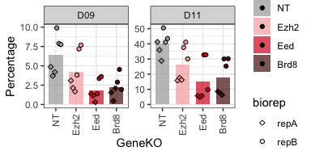
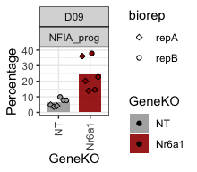
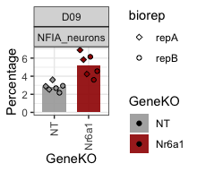

Screen flow cytometry follow up
================

``` r
rm(list=ls())

library(tidyverse)
library(colorspace)
```

### Load settings

Colors, main directory

``` r
source('./r_inputs/TemporalSpatialNeuralTube_settings.R')
```

### Set dirs

``` r
subworkinput="inputs_glialScreen_2/"

outdir="outputs_glialScreen_2_flow/"
ifelse(!dir.exists(file.path(workingdir,outdir)), dir.create(file.path(workingdir,outdir)), "Directory exists")
```

    ## [1] "Directory exists"

## Load data

``` r
nfia_panel <- lapply(list.files(path=paste0(workingdir,subworkinput),
                                      pattern="PanelNFIA*", recursive = TRUE, full.names=TRUE),function(x) {
  data <- read.csv(x,header=T,stringsAsFactors=F)
  data <- data[,1:6] # there is an empty column at the end
  colnames(data) <- c("sampleid","SOX2","NFIA_prog","OLIG2_prog","Neurons","NFIA_neurons")
  data <- data %>% filter(substr(sampleid, 1, 5) == "panel")
  data$metadata <- gsub(paste0(workingdir,subworkinput,"/"),"", x)
  data$metadata <- gsub(".csv","",data$metadata)
  data
})

nfia_panel_data <- do.call(rbind,nfia_panel)
```

### tidy data

``` r
nfia_panel_plot <- nfia_panel_data %>%
  separate(metadata, into = c("panel","biorep","Day"), sep = "_") %>%
  select(-c("panel","Day")) %>%
  separate(sampleid, into = c("panel","plate","Day","GeneKO","Rep","well"), sep="_", remove = F) %>%
  pivot_longer(SOX2:NFIA_neurons, names_to = "Population",values_to = "Percentage") 
```

#### 1 - Polycomb and Brd8

``` r
genes2plot <- c("NT","Ezh2","Eed","Brd8")

panel_plot <- nfia_panel_plot %>% 
  filter(GeneKO %in% genes2plot & Population %in% c("NFIA_prog") & Day %in% c("D09","D11")) %>%
  mutate(GeneKO=factor(GeneKO, levels=genes2plot))

plot_PRC_Brd9_d9_prog <- ggplot(panel_plot, aes(x=GeneKO, y=Percentage, group=GeneKO)) +
  stat_summary(aes(fill=GeneKO),fun = mean, geom="bar", alpha=0.7, width=0.7,position=position_dodge(0.7)) +
  geom_point(aes(shape=biorep, fill=GeneKO), position = position_dodge2(width = 0.6)) +
  scale_shape_manual(values = shapes4_fill_manual) +
  scale_fill_manual(values = c("#a7a7a7","#F8ACAD","#D61F26","#54100F")) +
  facet_wrap(~ Day , scales = "free") +
  theme_bw()+
  theme(axis.text.x = element_text(angle = 90, vjust = 0.5, hjust=1))


ggsave(paste0(workingdir,outdir,"Barplots_PRC_Brd8_d9_prog.pdf"), plot=plot_PRC_Brd9_d9_prog,
             width=4, height=2, units="in", useDingbats=FALSE)

plot_PRC_Brd9_d9_prog
```

<!-- -->
\#### 2 - Nr6a1 and progenitors

``` r
genes2plot <- c("NT","Nr6a1")

panel_plot <- nfia_panel_plot %>% 
  filter(GeneKO %in% genes2plot & Population %in% c("NFIA_prog") & Day %in% c("D09")) %>%
  mutate(GeneKO=factor(GeneKO, levels=genes2plot))

plot_Nr6a1_prog <- ggplot(panel_plot, aes(x=GeneKO, y=Percentage, group=GeneKO)) +
  stat_summary(aes(fill=GeneKO),fun = mean, geom="bar", alpha=0.9, width=0.7,position=position_dodge(0.7)) +
  geom_point(aes(shape=biorep, fill=GeneKO), position = position_dodge2(width = 0.6)) +
  expand_limits(y=40) +
  scale_shape_manual(values = shapes4_fill_manual) +
  scale_fill_manual(values = c("#a7a7a7","#9f0000")) +
  facet_wrap(Day ~ Population , scales = "free") +
  theme_bw()+
  theme(axis.text.x = element_text(angle = 90, vjust = 0.5, hjust=1))


ggsave(paste0(workingdir,outdir,"Barplots_Nr6a1_prog.pdf"), plot=plot_Nr6a1_prog,
             width=2.3, height=2, units="in", useDingbats=FALSE)

plot_Nr6a1_prog
```

<!-- -->

#### 2 - Nr6a1 and neurons

``` r
panel_plot <- nfia_panel_plot %>% 
  filter(GeneKO %in% genes2plot & Population %in% c("NFIA_neurons") & Day %in% c("D09")) %>%
  mutate(GeneKO=factor(GeneKO, levels=genes2plot))

plot_Nr6a1_neurons <- ggplot(panel_plot, aes(x=GeneKO, y=Percentage, group=GeneKO)) +
  stat_summary(aes(fill=GeneKO),fun = mean, geom="bar", alpha=0.9, width=0.7,position=position_dodge(0.7)) +
  geom_point(aes(shape=biorep, fill=GeneKO), position = position_dodge2(width = 0.6)) +
  scale_shape_manual(values = shapes4_fill_manual) +
  scale_fill_manual(values = c("#a7a7a7","#9f0000")) +
  facet_wrap(Day ~ Population , scales = "free") +
  theme_bw()+
  theme(axis.text.x = element_text(angle = 90, vjust = 0.5, hjust=1))

ggsave(paste0(workingdir,outdir,"Barplots_Nr6a1_neurons.pdf"), plot=plot_Nr6a1_neurons,
             width=2.3, height=2, units="in", useDingbats=FALSE)


plot_Nr6a1_neurons
```

<!-- -->

Significance test for Neuron plots

``` r
with(panel_plot, t.test(Percentage[GeneKO=="NT"],Percentage[GeneKO=="Nr6a1"]))
```

    ## 
    ##  Welch Two Sample t-test
    ## 
    ## data:  Percentage[GeneKO == "NT"] and Percentage[GeneKO == "Nr6a1"]
    ## t = -4.3525, df = 6.4029, p-value = 0.004129
    ## alternative hypothesis: true difference in means is not equal to 0
    ## 95 percent confidence interval:
    ##  -3.744474 -1.075526
    ## sample estimates:
    ## mean of x mean of y 
    ##  2.801667  5.211667

``` r
sessionInfo()
```

    ## R version 4.4.0 (2024-04-24)
    ## Platform: aarch64-apple-darwin20
    ## Running under: macOS 15.2
    ## 
    ## Matrix products: default
    ## BLAS:   /Library/Frameworks/R.framework/Versions/4.4-arm64/Resources/lib/libRblas.0.dylib 
    ## LAPACK: /Library/Frameworks/R.framework/Versions/4.4-arm64/Resources/lib/libRlapack.dylib;  LAPACK version 3.12.0
    ## 
    ## locale:
    ## [1] en_US.UTF-8/en_US.UTF-8/en_US.UTF-8/C/en_US.UTF-8/en_US.UTF-8
    ## 
    ## time zone: Europe/London
    ## tzcode source: internal
    ## 
    ## attached base packages:
    ## [1] stats     graphics  grDevices utils     datasets  methods   base     
    ## 
    ## other attached packages:
    ##  [1] colorspace_2.1-0 lubridate_1.9.3  forcats_1.0.0    stringr_1.5.1   
    ##  [5] dplyr_1.1.4      purrr_1.0.2      readr_2.1.5      tidyr_1.3.1     
    ##  [9] tibble_3.2.1     ggplot2_3.5.1    tidyverse_2.0.0 
    ## 
    ## loaded via a namespace (and not attached):
    ##  [1] gtable_0.3.5      highr_0.11        compiler_4.4.0    tidyselect_1.2.1 
    ##  [5] textshaping_0.4.0 systemfonts_1.1.0 scales_1.3.0      yaml_2.3.8       
    ##  [9] fastmap_1.2.0     R6_2.5.1          labeling_0.4.3    generics_0.1.3   
    ## [13] knitr_1.47        munsell_0.5.1     pillar_1.9.0      tzdb_0.4.0       
    ## [17] rlang_1.1.4       utf8_1.2.4        stringi_1.8.4     xfun_0.44        
    ## [21] timechange_0.3.0  cli_3.6.2         withr_3.0.0       magrittr_2.0.3   
    ## [25] digest_0.6.35     grid_4.4.0        rstudioapi_0.16.0 hms_1.1.3        
    ## [29] lifecycle_1.0.4   vctrs_0.6.5       evaluate_0.23     glue_1.7.0       
    ## [33] farver_2.1.2      ragg_1.3.2        fansi_1.0.6       rmarkdown_2.27   
    ## [37] tools_4.4.0       pkgconfig_2.0.3   htmltools_0.5.8.1
